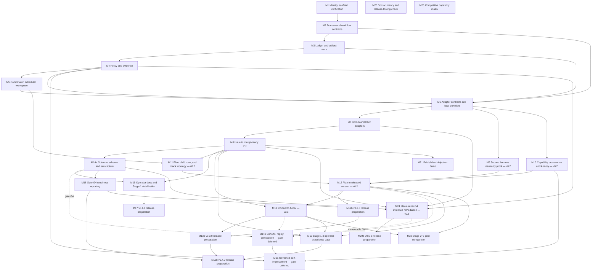

# Development Plan — Enginery

**Status:** Approved-design implementation plan — revised 2026-08-06
**Revision basis:** Approved design, M5 corrective delivery evidence, the mandatory reassessment protocol below, the 2026-08-04 decision assigning the merged M18/M19 backlog surface to `v0.4.0`, and the 2026-08-06 owner-approved G4 measurement remediation
**Target public release:** `v0.1.0` (M1–M8, M14a, M16, M17); `v0.2.0` (M9, M10, M11, M12, M12b) and `v0.3.0` (M13, M13b) trains follow, all three published; `v0.4.0` (M18, M19; M19b is the release-preparation unit) is published; `v0.5.0` (M24; M24b is the release-preparation unit) is the current open train; M14b/M15 remain gate-deferred (§8)
**License:** Apache-2.0  
**Repository state:** Greenfield  
**Stack depth limit:** 6 PRs per milestone
**Backlog:** Section I (M18–M23) is an enhancement backlog derived from `.docs/FUTURE_ENHANCEMENTS.md`, sourced independently of the `v0.1.0`–`v0.3.0` trains above. M18 and M19 shipped in `v0.4.0` through M19b; M20–M23 remain `none` because they ship repository tooling or published evidence that is never packaged into the wheel (§4). Section J corrects the G4 measurement defect before any further operational evidence is collected.

## 1. Context & Source Map

This plan turns the approved Enginery design into a dependency-ordered, independently verifiable implementation program. The target is an open-source, local-first Python 3.12 modular monolith that coordinates interchangeable agent harnesses, durable workflows, policy, evidence, provider integrations, releases, incidents, and governed factory self-improvement.

The approved product name is Enginery. The Python distribution, import package, and executable use `enginery`; M1 records these values in one canonical project-identity source and resolves the repository owner and URL.

| Plan area | Source document and sections | Planned milestones |
|---|---|---|
| Philosophy and actor allocation | `docs/overview.md` §3; `docs/pitch.md` | M2, M4, M5, M8, M15 |
| Repository and product boundary | `docs/overview.md` §§2, 6–7; `docs/design.md` §2 | M1, M6, M10, M16 |
| Product goals and non-goals | `docs/design.md` §§1, 4 | M1–M17 |
| Modular-monolith architecture | `docs/design.md` §3 | M1–M6 |
| Work, workflow, run, attempt, artifact, policy, outcome, and factory-change models | `docs/design.md` §5 | M2–M4, M14a; M14b–M15 gate-deferred |
| SQLite events, projections, inbox/outbox, artifacts, migrations | `docs/design.md` §6 | M3 |
| Workflow manifests and executable nodes | `docs/design.md` §7 | M2, M4, M6 |
| Coordinator epochs, leases, supervision, workspaces, cancellation | `docs/design.md` §§3, 7 | M5 |
| Provider contracts and reference adapters | `docs/design.md` §10 | M6–M10, M12–M13 |
| Policy hard rules and approval digests | `docs/design.md` §8 | M4, M8, M12, M13, M15 |
| Evidence, merge-ready, released, and outcome contracts | `docs/design.md` §§9, 13 | M4, M8, M12, M14a |
| Trust, credentials, brokers, and supply chain | `docs/design.md` §11 | M4, M6, M10, M12–M13 |
| Issue to merge-ready PR | `docs/design.md` §12.1 | M7–M8 |
| Plan to released version | `docs/design.md` §12.2 | M9, M11–M12 |
| Incident to hotfix | `docs/design.md` §12.3 | M13 |
| Factory self-improvement | `docs/design.md` §12.4 | M14b, M15 (gate-deferred, §8) |
| CLI, event stream, failure recovery, configuration, and tests | `docs/design.md` §§14–17 | M1–M15 |
| Release train and completion gates | `docs/design.md` §§17–18 | M8, M12–M17 |
| Falsifiability and gate corrections | `docs/design.md` §17 | M3–M5, M8, M12–M15 |
| Post-release enhancement backlog | `.docs/FUTURE_ENHANCEMENTS.md` §§3, 5, 7, 8 | M18, M19, M19b, M20, M21, M22, M23 |
| G4 measurable-evidence remediation | 2026-08-06 owner-approved G4 remediation decision; `docs/design.md` §§5, 8–9, 17 | M24, M24b |

## 2. Assumptions & Gaps

> ASSUMPTION: The implementation uses Python 3.12, `uv`, built-in generics and union syntax, `mypy --strict`, Ruff, pytest, SQLite, `asyncio`, TOML configuration, and Python package entry points only after two implementations require an extension surface. This follows the approved design and workstation conventions.

> ASSUMPTION: `v0.1.0` supports POSIX process semantics on macOS and Linux. Native Windows process supervision and worktree locking are outside this release because the approved supervisor design depends on process groups, signals, and process-start identity.

> ASSUMPTION: Harness agnosticism is proved with OMP and Claude Code reference adapters. Neither adapter may leak provider types into the domain or application layers. Additional harnesses use the same versioned contract after `v0.1.0`.

> ASSUMPTION: GitHub issues, pull requests, checks, releases, and PyPI are the first external work, SCM/CI, and publication providers. A local versioned HTTP service fixture is the controlled deployment and rollback target.

> ASSUMPTION: The first release stores one ledger per local control-plane installation and permits one active coordinator epoch per ledger. Distributed coordination is outside `v0.1.0`.

> DECISION: The product name is Enginery. The Python distribution, import package, and executable use `enginery`. M1 must verify that these identities remain available and record them in one canonical project-identity file before package scaffolding proceeds.

> GAP: The repository owner or organization is not explicitly selected. M1 must record it before creating the remote repository or release URLs.

> GAP: The final public API compatibility policy after `v0.1.0` is not specified. M17 must publish only the compatibility policy actually supported by the implemented adapters, event schemas, workflow manifests, and CLI; it must not imply `1.0` stability.

> DECISION (2026-08-06): G4 is not presently measurable: the GitHub adapter hard-codes every source item as `issue`/`low`, Stage 1 rejects every non-`issue` work kind, the roster is an unauthenticated list of strings, and the recurring-deficiency condition is permanently `unmeasured`. M24 is a bounded `v0.5.0` remediation, not a shortcut around G4: it binds declared GitHub labels to source snapshots, admits only supported labeled Stage 1 work kinds, records one dual-human GitHub-review-approved recurring-deficiency finding against durable evidence, and evaluates one verified classified cohort. Operational evidence remains required after M24 merges; no code may fabricate diversity, interventions, outcomes, or a deficiency.

> DECISION (2026-08-04): M18 and M19 shipped as `v0.4.0`, prepared and published by M19b. M20–M23 stay outside every train: `scripts/` is not packaged and published evidence artifacts are not code. This decision does not assign a train to M14b/M15, which remain gate-deferred behind G4.

### Mandatory pre-milestone reassessment gate

Every unstarted milestone from M6 onward, including release-preparation and gate-deferred milestones, begins with reassessment rather than implementation. Before detailed design, branch creation, or code changes, the executing agent must compare the target milestone against the current default-branch implementation, finalized product documents, externally merged dependency evidence, active decision gates, and the prior milestone's observed failures or corrective work.

The agent must append an evidence-backed entry to `.docs/MILESTONE_REASSESSMENTS.md`. Each entry records the baseline commit, documents and evidence inspected, confirmed and invalidated assumptions, newly discovered risks, discrete changes to objective, scope, deliverables, acceptance, verification, stack, and rollback, the result (`GO`, `NO-GO`, or `REPLAN REQUIRED`), and the human approval reference. This is local planning material: it remains globally ignored and is never referenced from implementation code or tracked documentation.

Every assessment outcome, including `GO`, requires recorded explicit human approval before detailed design, branch creation, or code changes. An invalid assumption, missing prerequisite evidence, incomplete safety proof, unbounded external side effect, or mismatch between plan and current design produces `REPLAN REQUIRED`. The agent must update this plan and regenerate `EXECUTION_PROMPTS.md`, then obtain explicit human approval before implementation resumes. Reassessment may clarify or strengthen contracts, verification, and rollback; it must not weaken acceptance criteria, erase safety evidence, widen release scope, or bypass an existing gate without a new explicit human decision.

M5 established the minimum evidence vocabulary for future milestones: focused tests, deterministic lifecycle faults, real-process or real-provider execution, real durable-state/workspace fixtures where relevant, concurrent stress where relevant, clean-main local proof, and fresh required CI on every supported platform. A milestone may omit a category only when its reassessment records why that category cannot exercise an asserted risk.

Every release-preparation milestone's reassessment must additionally grep its own required verification commands (as quoted in this plan's Verification/PER-PR GATES fields) against the actual current flags and subcommands the named scripts support today, before implementation starts -- not discover a gap mid-stack. This closes a pattern that recurred at both M12b and M13b: each found only after starting that `scripts/full_system_gate.py` did not yet support its own required `--stages` invocation, requiring an unplanned corrective PR ahead of the milestone's own release-preparation stack (`.docs/MILESTONE_REASSESSMENTS.md`'s M12b and M13b entries). Every release-preparation milestone's reassessment must also run `uv run python scripts/check_docs_currency.py` against the current default branch and record its result; a failure blocks `GO` until the flagged doc is corrected in the same reassessment cycle, not deferred to a later doc-sync pass.

## 3. Dependency Graph

Parallelizable after prerequisites:

- M14a and M16 can proceed in parallel after M8.
- M9 and M10 can proceed in parallel after M6, in the `v0.2` train, once Stage-1 usage friction exists (gate G1).
- M11 can proceed while M9 and M10 are implemented, after M8 and M5.
- Dotted edges into M14b are gate conditions, not build dependencies: M14b and M15 may not start until G4 passes (§8), regardless of milestone completion order. M24 is a regular prerequisite because it makes those conditions measurable; it does not itself satisfy them.
- Release-preparation milestones (M12b, M13b, M19b, M24b) run only after their full train externally merges; each additionally waits for the prior train's publication, since release trains publish in order.
- M18–M23 (the post-`v0.3.0` enhancement backlog) have no dependency on each other and no dependency on M14b/M15. M18/M19 are published in `v0.4.0`; M24 begins only after that published baseline and remains independent of operational G4 passage.

## 4. Release Trains

| Target release | Included milestones | Preparation trigger | Required artifacts | Verification | Publication |
|---|---|---|---|---|---|
| `v0.1.0` | M1–M8, M14a, M16; M17 is the release-preparation unit | M1–M8, M14a, and M16 externally merged and the Stage 1 gate has a checked evidence bundle | Canonical version update, `CHANGELOG.md`, source archive, wheel, sdist, SBOM or dependency manifest, release notes | `uv run python scripts/release_gate.py --version 0.1.0` exits 0 after full lint, type, test, build, clean-install, Stage-1-workflow, and artifact checks | M17 publishes to PyPI and GitHub Releases only after a human publication gate; `uv run python scripts/verify_published_release.py --version 0.1.0` must verify both destinations |
| `v0.2.0` | M9, M10, M11, M12; M12b is the release-preparation unit | M9, M10, M11, and M12 externally merged and the Stage 2 gate has a checked evidence bundle | Same artifact classes as `v0.1.0` plus Stage 2 evidence index | Stage 2 gate scripts plus the cumulative `full_system_gate.py --stages 1,2` | M12b publishes to PyPI and GitHub Releases only after a human publication gate; `uv run python scripts/verify_published_release.py --version 0.2.0` must verify both destinations |
| `v0.3.0` | M13; M13b is the release-preparation unit | M13 externally merged, `v0.2.0` already published, and the Stage 3 gate has a checked evidence bundle | Same artifact classes plus Stage 3 evidence index | Stage 3 gate scripts plus cumulative `--stages 1,2,3` | M13b publishes to PyPI and GitHub Releases only after a human publication gate; `uv run python scripts/verify_published_release.py --version 0.3.0` must verify both destinations |
| Gate-deferred (unversioned) | M14b, M15 | Measurable Gate G4 passes (§8); assigned to a release train only at that point | — | — | — |
| `v0.4.0` | M18, M19; M19b is the release-preparation unit | Completed and published 2026-08-03 | Canonical version update, `CHANGELOG.md`, source archive, wheel, sdist, dependency manifest, release notes, and release evidence | `scripts/release_gate.py --version 0.4.0`, cumulative Stage 1–3 gate, artifact checks, and published-consumer smoke passed | Published to PyPI and GitHub Releases |
| `v0.5.0` | M24; M24b is the release-preparation unit | M24 externally merged and `v0.4.0` published | Canonical version update, `CHANGELOG.md`, source archive, wheel, sdist, dependency manifest, release notes, and release evidence | Full lint/type/test gates; labeled Stage 1 smoke; gate-evidence adversarial tests; build, clean-install, and published-consumer command smoke | M24b publishes to PyPI and GitHub Releases only after a human publication gate; `uv run python scripts/verify_published_release.py --version 0.5.0` must verify both destinations |
| `none` (repository tooling or published evidence, never packaged into the wheel) | M20, M21, M22, M23 | Each runs independently once its own listed prerequisites are merged | — | — | — |

Release rules:

- No milestone other than a release-preparation pass updates the public version or `CHANGELOG.md`.
- M17 owns the `v0.1.0` version and changelog update; M12b owns `v0.2.0`; M13b owns `v0.3.0`; M19b owns `v0.4.0`; M24b owns `v0.5.0`. Each release-preparation milestone follows the same rules as M17, scoped to its own train.
- There is deliberately no standing `## [Unreleased]` accumulator in `CHANGELOG.md`. Because only a release-preparation pass may touch that file, each version section is authored retroactively by its own release-preparation milestone from the merged train's actual diff. A release-cadence gap therefore surfaces as a missing release-preparation milestone, not as an overfull `Unreleased` section — which is exactly how the M18–M23 gap surfaced.
- M12 may publish a deliberately separate fixture distribution to prove the release provider. It must never consume the final product’s name or version.
- M13 deploys only the controlled local service fixture.
- A milestone `GO` authorizes merging that milestone stack after independent gate verification. It does not authorize release preparation or publication.
- M14b and M15 must not start — including design-detail work beyond the M14a schema — before gate G4 passes. The prohibition is a plan rule, not a soft priority.

## 5. Sections & Milestones

### Section A — Product foundation

#### M1 — Confirm project identity and establish the repository scaffold

| Field | Value |
|---|---|
| Objective | Confirm the repository owner and URL, record the approved Enginery identity, create the greenfield Apache-2.0 Python 3.12 repository, and establish the smallest verification surface every later milestone can trust. |
| In / Out of scope | In: human repository-ownership gate; approved product, distribution, import, and CLI names (`Enginery` and `enginery`); Apache-2.0; `pyproject.toml`; `uv.lock`; `src` layout; package boundaries; CLI `--version` and `doctor` skeleton; Ruff; `mypy --strict`; pytest; macOS and Ubuntu CI; release metadata source. Out: domain behavior, SQLite, adapters, workflows, provider calls. |
| Depends on | `none` |
| Target release | `v0.1.0` |
| Deliverables | Canonical project-identity and version source; repository scaffold; package-boundary import tests; CLI skeleton; deterministic test clock/ID helpers; CI; license; contribution/security basics needed for an open repository. |
| Acceptance | A human records the repository owner and URL before package code exists. One file is authoritative for product, distribution, import, executable, repository URL, and version. The approved values are `Enginery` and `enginery`; any availability conflict returns `NO-GO` for a new human decision. `uv sync --all-extras --dev` succeeds on a clean checkout. CLI prints the same version as the canonical source. Domain imports no outer package. CI runs lint, format check, strict typing, and tests on macOS and Ubuntu. |
| Verification | `uv sync --all-extras --dev && uv run ruff check . && uv run ruff format --check . && uv run mypy --strict src && uv run pytest -q` exits 0; `uv run python scripts/verify_project_identity.py` exits 0; `uv run enginery --version` prints `0.0.0.dev0` or the documented pre-release placeholder from the canonical source. |
| Risks & rollback | Identity changes after M1 create package and import churn; treat the repository ownership record and identity availability check as the gate. Roll back the M1 stack as a unit before downstream work. |
| Est. PRs | 4 |

#### M2 — Implement domain types, state machines, and workflow manifests

| Field | Value |
|---|---|
| Objective | Encode provider-neutral aggregates, value types, state transitions, workflow manifests, node declarations, and failure classifications as the stable inner contract. |
| In / Out of scope | In: IDs/digests; `WorkItem`, `WorkflowDefinition`, `Run`, `NodeAttempt`, `Artifact`, `PolicyDecision`, `Intervention`, `Outcome`, `FactoryChange`; state-transition guards; typed manifest parser; registered node metadata; schema versions; failure classes. Out: persistence, node execution, provider SDKs, policy evaluation behavior. |
| Depends on | M1 |
| Target release | `v0.1.0` |
| Deliverables | Immutable domain models; complete transition tables from design §10; manifest validation; side-effect/idempotency declarations; operation-ID derivation; serialization schemas; domain invariant tests. |
| Acceptance | Every designed state edge is represented and invalid edges fail loudly. Operation IDs remain stable across attempts. Unknown node types, cycles, missing schemas, invalid terminal contracts, and general-programming payloads are rejected. Domain tests import no adapter, database, CLI, or provider package. |
| Verification | `uv run pytest tests/domain tests/workflow/test_manifest.py -q` exits 0; `uv run python scripts/check_import_boundaries.py domain` reports zero outward imports; `uv run mypy --strict src` exits 0. |
| Risks & rollback | Premature abstractions can freeze provider assumptions. Keep ports out of the domain until M6 demonstrates consumers. Roll back individual PRs only while serialization fixtures remain unchanged; otherwise roll back the milestone stack. |
| Est. PRs | 5 |

#### M3 — Build the SQLite event ledger and content-addressed artifact store

| Field | Value |
|---|---|
| Objective | Make workflow state crash-safe, replayable, transactionally consistent, and independent of conversations or process lifetime. |
| In / Out of scope | In: SQLite schema; aggregate versions; append events; atomic multi-aggregate commands; process-manager state; command inbox; transactional outbox; projections; local commit cursor; artifact metadata/files; redaction boundary; migrations; backup/restore; corruption checks. Out: scheduler execution and external outbox consumers. |
| Depends on | M2 |
| Target release | `v0.1.0` |
| Deliverables | Ledger service; projection rebuild; artifact store; migration runner; backup command; invariant and fault tests; schema/version documentation generated from code. |
| Acceptance | Expected-version conflicts reject atomically. A multi-aggregate command either commits all local events/projections/outbox rows or none. Replay reproduces projections and commit cursors. Artifact digest mismatch fails. Interrupted migration does not start the application. Backup/restore reproduces the same aggregate and artifact metadata. Credential-source fields cannot enter the serialized event schema. |
| Verification | `uv run pytest tests/ledger tests/artifacts tests/migrations -q` exits 0; `uv run python scripts/fault_inject_ledger.py` exits 0; `uv run enginery ledger verify --database tests/fixtures/ledger.db` reports `healthy`. |
| Risks & rollback | Schema mistakes become durable compatibility debt. Each migration requires forward verification and documented rollback or restore. Never rewrite historical events in place. |
| Est. PRs | 5 |

### Section B — Governance and execution kernel

#### M4 — Implement policy, approval, evidence, and terminal contracts

| Field | Value |
|---|---|
| Objective | Enforce action-scoped autonomy, the closed non-overridable hard-rule set, complete approval digests, and deterministic evidence evaluation. |
| In / Out of scope | In: action schemas; default-deny; allow/deny/human results; hard rules; actor separation; approval supersession; policy overrides; evidence pass/fail/indeterminate; waivers; non-applicability; merge-ready/released contracts; risk profiles. Out: provider evidence collection and UI beyond CLI domain commands. |
| Depends on | M2, M3 |
| Target release | `v0.1.0` |
| Deliverables | Policy evaluator; canonical action digest; approval records; hard-rule tests; evidence verifier; merge-ready and release evaluators; policy explanation output. |
| Acceptance | Unknown actions deny. Hard rules cannot be overridden. Changed bound input supersedes approval. Self-approval fails. Human-only actions reject worker-origin approvals. Indeterminate required evidence never passes. All-non-applicable or empty-diff work cannot become merge-ready. Stale subjects fail terminal contracts. Run-introduced capabilities require exact-digest human approval. |
| Verification | `uv run pytest tests/policy tests/evidence -q` exits 0; `uv run python scripts/adversarial_policy_gate.py` rejects every hard-rule bypass fixture; `uv run enginery policy explain tests/fixtures/policy/unknown-action.json` exits with the documented deny code. |
| Risks & rollback | A permissive default or incomplete digest silently expands authority. Hard-rule changes require schema migration and two-pass review. Roll back the full policy stack if any adversarial fixture passes. |
| Est. PRs | 5 |

#### M5 — Implement coordinator epochs, scheduling, worker supervision, and worktree isolation

| Field | Value |
|---|---|
| Objective | Execute runnable nodes without duplicate workers, workspace collision, orphan continuation, or unbounded human-wait leases. |
| In / Out of scope | In: coordinator lease/epoch; typed command inbox consumption; readiness scheduler; concurrency limits; node fencing tokens; run-level workspace reservations; node leases; child process groups; independent supervisor; heartbeat; cancellation; orphan quiescence; worktree create/inspect/retain/cleanup. Out: hostile-process containment, containers, distributed scheduling, real agent adapters. |
| Depends on | M3, M4 |
| Target release | `v0.1.0` |
| Deliverables | Coordinator application service; scheduler; fenced worker-result envelopes; worker supervisor; worktree backend; cancellation and human-wait resume commands; macOS/Linux process-identity probes; deterministic lifecycle fault matrix; real SQLite/worktree/process-group concurrent stress harness; CI enforcement of platform-sensitive lifecycle proof. |
| Acceptance | One coordinator epoch transitions aggregates and workers never write the ledger. Workspace reservations and node leases are independent durable resources. Launch intent precedes process creation; PID, process group, and process-start identity all match before a result is accepted or a group is terminated. Human waits retain workspace reservations but hold no node lease or live child. Resume proves prior process-group absence and workspace quiescence before re-lease. Missing identity, PID mismatch, probe failure, Git lock, inspection failure, and cleanup failure block automatic continuation for human reconciliation. Concurrent runs never own one workspace. |
| Verification | `uv run pytest tests/engine tests/scheduler tests/workspace -q` exits 0; `uv run python scripts/fault_inject_workers.py --platform current` passes every named lifecycle boundary; `uv run python scripts/stress_runtime.py --runs 50 --global-concurrency 8 --same-repository-runs 2 --seed 20260718` reports zero duplicate leases, duplicate process groups, workspace collisions, accepted stale results, active human-wait leases, and orphaned process groups; CI runs the lifecycle matrix on macOS and Ubuntu. |
| Risks & rollback | PID reuse, launch-before-identity gaps, and crash races can violate safety. Use process-start identity and workspace locks, not PID alone; fail ambiguous launch state closed instead of guessing. Roll back the milestone if a deterministic fault, real-process stress, or platform-sensitive lifecycle proof is absent, nondeterministic, or fails. |
| Est. PRs | 6 |

#### M6 — Define adapter contracts and ship deterministic local providers

| Field | Value |
|---|---|
| Objective | Establish provider-neutral application ports using local implementations before external SDKs are introduced. |
| In / Out of scope | In: capability/version probing; durable adapter fingerprint binding and a fail-closed resume guard; normalized failure taxonomy; operation-ID reconciliation contract; work-ledger, harness, workspace, git/PR, validation/CI, release/deployment, and capability-registry ports; local work ledger; local scripted harness fixture; local git; local validation; local artifact publication; local capability source; an accurate tracked implementation-status statement. Out: general plugin loading, GitHub, OMP, Claude Code, Armory. |
| Depends on | M2, M3, M4, M5 |
| Target release | `v0.1.0` |
| Deliverables | Typed application ports; adapter API version; shared contract suites; local providers; redacted event envelope; durable fingerprint/resume compatibility surface; adapter doctor output; compatibility fixtures; a root README status correction limited to merged behavior. |
| Acceptance | Provider-native objects never cross adapters. Every side-effect provider supports native idempotency or four-result reconciliation. Raw output is redacted and sensitivity classified before persistence. A changed adapter fingerprint blocks resume before any provider call. Shared contract suites pass for every local provider. The root README contains no implementation-status claim contradicted by merged M2–M6 behavior. No speculative entry-point plugin system exists. |
| Verification | `uv run pytest tests/adapters/contracts tests/adapters/local tests/domain/test_run.py -q` exits 0; the suite includes fingerprint migration/serialization and resume-drift fixtures plus a secret-bearing output fixture that proves only redacted data reaches ledger persistence; `uv run python scripts/check_import_boundaries.py adapters` reports no provider imports outside adapter packages; `uv run enginery adapter doctor` reports every configured local provider. |
| Risks & rollback | An interface designed around one future provider defeats neutrality. Keep provider-specific optional capabilities discoverable rather than widening the core type. Roll back a port change, its implementations, fingerprint migration, fixtures, and matching public status claim as one stack. |
| Est. PRs | 5 |

### Section C — First operational workflow

#### M7 — Integrate GitHub and OMP as first external providers

| Field | Value |
|---|---|
| Objective | Connect real issue/PR/check state and real coding-agent execution without leaking either provider into the core. |
| In / Out of scope | In: GitHub issue snapshots/revisions; lifecycle projection; PR create/update/reconcile; head/base/check queries; OMP probe/start/events/cancel/result collection; opaque credential references; explicit static allowlist validation for the dedicated GitHub smoke repository; pinned provider/protocol capability reporting; provider contract tests; opt-in real-provider smoke fixtures. Out: provider SDK dependencies, merge automation, release publication, webhook-server operation, unrestricted repository configuration, second harness. |
| Depends on | M6 |
| Target release | `v0.1.0` |
| Deliverables | GitHub work-ledger and SCM/CI adapters; OMP harness adapter; deterministic branch/PR correlation; source polling/event input; provider diagnostics; explicit smoke-fixture prerequisite and cleanup/retention record; real smoke-test harness. |
| Acceptance | Ambiguous PR creation adopts a matching existing PR and never duplicates it. CI evidence binds exact head SHA. Issue bound-field changes emit source divergence. OMP output crosses as normalized events/redacted artifacts. Provider auth failure, rate limit, conflict, and ambiguity classify distinctly. GitHub mutation is refused unless the configured smoke repository exactly matches the static allowlist. A missing live prerequisite reports `not-run`, never a passing or silently deselected smoke result. Real smoke tests operate only on an explicit test repository. |
| Verification | The inherited M6 adapter baseline uses its merged test locations: `uv run pytest tests/application/test_adapter_types.py tests/application/test_work_ports.py tests/application/test_delivery_ports.py tests/adapters/local/test_local_providers.py -q`. `uv run pytest tests/adapters/github tests/adapters/omp -q` exits 0 and covers pagination, issue/PR filtering, provider failure classification, duplicate adoption after ambiguous success, exact-head checks, malformed OMP records, cancellation, and redaction. With opt-in credentials and the approved repository, `uv run pytest tests/provider_smoke/test_github_omp.py -q -m provider_smoke` exits 0 and cleans its test issue/branch/PR or records retained diagnostics without secret values. |
| Risks & rollback | Live-provider tests can mutate real repositories. Require an explicit test-repository allowlist, idempotency markers, opaque credential references, and redacted diagnostics. Revoke test credentials, reconcile retained artifacts before rollback, and retain the operation/correlation evidence even when a fixture must be removed. |
| Est. PRs | 5 |

#### M8 — Deliver issue to merge-ready pull request

| Field | Value |
|---|---|
| Objective | Complete Stage 1 with one persistent coordinator-owned issue-to-PR progression loop: a real issue reaches a non-empty, evidence-complete merge-ready PR through durable, resumable, policy-gated execution. |
| In / Out of scope | In: a `stage1` CLI lifecycle surface; a durable run projection, retained-workspace lifecycle, and manifest-node progression owned by the existing coordinator runtime; qualification; readiness escalation; risk routing; optional plan approval; CI-capable allowlisted live-provider preflight; worktree; OMP execution; focused validation; independent/human review rules; bounded repair; source supersession; double-read merge verification; PR/CI evidence; evidence summary; cancellation and resume. Out: merge, release, incidents, self-improvement, a second scheduler, and manually composing helper services for a live run. |
| Depends on | M7, M4, M5 |
| Target release | `v0.1.0` |
| Deliverables | A versioned workflow manifest and one `stage1` CLI command family (`start`, `watch`, `approve`, `reject`, `cancel`, `resume`, `evidence`) backed by a coordinator-owned progression service. `watch` derives one safe next action from durable run/node/workspace/lease state and current provider observations, persists that action before its effect, and reconciles it by durable operation ID. The service retains an implementation workspace through validation, review, repair, PR/CI, and terminal verification; it releases the workspace only through a fenced terminal cleanup transition, or records it retained for reconciliation. The workflow never merges. Also deliver a maintained CI-capable static allowlist fixture with a named `CI` check, deterministic composed-runtime fixtures, and one retained real issue evidence bundle. |
| Acceptance | At least one criterion has positive implementation evidence tied to a non-empty diff. Only the persistent progression service may progress a live Stage 1 run or invoke provider/harness side effects. All-non-applicable work ends `no_change_required`. Every running or human-wait node can cancel or resume through a declared terminal transition. Bounded repair creates a fresh fenced attempt and re-enters validation; exhaustion blocks with evidence. Stale issue/base/head/review/CI cannot produce merge-ready. A replacement `watch` process resumes any recorded operation without duplicating an OMP attempt, PR mutation, workspace release, or terminal evidence. A workspace exists through validation and is cleaned exactly once after every terminal/cancelled run, or is durably retained for reconciliation. Medium/high work has a current human final review. A passing live-provider preflight proves the allowlisted repository has a currently observable exact-head `CI` result, opaque credential references, OMP capability, and cleanup/reconciliation before Stage 1 activation. A real issue completes the gate through the CLI, survives a controlled coordinator interruption and resume without duplicate side effects, and retains an open, unmerged, non-empty merge-ready PR with current exact-head source, review, and CI evidence. |
| Verification | `uv run pytest tests/workflows/test_issue_to_pr.py tests/workflows/test_stage1_runtime.py tests/e2e/test_issue_to_pr_recovery.py tests/cli/test_stage1.py -q` exits 0 and exercises implementation-result-to-validation workspace handoff, coordinator crash before and after provider effects, harness loss, source/base/head mutation, repair, cancellation, resume, and terminal cleanup against the composed command runtime. `uv run python scripts/adversarial_merge_ready_gate.py` rejects no-op, stale-CI, self-waiver, changed-head, and duplicate-check fixtures. `ENGINERY_PROVIDER_SMOKE=1 uv run pytest tests/provider_smoke/test_github_omp.py -q -m provider_smoke` exits 0 only after observing a completed successful `CI` check bound to the smoke PR's current head, with cleanup or retained diagnostics before Stage 1 activation. Opt-in `uv run python scripts/run_stage1_gate.py --provider github --harness omp` exits 0 only after a controlled interruption/recovery through `enginery stage1 watch`; it prints the retained issue, PR, exact-head subject versions, review, CI, workspace cleanup outcome, and evidence-bundle digest. |
| Risks & rollback | A helper-only CLI, a passive `watch`, or an allowlist without an executable exact-head CI check can falsely imply a working Stage 1 system. The progression service must persist each operation before its effect and reconcile an interrupted external operation before retrying. Roll back workflow-version activation, not historical events or evidence; retain the live issue/PR bundle, workspace reconciliation records, and preflight diagnostics. |
| Est. PRs | 3 corrective PRs after the merged Stage 1 stack: retained workspace lifecycle, coordinator-owned progression, then recovery/live-gate evidence. |

### Section D — Harness and capability ecosystem

#### M9 — Prove harness neutrality with a Claude Code reference adapter

| Field | Value |
|---|---|
| Objective | Demonstrate that the harness contract is not OMP-shaped by running the same normalized task, event, cancellation, artifact, and evidence fixture through Claude Code. |
| In / Out of scope | In: Claude Code headless probe/start/stream/cancel/result adapter; capability discovery; model/harness metadata; shared harness fixture; compatibility negotiation; adapter docs generated from contracts. Out: provider-specific behavior in domain types; requiring Claude Code for all users. |
| Depends on | M6; scheduled in the `v0.2` train after gate G1, so the adapter contract freezes against real Stage-1 usage friction rather than speculation |
| Target release | `v0.2.0` |
| Deliverables | Claude Code adapter; two-adapter contract matrix; shared fixture results; documented optional installation. |
| Acceptance | OMP and Claude Code pass the same harness contract fixture. Neither provider requires a provider-named domain field. Missing harness installations fail doctor clearly and do not trigger fallback. Cancellation and malformed output produce the same normalized failure classes. |
| Verification | `uv run pytest tests/adapters/omp tests/adapters/claude_code tests/adapters/contracts/test_harness.py -q` exits 0; with both installed, `uv run python scripts/verify_harness_neutrality.py --harness omp --harness claude-code` exits 0 and reports one normalized result schema. |
| Risks & rollback | The second adapter may expose capabilities absent in OMP. Represent optional capabilities through discovery, not lowest-common-denominator branching in domain code. Roll back the adapter without changing the stable contract unless the contract fixture proves a defect. |
| Est. PRs | 4 |

#### M10 — Enforce capability provenance and integrate Armory

| Field | Value |
|---|---|
| Objective | Resolve, lock, approve, and materialize repository-local and Armory capabilities without treating a digest as proof of trust. |
| In / Out of scope | In: capability lockfile; pinned-key signature chain; exact-digest approval; run-introduced capability hard rule; immutable materialization; Armory discovery adapter; provenance/evidence records; license metadata. Out: requiring Armory; arbitrary plugin execution; mutable in-flight capability updates. |
| Depends on | M6, M4; scheduled in the `v0.2` train after gate G1 |
| Target release | `v0.2.0` |
| Deliverables | Capability resolver/lock; provenance verifier; Armory adapter; policy integration; malicious/unsigned/change-during-run fixtures. |
| Acceptance | Existing reviewed local capabilities can resolve by policy. Run-added or changed capabilities cannot execute before human exact-digest approval. TLS-only external provenance is insufficient. Signed capability identity verifies against pinned keys. Mutable references cannot change an in-flight lock. The engine works with Armory disabled. |
| Verification | `uv run pytest tests/capabilities tests/adapters/armory -q` exits 0; `uv run python scripts/adversarial_capability_gate.py` rejects unsigned, digest-swapped, self-approved, and run-introduced execution fixtures; `uv run enginery capability lock --check` reports no drift. |
| Risks & rollback | Supply-chain policy can block legitimate local workflows or admit malicious packages. Preserve explicit human digest approval as the safe escape path. Roll back provider activation while retaining historical lock/evidence records. |
| Est. PRs | 4 |

### Section E — Plans, stacks, and releases

#### M11 — Implement plan ingestion, child runs, dependency scheduling, and stack topology

| Field | Value |
|---|---|
| Objective | Convert a validated development plan into linked work items and child runs that execute dependency order and preserve stacked PR topology. |
| In / Out of scope | In: plan schema; milestone normalization; cycle detection; dependency DAG; child-run links; fan-out/join; per-repository limits; branch/PR stack metadata; fresh-evidence merge-order preparation; partial resume. Out: merge authorization, version/changelog, publication. |
| Depends on | M8, M5 |
| Target release | `v0.2.0` |
| Deliverables | Plan work-item adapter; plan-to-child-run process manager; DAG scheduler; stack topology model; stack evidence projection; fixtures for linear, parallel, diamond, failed, and resumed plans. |
| Acceptance | Cycles and unresolved dependencies fail before execution. Independent milestones run concurrently. Dependent milestones wait for configured predecessor state. Child evidence remains separate and linked. Stack bases and commit ancestry remain correct through resume. One child failure does not erase completed siblings. |
| Verification | `uv run pytest tests/plans tests/workflows/test_plan_scheduler.py tests/stacks -q` exits 0; `uv run python scripts/stress_plan_scheduler.py --fixture tests/fixtures/plans/diamond.toml` reports correct order and zero duplicate child runs. |
| Risks & rollback | Conflating plan progress with git topology can corrupt stacks. Keep work dependencies and branch ancestry distinct but linked. Roll back active workflow version; preserve child histories. |
| Est. PRs | 5 |

#### M12 — Deliver plan to verified released version

| Field | Value |
|---|---|
| Objective | Complete Stage 2: merge dependency-ordered work with fresh evidence, prepare a release once, publish a fixture through GitHub/PyPI providers, and verify the destination. |
| In / Out of scope | In: merge policy action; stale-check revalidation; root-to-leaf stack merge; cleanup; release target validation; version/changelog broker; wheel/sdist fixture build; fixed publication broker; GitHub Release and PyPI adapters; ambiguous-publication reconciliation; destination verification; both harness contract gate. Out: publishing the control plane itself; production deployment. |
| Depends on | M9, M10, M11 |
| Target release | `v0.2.0` |
| Deliverables | Plan-to-release workflow; release manifest; fixed broker nodes; GitHub/PyPI fixture provider; clean-consumer smoke verifier; Stage 2 evidence bundle. |
| Acceptance | Merge order follows dependencies and every PR has fresh current-head evidence. Version/changelog starts only after implementation gates pass. Publication credentials never enter worker/command nodes. Ambiguous publish reconciles before retry. Destination version and artifact digest match the release manifest. OMP and Claude Code satisfy the shared harness fixture. A multi-milestone fixture reaches a verified released version. |
| Verification | `uv run pytest tests/workflows/test_plan_to_release.py tests/releases tests/adapters/pypi tests/adapters/github_release -q` exits 0; `uv run python scripts/fault_inject_publication.py` exits 0 without duplicate versions; opt-in `uv run python scripts/run_stage2_gate.py --fixture-distribution` verifies GitHub and PyPI destinations and prints the release evidence digest. |
| Risks & rollback | PyPI versions are immutable and cannot be deleted safely. Use a dedicated fixture distribution and unique pre-release fixture versions; remediation, not deletion, is the rollback. Human approval is mandatory before any external publish. |
| Est. PRs | 6 |

#### M12b — Prepare, publish, and verify `v0.2.0`

| Field | Value |
|---|---|
| Objective | Perform the single release-preparation pass after the `v0.2.0` train (M9, M10, M11, M12) merges, publish signed or checksummed artifacts to PyPI and GitHub Releases, and verify the clean-consumer experience against the cumulative v0.1.0+v0.2.0 surface. |
| In / Out of scope | In: version update to `0.2.0`; changelog entry appended to the existing history; release notes scoped to Stage 2 plus second-harness and capability-provenance additions; compatibility statement; build; artifact checks; dependency/SBOM manifest; clean install; CLI smoke; tag; PyPI publish; GitHub Release; destination verification. Out: new product features, provider expansion beyond M9–M12 scope, breaking contract changes, Stage 3/4 content. |
| Depends on | M9, M10, M11, M12; external merge of the full `v0.2.0` train |
| Target release | `v0.2.0` |
| Deliverables | Release-preparation PR; `CHANGELOG.md` entry; `v0.2.0` artifacts; release evidence; annotated tag; PyPI project update; GitHub Release; post-publication verification report; cumulative Stage 1+2 gate evidence (`full_system_gate.py --stages 1,2`). |
| Acceptance | M9, M10, M11, and M12 are externally merged and each milestone's own gate evidence exists. No feature diff enters release prep. Canonical version, wheel, sdist, CLI, tag, and destinations all report `0.2.0`. Clean isolated install passes on macOS and Ubuntu. Artifacts match recorded hashes. PyPI and GitHub Release point to the intended commit. Human publication approval is recorded. Release notes state that Stage 3 and Stage 4 remain unshipped. |
| Verification | `uv run python scripts/release_gate.py --version 0.2.0` exits 0; `uv run python scripts/full_system_gate.py --stages 1,2` exits 0; `uv build` succeeds; `uvx twine check dist/*` succeeds; after the human gate, `uv publish`; `gh release create v0.2.0 --verify-tag --notes-file RELEASE_NOTES.md dist/*`; `uv run python scripts/verify_published_release.py --version 0.2.0` exits 0 for PyPI and GitHub. |
| Risks & rollback | PyPI versions and public tags are effectively irreversible. Before publication, rollback is closing the prep PR. After publication, never rewrite or reuse `0.2.0`; publish a corrective version and document remediation. A `v0.2.0` release must not silently widen the `v0.1.0` compatibility statement without measured evidence. |
| Est. PRs | 2 |

### Section F — Incident operations

#### M13 — Deliver production incident to verified hotfix and rollback

| Field | Value |
|---|---|
| Objective | Complete Stage 3 against a controlled local service: ingest an incident, select release lineage, implement a minimal hotfix, deploy through fixed broker code, observe it, and execute rollback to the prior revision. |
| In / Out of scope | In: incident work kind/state; severity/authority policy; containment vs remediation; release-lineage resolution; falsifiable reproduction; mutation/non-vacuous regression guard; emergency PR; local versioned HTTP service; fixed deployment/rollback broker; short-lived credential reference fixture; observation evidence; follow-up work. Out: real production credentials or cloud deployment. |
| Depends on | M12, M8 |
| Target release | `v0.3.0` |
| Deliverables | Incident-to-hotfix workflow; controlled service and health probes; deployment/rollback providers; actual restoration test; authority records; Stage 3 evidence bundle. |
| Acceptance | Unreproduced incidents are never labeled reproduced. Hotfix base matches affected release lineage. Regression guard fails without the fix and passes with it where feasible. No agent or arbitrary command receives deployment credentials. Deployment and rollback approvals are separate. Rollback executes on the controlled target and observation proves the prior revision is restored. Follow-up work remains separate. |
| Verification | `uv run pytest tests/incidents tests/workflows/test_incident_to_hotfix.py tests/deployment/local_service -q` exits 0; `uv run python scripts/run_stage3_gate.py --fixture local-http-service` exits 0 after deploy, health observation, forced threshold failure, rollback, and prior-revision verification. |
| Risks & rollback | A fixture that only simulates rollback gives false confidence. The gate must change the live local service revision and observe restoration. No cloud or production destination is allowed in `v0.1.0` verification. |
| Est. PRs | 6 |

#### M13b — Prepare, publish, and verify `v0.3.0`

| Field | Value |
|---|---|
| Objective | Perform the single release-preparation pass after the `v0.3.0` train (M13) merges, publish signed or checksummed artifacts to PyPI and GitHub Releases, and verify the clean-consumer experience against the cumulative v0.1.0+v0.2.0+v0.3.0 surface. |
| In / Out of scope | In: version update to `0.3.0`; changelog entry appended to the existing history; release notes scoped to Stage 3 incident/hotfix/rollback additions; compatibility statement; build; artifact checks; dependency/SBOM manifest; clean install; CLI smoke; tag; PyPI publish; GitHub Release; destination verification. Out: new product features, provider expansion beyond M13 scope, breaking contract changes, Stage 4 content. |
| Depends on | M13; M12b externally merged and `v0.2.0` published (release trains publish in order) |
| Target release | `v0.3.0` |
| Deliverables | Release-preparation PR; `CHANGELOG.md` entry; `v0.3.0` artifacts; release evidence; annotated tag; PyPI project update; GitHub Release; post-publication verification report; cumulative Stage 1+2+3 gate evidence (`full_system_gate.py --stages 1,2,3`). |
| Acceptance | M13 is externally merged and its own gate evidence exists. `v0.2.0` is already published. No feature diff enters release prep. Canonical version, wheel, sdist, CLI, tag, and destinations all report `0.3.0`. Clean isolated install passes on macOS and Ubuntu. Artifacts match recorded hashes. PyPI and GitHub Release point to the intended commit. Human publication approval is recorded. Release notes state that Stage 4 remains gate-deferred with no committed date. |
| Verification | `uv run python scripts/release_gate.py --version 0.3.0` exits 0; `uv run python scripts/full_system_gate.py --stages 1,2,3` exits 0; `uv build` succeeds; `uvx twine check dist/*` succeeds; after the human gate, `uv publish`; `gh release create v0.3.0 --verify-tag --notes-file RELEASE_NOTES.md dist/*`; `uv run python scripts/verify_published_release.py --version 0.3.0` exits 0 for PyPI and GitHub. |
| Risks & rollback | PyPI versions and public tags are effectively irreversible. Before publication, rollback is closing the prep PR. After publication, never rewrite or reuse `0.3.0`; publish a corrective version and document remediation. |
| Est. PRs | 2 |

### Section G — Outcomes and governed self-improvement

#### M14a — Build outcome schema and raw observation capture

| Field | Value |
|---|---|
| Objective | Make every run emit immutable, versioned raw outcome observations from the first release, so evaluation data accumulates from day one without retrofitting capture onto un-instrumented history. |
| In / Out of scope | In: outcome record schema; outcome adapters for Stage-1 subjects (merge, reopen, escaped defect); observation windows; indeterminate outcome; raw metric observations; versioned derivations; outcome-capture completeness metric; intervention and failure queries. Out: comparable cohort schema, cohort registry, replay/shadow environment, comparison, candidate generation (all M14b/M15). |
| Depends on | M8 |
| Target release | `v0.1.0` |
| Deliverables | Outcome service; raw observation store; completeness projection; CLI inspect commands; schema documentation generated from code. |
| Acceptance | Unobserved outcomes become indeterminate. Suppressing attribution worsens the completeness metric. Raw observations remain immutable when derivation formulas change. Stage-1 runs emit outcome events without configuration beyond the default. Dogfooding runs (using Enginery to build Enginery) produce a queryable observation corpus. |
| Verification | `uv run pytest tests/outcomes tests/metrics -q` exits 0; `uv run python scripts/adversarial_outcome_capture.py` rejects suppression and delayed-attribution gaming fixtures. |
| Risks & rollback | Schema instability creates migration debt against accumulated history; version every derivation and retain raw observations. Roll back projections/formulas by version; never rewrite source outcomes. |
| Est. PRs | 3 |

#### M14b — Build cohort registry, replay, and comparison foundation *(gate-deferred)*

| Field | Value |
|---|---|
| Status | **Blocked by gate G4 (§8). Its verified classified cohort must include two registered human `AuthorityPrincipal`s mapped to immutable GitHub numeric user IDs; do not start — including detailed design — before the gate passes.** |
| Objective | Turn the accumulated raw observation corpus into comparable cohorts and a replay environment suitable for baseline-versus-candidate evaluation. |
| In / Out of scope | In: comparable cohort schema; fixed/independent cohort registry; replay/shadow provider set with side effects disabled; deterministic comparison; CLI compare. Out: candidate generation, promotion, canary control (M15). |
| Depends on | M14a, M24, gate G4, and M12/M13 evidence corpora as gate inputs |
| Target release | Assigned when gate G4 passes |
| Deliverables | Cohort registry; replay environment; comparison report; deterministic comparison fixtures. |
| Acceptance | Cohort filters are registered independently of candidates. Replay cannot call real side-effect adapters. Comparable-cohort checks reject incompatible work/risk populations. Comparison operates on the M14a corpus without schema migration. |
| Verification | `uv run pytest tests/evaluation/test_cohorts.py tests/replay -q` exits 0. |
| Risks & rollback | Metric formulas can become hidden policy; version every derivation. A single-repository corpus fails comparability requirements — the G4 corpus-diversity condition exists for this reason. |
| Est. PRs | 3 |

#### M15 — Deliver evaluated, canaried, and governed factory self-improvement *(gate-deferred)*

| Field | Value |
|---|---|
| Status | **Blocked by gate G4 (§8). Also requires at least two registered human principals mapped to immutable GitHub numeric user IDs — canary and promotion approval are dual-human separations a single operator cannot satisfy (`docs/design.md` §8, §12.4).** |
| Objective | Complete Stage 4: propose a versioned factory change, evaluate it against independent held-out cases, reject gaming, require separate human canary/promotion decisions, and promote, retain, or roll back safely. |
| In / Out of scope | In: `FactoryChange` lifecycle; evidence-backed hypothesis; candidate lock; independent held-out selection; baseline/candidate replay; hard constraints; anti-gaming family; factory-change PR; canary bounds; non-production/baseline-authoritative shadow; retained state; promotion/rollback; historical immutability. Out: online mutation, self-approval, production-authoritative gate changes. |
| Depends on | M14b, M10, M4; gate G4 |
| Target release | Assigned when gate G4 passes |
| Deliverables | Factory-change workflow; independently versioned evaluator; held-out store; gaming fixtures; compare report; canary controller; promotion registry; rollback command; Stage 4 evidence bundle. |
| Acceptance | Proposer cannot author cohort filters or inspect held-out cases. Baseline and candidate use the same cohorts. Every exclusion is symmetric and reviewed. Validation weakening, cohort bias, outcome suppression, case omission, and overfitting fixtures are rejected without fixed-text matching. Canary and promotion require separate humans. Authority-affecting candidates use non-production or baseline-authoritative shadow mode. A real candidate is promoted, retained, or rejected with rollback evidence. |
| Verification | `uv run pytest tests/factory_changes tests/evaluation tests/canary -q` exits 0; `uv run python scripts/adversarial_factory_gate.py --held-out-seed random` rejects each enumerated gaming family (validation weakening, cohort bias, outcome suppression, case omission, overfitting); the enumerated set is versioned and extended as new families are identified — the gate claims coverage of the enumerated set, not of all possible gaming strategies; `uv run python scripts/run_stage4_gate.py --source-evidence stage1,stage2,stage3` exits 0 and prints candidate, held-out, canary, decision, and rollback digests. |
| Risks & rollback | Self-improvement can optimize proxies or weaken governance. Hard-rule checks run outside candidate control. Promotion changes an active-version pointer only; rollback restores the prior pointer and never deletes candidate history. |
| Est. PRs | 6 |

### Section H — Migration, stabilization, and release

#### M16 — Complete operator documentation and prove cumulative Stage-1 behavior

| Field | Value |
|---|---|
| Objective | Document the complete local operator model and run cumulative recovery and restart verification for the Stage-1 workflow before release preparation. |
| In / Out of scope | In: operator install/config/doctor/recovery/backup/security docs; adapter authoring docs; Armory relationship; example workflows; Stage-1 cumulative test matrix with restart/replay; performance baseline; manual `sage-dev` migration guidance (documented procedure, not an engineered importer). Out: engineered `.sage/tickets` importer (descoped 2026-07-14 — manual migration only); archiving `sage-dev`; hosted UI; Windows; additional providers; Stage 2–4 cumulative gates (they move to their release trains). |
| Depends on | M3, M8, M14a |
| Target release | `v0.1.0` |
| Deliverables | Operator and provider documentation; manual migration guide; example workflows; Stage 1 evidence index; measured local performance baseline; release-readiness report. |
| Acceptance | The Stage 1 gate passes cumulatively after restart and replay. Documentation states worktree security limits, broker credential boundaries, and the single-operator authority model including its Stage-4 dual-human limit. The migration guide is executable by hand against a `sage-dev` fixture without ledger pollution. No `/sage.*` compatibility is promised. |
| Verification | `uv run pytest tests/e2e -q` exits 0; `uv run python scripts/full_system_gate.py --stages 1 --restart-between-stages` exits 0; `uv run python scripts/performance_baseline.py --assert-bounds config/performance-bounds.toml` exits 0. |
| Risks & rollback | Manual migration can still pollute a ledger if the guide is wrong; require a backup step in the documented procedure. Rollback restores the pre-migration database and artifact snapshot. |
| Est. PRs | 4 |

#### M17 — Prepare, publish, and verify `v0.1.0`

| Field | Value |
|---|---|
| Objective | Perform the single release-preparation pass after the `v0.1.0` train (M1–M8, M14a, M16) merges, publish signed or checksummed artifacts to PyPI and GitHub Releases, and verify the clean-consumer experience. |
| In / Out of scope | In: final version update to `0.1.0`; changelog; release notes; compatibility statement; build; artifact checks; dependency/SBOM manifest; clean install; CLI smoke; tag; PyPI publish; GitHub Release; destination verification; migration notice. Out: new product features, provider expansion, breaking contract changes. |
| Depends on | M16 and external merge of M1–M8, M14a, M16 |
| Target release | `v0.1.0` |
| Deliverables | Release-preparation PR; `CHANGELOG.md`; `v0.1.0` artifacts; release evidence; annotated tag; PyPI project; GitHub Release; post-publication verification report. |
| Acceptance | M1–M8, M14a, and M16 are externally merged. No feature diff enters release prep. Canonical version, wheel, sdist, CLI, tag, and destinations all report `0.1.0`. Clean isolated install passes on macOS and Ubuntu. Artifacts match recorded hashes. PyPI and GitHub Release point to the intended commit. Human publication approval is recorded. |
| Verification | `uv run python scripts/release_gate.py --version 0.1.0` exits 0; `uv build` succeeds; `uvx twine check dist/*` succeeds; after the human gate, `uv publish`; `gh release create v0.1.0 --verify-tag --notes-file RELEASE_NOTES.md dist/*`; `uv run python scripts/verify_published_release.py --version 0.1.0` exits 0 for PyPI and GitHub. |
| Risks & rollback | PyPI versions and public tags are effectively irreversible. Before publication, rollback is closing the prep PR. After publication, never rewrite or reuse `0.1.0`; publish a corrective version and document remediation. |
| Est. PRs | 2 |

### Section I — Post-`v0.3.0` enhancement backlog and the `v0.4.0` train

#### M18 — Report gate G4 readiness against the registered conditions

| Field | Value |
|---|---|
| Objective | Give an operator a single deterministic command reporting where the deployment stands against every gate-G4 condition (§8), instead of requiring a manual read of `.docs/MILESTONE_REASSESSMENTS.md`. Does not attempt to satisfy G4 itself — corpus diversity and a second registered human principal are operational actions this milestone cannot manufacture (§2 GAP above). |
| In / Out of scope | In: read-only reporting over already-captured M14a outcome/intervention/completeness data; a registered-principal count and a repository-diversity count; a `--json` structured report; a documented, versioned "floor" configuration analogous to `config/performance-bounds.toml`. Out: any action that itself creates corpus diversity or registers a second human principal; any Stage 4 design work (independently prohibited by §4's release rules). |
| Depends on | M14a |
| Target release | `v0.4.0` |
| Deliverables | `enginery gate status --gate G4 [--json]` (or equivalent CLI verb); a registered-floor configuration file; a completeness/intervention/principal-count projection reused from M14a's existing outcome service; tests proving the report is derived from durable ledger data, not recomputed ad hoc, and fails closed. |
| Acceptance | The command reports the true current state of every listed G4 condition using only durably captured data. A condition the tool cannot measure (for example "recurring evidence-backed deficiency") is reported as `unmeasured`, never silently passed. The command never implies G4 has passed when it has not. |
| Verification | `uv run pytest tests/gate -q` exits 0 and covers fixtures with zero/one/two registered principals and one/two repositories; `uv run enginery gate status --gate G4` against a real local ledger reports the correct fail state for corpus diversity and principal count today. |
| Design reevaluation | Re-check M14a's outcome schema for drift and the current registered-floor configuration before implementation; no downstream milestone in this plan depends on M18. |
| Risks & rollback | A reporting tool that overstates readiness could pressure a premature G4 decision; every unmeasurable condition must degrade to `unmeasured`, never `pass`. Roll back the command surface without touching the ledger data it reads. |
| Est. PRs | 3 |

#### M19 — Close the pilot-identified Stage 1/2/3 operator-experience gaps

| Field | Value |
|---|---|
| Objective | Close the three concrete CLI gaps the real G1 pilot (`docs/pitch.md`) identified and that remain open as of `v0.3.0`: no command builds a Stage 1 run request, no command inspects/releases a stuck workspace reservation, and neither `doctor` nor `adapter doctor` reports Stage 2/3 broker health. |
| In / Out of scope | In: a guided/templated Stage 1 request-builder command that writes a valid `--request` JSON document from prompted or flagged fields; a workspace-inspection command listing current reservations and a release command for a reservation with no live lease, gated identically to the coordinator's own internal fenced-proof guard; a fault-injection test determining whether a `queued` node stuck past its registering tick needs a dedicated recovery path or is an acceptable, precisely documented limit; `doctor`/`adapter doctor` coverage for the Stage 2 release broker and Stage 3 `LocalServiceDeploymentAdapter` configuration sanity. Out: any change to Stage 1/2/3's actual workflow behavior, policy, or evidence contracts; a general workspace-management UI. |
| Depends on | M8, M12, M13 |
| Target release | `v0.4.0` |
| Deliverables | Request-builder CLI command; workspace inspect/release CLI commands; the queued-node fault-injection test and its resulting documented behavior (fix or documented limit); extended doctor output. |
| Acceptance | The request-builder command produces a `Stage1RunRequest`-valid document `stage1 start` accepts unmodified. The workspace-release command refuses to release a reservation with a live, unexpired lease, using the same fenced-proof discipline `CoordinatorRuntime.release_workspace` already enforces internally, not a weaker CLI-only check. The queued-node fault-injection result is recorded and matches shipped behavior exactly. `doctor`/`adapter doctor` report Stage 2/3 broker configuration state without a live GitHub/PyPI/local-service call. |
| Verification | `uv run pytest tests/cli/test_stage1_request_builder.py tests/cli/test_workspace_inspect.py tests/engine/test_queued_node_fault.py -q` exits 0; the request-builder's output is fed unmodified into `stage1 start --request` in the same test; `uv run enginery doctor --json` reports Stage 2/3 broker entries. |
| Design reevaluation | Re-verify the coordinator's current fenced-proof/lease-release internals before implementing the CLI wrapper; no downstream milestone in this plan depends on M19. |
| Risks & rollback | A workspace-release command is inherently destructive if it races a live lease; require the identical fenced-proof check the coordinator already uses, plus the human-review-gate language for any destructive path. Roll back the new commands without touching coordinator/runtime code. |
| Est. PRs | 4 |

#### M19b — Prepare, publish, and verify `v0.4.0`

| Field | Value |
|---|---|
| Objective | Perform the single release-preparation pass for the `v0.4.0` train (M18, M19) after both merged on 2026-07-22 without a release, publish to PyPI and GitHub Releases, and verify that the five new CLI commands are reachable from a clean consumer install rather than only from `origin/main`. |
| In / Out of scope | In: a pre-release corrective change to `scripts/check_docs_currency.py` generalizing its self-version detection so a real `0.3.0` -> `0.4.0` transition fails closed on `README.md`, removing the two detection patterns with zero corpus hits, and adding a mutation-verified regression test asserting the detection against the real tracked corpus rather than a synthetic fixture alone; canonical version update `0.3.0` -> `0.4.0`; a `## [0.4.0]` `CHANGELOG.md` section authored retroactively from the merged M18/M19 diff (§4 release rules — there is no standing `Unreleased` accumulator); release notes; compatibility statement; a `README.md`/`docs/` currency sync to `0.4.0` inside this stack; `docs/DEPENDENCIES.md` and `docs/RELEASE_EVIDENCE.md` updates for this version; build; wheel/sdist checks; hashes; clean isolated install on macOS and Ubuntu; CLI smoke of every command M18/M19 added; annotated tag; `uv publish`; GitHub Release; destination verification. Out: any product-code change under `src/enginery`; any adapter-defect, prompt-layer, envelope, usage-accounting, session-affinity, roster, watch-follow, write-boundary, or human-lane work (those are separate candidate milestones and are not in this train); widening `check_docs_currency.py` beyond self-version detection (its stale-status-phrase list is out of scope); M20–M23 content, which ships as repository tooling and published evidence and is deliberately never packaged into the wheel; Stage 4. |
| Depends on | M18 and M19 externally merged (PRs #140–#146, all merged 2026-07-22); `v0.3.0` published (release trains publish in order) |
| Target release | `v0.4.0` |
| Deliverables | A pre-release corrective PR generalizing `scripts/check_docs_currency.py`'s self-version detection plus its mutation-verified regression test; release-preparation PRs; `CHANGELOG.md` `[0.4.0]` section; `README.md`/`docs/` currency sync to `0.4.0`; `v0.4.0` artifacts; release evidence appended to `docs/RELEASE_EVIDENCE.md`; dependency manifest update; annotated tag; PyPI project update; GitHub Release; post-publication verification report. |
| Acceptance | M18 and M19 are externally merged and `v0.3.0` is published. No feature diff enters release prep. Canonical version, wheel, sdist, CLI, tag, and both destinations all report `0.4.0`. **A clean isolated install of `enginery==0.4.0` from PyPI can invoke `enginery gate status --gate G4`, `enginery stage1 build-request --help`, `enginery workspace inspect --help`, `enginery workspace release --help`, and `enginery adapter doctor --json` with its Stage 2/3 broker entries** — this is the specific proof that the 2026-07-22 cadence gap is closed, and a checkout-only smoke does not satisfy it. `uv run python scripts/check_docs_currency.py` exits 0 on the release commit. Artifacts match recorded hashes. Human publication approval is recorded. Release notes state that this release adds no workflow stage, that Stage 4 remains gate-deferred behind G4 with no committed date, and that M20–M23's repository tooling and published evidence are intentionally not part of the distribution. |
| Verification | `uv run python scripts/release_gate.py --version 0.4.0` exits 0 (this now includes M20's docs-currency check); `uv run python scripts/full_system_gate.py --stages 1,2,3` exits 0 unchanged, because this train adds no stage; `uv build` succeeds; `uvx twine check dist/*` succeeds; after the human gate, `uv publish`; `gh release create v0.4.0 --verify-tag --notes-file RELEASE_NOTES.md dist/*`; `uv run python scripts/verify_published_release.py --version 0.4.0` exits 0 for PyPI and GitHub; the new-command smoke above runs from a scratch directory against the published wheel, never the local checkout. Additionally, before the doc-sync PR, the self-version check must report `README.md` among its failures at canonical `0.4.0`, and after it must report zero failures — proving the check actually sees the file it previously missed. |
| Design reevaluation | **Complete, 2026-08-04, `GO` with a scope amendment, human-approved** (recorded in `MILESTONE_REASSESSMENTS.md`). §2's tooling-completeness grep confirmed that `release_gate.py` accepts `--version 0.4.0`, that `full_system_gate.py --stages 1,2,3` is unchanged (the first release-preparation milestone where that grep found no gap), and that `check_docs_currency.py` is genuinely wired into the gate and passes today. It also **invalidated this milestone's original stated risk**: the anticipated false-positive on historical `CHANGELOG.md`/`docs/RELEASE_EVIDENCE.md` entries cannot occur, because `EXCLUDED_DOCS` excludes both files wholesale. The real defect is a false-negative — simulating the `0.3.0` -> `0.4.0` transition against the real tracked corpus yields failures only in `docs/operations.md` and **none in `README.md`**, whose Status section is the repository's most-read current-version claim, because the four detection patterns are literal sentence forms and two of them match nothing anywhere in the corpus. Hence the amendment below. |
| Risks & rollback | PyPI versions and public tags are effectively irreversible. Before publication, rollback is closing the prep PRs. After publication, never rewrite or reuse `0.4.0`; publish a corrective version and document remediation. Because the packaged surface merged 2026-07-22, well before its release, a stale local checkout could publish a commit that is not the current `origin/main` — build only from the verified `origin/main` commit after all prep PRs merge. PR 1 touches only `scripts/check_docs_currency.py` and its test, neither of which is packaged, so it reverts independently of the release. |
| Est. PRs | 4 (amended 2026-08-04 from 3, human-approved). PR 1 is the pre-release corrective PR the reassessment gate required. PRs 2–4 are the release stack: two more than M17/M12b/M13b's two, because M20's docs-currency check now fails the release gate until `README.md` and `docs/` are synced to `0.4.0`, so the doc sync that was a separate follow-on PR for `v0.3.0` moves inside this stack. |

#### M20 — Add a docs-currency and release-tooling-completeness check to the release gate

| Field | Value |
|---|---|
| Objective | Prevent the two recurring failure patterns this plan's own delivery record shows twice each: tracked docs describing a stale product state after a release ships, and a release-preparation milestone discovering its own required verification script doesn't support its own invocation only after implementation starts. |
| In / Out of scope | In: `scripts/check_docs_currency.py`, failing closed if a tracked doc contains the previous product version number outside a changelog/evidence file, or a configurable stale-status phrase outside `docs/RELEASE_EVIDENCE.md`'s and `CHANGELOG.md`'s own historical entries; wiring it into `scripts/release_gate.py`; an update to this plan's own "Mandatory pre-milestone reassessment gate" (§2) requiring a verification-tooling-completeness grep for every future release-preparation milestone. Out: any product-code change; any change to already-shipped docs (M13b's own doc-sync follow-on is already merged). |
| Depends on | `none` |
| Target release | `none` — `scripts/` is never packaged into the wheel (`pyproject.toml`'s `[tool.hatch.build.targets.wheel]` packages only `src/enginery`), so this ships as repository tooling with no version bump. |
| Deliverables | `scripts/check_docs_currency.py`; its wiring into `scripts/release_gate.py`; an updated reassessment-gate paragraph in this plan requiring the tooling-completeness grep. |
| Acceptance | The script fails closed against a fixture doc containing a stale version reference or stale-status phrase. It passes against the current, already-corrected doc set. `scripts/release_gate.py` fails the whole gate if it fails. |
| Verification | `uv run pytest tests/system/test_check_docs_currency.py -q` exits 0, including fixtures proving both rejection and acceptance; `uv run python scripts/check_docs_currency.py` exits 0 against the real `docs/` tree today. |
| Design reevaluation | Re-scan the current doc set for the exact stale-phrase list before implementation, since new docs may have been added since this plan revision; no downstream milestone depends on M20. |
| Risks & rollback | An overly broad stale-phrase list could false-positive against legitimate historical text; scope the check to exclude `CHANGELOG.md`'s and `docs/RELEASE_EVIDENCE.md`'s own historical sections explicitly. Roll back the script without touching any doc content. |
| Est. PRs | 2 |

#### M21 — Publish the recorded fault-injection recovery demonstration

| Field | Value |
|---|---|
| Objective | Produce and publish the standalone recovery demonstration `strategy.md` §5 names as the launch wedge artifact and gate G1's own pass condition requires ("publish the recovery demonstration"), which does not appear to exist yet as a distinct published artifact separate from the pilot record already embedded in `docs/pitch.md`. |
| In / Out of scope | In: a reproducible, scripted demonstration (kill the coordinator mid-run against a real or realistic fixture, show reconciliation-driven recovery, show zero duplicate side effects) with a published evidence bundle suitable for the stated launch channels (`strategy.md` §5). Out: any new product feature; any claim not already backed by evidence this repository has already produced. |
| Depends on | M8; opt-in live-provider credentials required, same discipline as `tests/provider_smoke` |
| Target release | `none` — a published demo artifact, not a package release |
| Deliverables | A demo script or runbook reproducing a real coordinator-interruption-and-recovery sequence; a published write-up or recording; a link from `README.md`/`docs/pitch.md` to the published artifact. |
| Acceptance | The demonstration is reproducible by a third party following the published runbook without special repository access beyond what `README.md` already documents. It shows a real interruption and a real reconciled recovery, not a scripted-looking simulation. It is actually published somewhere reachable, not merely recorded locally. |
| Verification | A human reviews the published artifact against the "no simulation-only" bar M13's own FINAL VERDICT convention already applies to Stage 3 — minimum manual check; no fully automated CI signal applies to publication itself. |
| Design reevaluation | Re-confirm the allowlisted smoke-fixture repository and credentials are still valid before recording; no downstream milestone depends on M21. |
| Risks & rollback | Publishing before the artifact is genuinely reproducible would repeat the exact overclaiming failure mode this repository's own delivery discipline exists to prevent. Do not publish until a human confirms the recording/runbook matches a real, not staged, recovery sequence. |
| Est. PRs | 1 |

#### M22 — Run and publish the Stage 2 + Stage 3 pilot comparison protocol

| Field | Value |
|---|---|
| Objective | Extend the existing Stage-1-only pilot record (`docs/pitch.md`, 2026-07-20) with a comparable manual-baseline-versus-Enginery comparison for a real Stage 2 (plan to release) cycle and a real Stage 3 (incident to hotfix) cycle, using the same documented comparison protocol `docs/pitch.md` already established. |
| In / Out of scope | In: running the existing comparison protocol against one real Stage 2 work item (a real, disposable fixture release, mirroring M12's own disposable-fixture discipline) and one real Stage 3 work item (a real controlled-local-service incident, mirroring M13's own discipline); a published write-up comparable in structure to `docs/pitch.md`'s existing "Pilot results" section. Out: any new product feature; any live provider mutation outside the already-established allowlisted fixtures. |
| Depends on | M12, M13; opt-in live-provider/local-service credentials required |
| Target release | `none` — a published pilot write-up, not a package release |
| Deliverables | A Stage 2 comparison run (manual baseline vs. Enginery-orchestrated) and its evidence bundle; a Stage 3 comparison run and its evidence bundle; a published write-up appended to or alongside `docs/pitch.md`. |
| Acceptance | Each comparison run uses the same go/no-go decision rule `docs/pitch.md` already defines. The write-up states elapsed time, intervention count, and burden for both paths, matching the existing Stage 1 write-up's level of detail. No productivity claim exceeds what the recorded numbers support. |
| Verification | The same fixture/allowlist infrastructure `tests/provider_smoke` and `scripts/run_stage3_gate.py` already use, run live and opt-in; a human reviews the published write-up against `docs/pitch.md`'s existing comparison-protocol rules before publication. |
| Design reevaluation | Re-confirm the disposable-fixture-distribution discipline from M12 and the controlled-local-service discipline from M13 are still current before running; no downstream milestone depends on M22. |
| Risks & rollback | A real Stage 2 fixture publish is irreversible; reuse M12's disposable-fixture-distribution discipline exactly, never the real `enginery` package name or version. A real Stage 3 run only ever targets the controlled local service, never a real destination. |
| Est. PRs | 1 |

#### M23 — Hands-on competitive capability matrix

| Field | Value |
|---|---|
| Objective | Produce the hands-on verification `docs/overview.md` §7 and `strategy.md` §5 both require before any comparative or uniqueness claim ships in marketing copy: exercise the closest control-plane entrants against the same ambiguous-side-effect, stale-evidence, and approval-supersession scenarios this repository's own adversarial gates already define. |
| In / Out of scope | In: a written, dated capability matrix recording what was actually observed for each entrant against each scenario, with primary-source citations; explicit "not verified" entries where a claim could not be independently confirmed. Out: any product-code change; the marketing copy itself (this milestone produces its evidence input, not the copy). |
| Depends on | `none` |
| Target release | `none` — a research document, not a package release |
| Deliverables | A dated capability-matrix document (for example `docs/competitive-capability-matrix.md`) with one row per entrant per scenario and a primary-source citation or explicit "not independently verified" mark. |
| Acceptance | Every claim is either a first-hand observation against a real running instance of the entrant, or explicitly marked unverified with its secondary source. No entry states or implies a mechanism gap without attempting direct reproduction, per `docs/overview.md` §7's "secondary-source absence is not evidence of absence" rule. |
| Verification | A human review confirms every row cites either a direct reproduction or an explicit unverified mark — minimum manual check; no command-backed CI signal applies to a research document. |
| Design reevaluation | Re-check which control-plane entrants are still active and relevant at research time before starting; no downstream milestone depends on M23. |
| Risks & rollback | Publishing an unverified competitive claim would violate this project's own stated claim discipline (`strategy.md` §5) and could be reputationally costly to retract. Do not let any public copy cite this matrix until the human review above is complete. |
| Est. PRs | 1 |

### Section J — Measurable G4 evidence and the `v0.5.0` train

#### M24 — Make Gate G4 evidence measurable and fail closed

| Field | Value |
|---|---|
| Objective | Correct the unreachable G4 implementation before collecting further operational evidence: bind declared GitHub work-kind/risk labels to source snapshots; accept a bounded labeled Stage 1 intent surface; record a dual-human GitHub-review-approved recurring-deficiency finding against durable run evidence; and evaluate all measurable G4 conditions over one verified classified cohort. |
| In / Out of scope | In: exact GitHub label parsing and provenance; `issue` and `plan` Stage 1 work kinds; `low` and `medium` risk classes; a versioned GitHub-mapped authority roster binding immutable GitHub numeric user IDs with logins retained as diagnostics; immutable G4 deficiency evidence in the ledger; GitHub evidence-PR/review verification; gate CLI output; migration; adversarial tests; product documentation. Out: collection or manufacture of a second repository, real human principal, intervention, outcome, or deficiency; additional source providers; `incident`, `milestone`, `factory_change`, high-risk Stage 1 execution; cohort/replay/candidate/canary/promotion behavior; Stage 4. |
| Depends on | M4, M7, M8, M14a, M18; `v0.4.0` published |
| Target release | `v0.5.0` |
| Deliverables | Closed `enginery/work-kind/{issue,plan}` and `enginery/risk/{low,medium}` label contract; source-bound classification provenance; clean Stage 1 qualification terminology and supported-kind routing; version-2 authority roster mapping each principal to an immutable GitHub numeric user ID; immutable `G4DeficiencyFinding` aggregate; GitHub evidence-PR/review reader; a gate-recording command; enriched `enginery gate status --gate G4 --json`; migration and operator documentation. |
| Acceptance | Every Stage 1 source issue has exactly one recognized label of each class or rejects before mutation; label classification is in the bound snapshot and cannot be backfilled onto legacy runs. Only verified-complete classified runs contribute to run, work-kind, risk, intervention, outcome, and repository measures. A recurring-deficiency condition passes only for a merged evidence PR whose exact digest binds at least two distinct eligible runs and whose latest head-bound reviews from two distinct configured GitHub numeric user IDs approve it; neither reviewer may be the PR author or a cited-evidence producer. Every missing, stale, duplicated, conflicting, unmerged, unregistered, self-approved, or unverifiable input fails closed. M24 never reports G4 passed without real operational evidence. |
| Verification | Focused adapter, workflow, ledger, gate, CLI, migration, and adversarial tests exit 0; mutation checks prove removal of each acceptance guard makes its regression test fail; `uv run ruff check .`, `uv run ruff format --check .`, `uv run mypy --strict src`, and `uv run pytest -q` exit 0; an opt-in approved GitHub fixture verifies label fetch and evidence-PR review parsing without creating a synthetic pass. |
| Design reevaluation | Re-check the published `v0.4.0` source/API, GitHub review payload semantics, the current authority and ledger serialization contracts, and every M14b/M15 assumption. Any change to the cohort definition, identity assurance, label vocabulary, or release target requires plan/prompt propagation to M24b, M14b, and M15 before code. |
| Risks & rollback | Label/default fallback, a locally asserted approver, review stale against a changed head, or a record that cites incomplete runs would create false readiness. Require exact source/review/digest checks and immutable records. Before release, roll back the M24 stack; after `v0.5.0`, publish a corrective version and preserve evidence history. |
| Est. PRs | 5 |

#### M24b — Prepare, publish, and verify `v0.5.0`

| Field | Value |
|---|---|
| Objective | Publish exactly M24's measurable-G4-evidence surface as `v0.5.0` and prove a clean consumer can run the labeled Stage 1 and gate-evidence command surface. |
| In / Out of scope | In: canonical version update; retroactive changelog/release notes from merged M24 diffs; docs/dependency/evidence updates; artifact checks; macOS/Ubuntu clean installs; labeled Stage 1 fixture smoke; published-consumer CLI smoke; tag, PyPI, GitHub Release, and destination verification. Out: M14b/M15, Stage 4, new providers, real G4 passage, and changes to M24 product behavior. |
| Depends on | M24 externally merged; `v0.4.0` published |
| Target release | `v0.5.0` |
| Deliverables | Release-preparation PRs; `[0.5.0]` changelog; docs/current-version sync; release notes stating that no workflow stage or self-improvement capability is added; artifacts/hashes; annotated tag; PyPI and GitHub Release; published-consumer evidence. |
| Acceptance | Canonical version, wheel, sdist, CLI, tag, and both destinations report `0.5.0`. A clean PyPI consumer invokes `enginery gate status --gate G4 --json`, `enginery gate record-g4-deficiency --help`, `enginery gate record-g4-deficiency-evidence --help`, and labeled Stage 1 request/start help; the labeled approved fixture smoke exercises source classification and medium-risk human approval without asserting G4 passage. Release notes state that real multi-repository, dual-human, outcome, intervention, and deficiency evidence is still required before M14b/M15. |
| Verification | `uv run python scripts/release_gate.py --version 0.5.0`, full lint/type/test suite, labeled Stage 1 smoke, `uv build`, `uvx twine check dist/*`, recorded hashes, macOS/Ubuntu clean-install smoke, human publication approval, `uv publish`, `gh release create`, and `uv run python scripts/verify_published_release.py --version 0.5.0` all succeed. |
| Design reevaluation | Verify M24's exact merged command names, config migration, current release-tool flags, `check_docs_currency.py`, and required consumer smoke before branch creation. A release-tool mismatch is `REPLAN REQUIRED`, not a release-prep implementation task. |
| Risks & rollback | Publishing an untested evidence contract would induce unsafe gate reliance. Before publication, close preparation PRs; after publication, never rewrite or reuse `0.5.0`, publish a corrective version, and preserve destination evidence. |
| Est. PRs | 4 |

## 6. Cross-Cutting Concerns

### Security and authority

- The worktree backend is workspace separation, not hostile-code containment.
- Production/publication credentials exist only inside fixed broker implementations and never enter agent workspaces, arbitrary commands, or agent-authored executables.
- Hard rules are enforced below candidate-controlled workflows and are independently adversarial-tested.
- Unknown actions deny; missing providers fail loudly; no provider fallback is automatic.
- Human-only actions require an approval channel unavailable to worker task envelopes.

### Repository hygiene

- `.docs/` (this planning directory) is globally gitignored and must never be committed to the implementation repository, except for the three immutable M24 reconciliation records required to review this authority correction. No other `.docs/` artifact may be committed.
- Implementation code, docstrings, comments, and tracked documentation (`README.md`, `CONTRIBUTING.md`, `docs/`, source files) must never reference `.docs/` files by path, filename, or section number (for example `03_SYSTEM_DESIGN.md §9.5`). Cite design rationale in prose instead of pointing at an untracked source.
- `docs/` (tracked, published product documentation) is the only design reference tracked files may cite by path.
- Every milestone in §5 and every corresponding `/goal` block in `EXECUTION_PROMPTS.md` inherits this rule; it applies regardless of milestone.

### Data integrity and migrations

- Historical events and outcome observations are immutable.
- Every schema migration blocks startup until verified.
- External effects use stable operation IDs and deterministic reconciliation.
- `sage-dev` import is dry-run-first, backed up, transactional, and reversible by restore.

### Privacy and logs

- Credential-source fields never enter serialization.
- Harness and command output is untrusted, redacted for known patterns, sensitivity classified, and subject to retention policy.
- The product explicitly does not claim to detect every unknown secret form.

### Compatibility

- `v0.1.0` publishes schema/API versions but does not claim `1.0` stability.
- Runs bind adapter/version fingerprints and block silent resume under different behavior.
- Provider capabilities are discovered; optional behavior does not leak into domain types.

### Performance

- One SQLite ledger and coordinator epoch must support the documented local concurrency bounds.
- Performance claims require M16 measured baselines; no speculative throughput claim belongs in release docs.
- Deterministic code handles routing inputs, state, validation, policy, and evidence wherever an agent is unnecessary.

### Observability

- Every command, transition, approval, attempt, external operation, reconciliation, and evidence result emits versioned events.
- JSONL cursors use the ledger commit sequence; causality uses aggregate, correlation, and causation IDs.
- Outcome-capture completeness is reported alongside quality metrics.

### Verification economies

- One shared fault-injection and adversarial-gate framework is built once (foundations in M3, process-fault support in M5) and parameterized per milestone. Milestone-named scripts (`fault_inject_ledger.py`, `fault_inject_workers.py`, `adversarial_policy_gate.py`, `adversarial_merge_ready_gate.py`, and later gates) are thin entry points over that framework, not independent harnesses.
- Adversarial gates claim coverage of enumerated, versioned failure and gaming families. No gate claims to reject "every" strategy; extending an enumerated set is a normal, reviewable change.
- `scripts/check_docs_currency.py` (M20, backlog) extends this shared-framework convention to documentation currency: a thin, versioned check wired into `scripts/release_gate.py` rather than a manual audit step.

### Release management

- M17, M12b, M13b, M19b, and M24b are the only release-preparation milestones, one per train (`v0.1.0`, `v0.2.0`, `v0.3.0`, `v0.4.0`, `v0.5.0` respectively).
- GitHub/PyPI fixture publication in M12 uses a separate distribution and version namespace.
- Publication and deployment are human-gated, fixed-broker actions.
- M18–M23 (Section I) are an enhancement backlog sourced from `.docs/FUTURE_ENHANCEMENTS.md`. M18 and M19 are published in `v0.4.0`; M20–M23 are not on any train. M24/M24b are the dedicated `v0.5.0` G4-remediation train. Only M17, M12b, M13b, M19b, or M24b may update the public version or `CHANGELOG.md`.

## 7. Critical Path

| Order | Milestone | Train | Critical result |
|---|---|---|---|
| 1 | M1 | `v0.1.0` | Named, licensed, verified repository exists. |
| 2 | M2 | `v0.1.0` | Provider-neutral contracts and reachable state machines exist. |
| 3 | M3 | `v0.1.0` | Durable replayable state and artifacts exist. |
| 4 | M4 | `v0.1.0` | Authority and evidence cannot be bypassed. |
| 5 | M5 | `v0.1.0` | Execution survives crashes without duplicate workers. |
| 6 | M6 | `v0.1.0` | Providers have enforceable contracts and local fixtures. |
| 7 | M7 | `v0.1.0` | GitHub and OMP cross the adapter boundary correctly. |
| 8 | M8 | `v0.1.0` | Stage 1 issue-to-PR gate passes. |
| 9 | M14a + M16 | `v0.1.0` | Runs emit raw outcome observations; operator docs and Stage-1 cumulative gates pass. |
| 10 | M17 | `v0.1.0` | `v0.1.0` is prepared, published, and verified. |
| 11 | M9 + M10 | `v0.2.0` | Harness neutrality and capability provenance are proved against real Stage-1 friction. |
| 12 | M11 | `v0.2.0` | Plans become dependency-safe child workflows and stacks. |
| 13 | M12 | `v0.2.0` | Stage 2 plan-to-release gate passes. |
| 14 | M12b | `v0.2.0` | `v0.2.0` is prepared, published, and verified. |
| 15 | M13 | `v0.3.0` | Stage 3 incident rollback gate passes. |
| 16 | M13b | `v0.3.0` | `v0.3.0` is prepared, published, and verified. |
| 17 | M24 | `v0.5.0` | G4 measures source-bound, dual-authority evidence without claiming operational passage. |
| 18 | M24b | `v0.5.0` | `v0.5.0` is prepared, published, and verified. |
| 19 | M14b | gate-deferred | Cohorts, replay, and comparison operate only after a measured G4 pass. |
| 20 | M15 | gate-deferred | Stage 4 governed self-improvement gate passes. |

No milestone after M8 may compensate for a failed Stage 1 gate. No `v0.1.0` release preparation begins until M1–M8, M14a, and M16 are externally merged and the Stage 1 evidence bundle passes independent review. Each later train applies the same rule to its own stage gate.

### Backlog and the `v0.4.0`/`v0.5.0` trains (not on the `v0.1.0`–`v0.3.0` critical path)

| Milestone | Train | Result |
|---|---|---|
| M18 | `v0.4.0` | Deterministic gate-G4 readiness reporting exists. |
| M19 | `v0.4.0` | The three pilot-identified Stage 1/2/3 CLI gaps are closed. |
| M19b | `v0.4.0` | `v0.4.0` is published and verified; the M18/M19 surface is reachable by an installed consumer. |
| M20 | `none` | Docs and release-tooling completeness are checked automatically, not manually. |
| M21 | `none` | The fault-injection recovery demonstration is published. |
| M22 | `none` | Stage 2 and Stage 3 have comparable pilot evidence to Stage 1's. |
| M23 | `none` | A hands-on competitive capability matrix exists before any comparative marketing claim ships. |
| M24 | `v0.5.0` | G4 classification, dual-authority deficiency evidence, and cohort measurement are fail-closed and measurable. |
| M24b | `v0.5.0` | `v0.5.0` is prepared, published, and verified. |

M18–M23 neither gate nor are gated by the already-published `v0.1.0`–`v0.3.0` trains. M24 starts from the published `v0.4.0` baseline; it makes G4 measurable but does not pass it. M14b/M15 remain blocked until real post-M24 operational evidence passes G4.

## 8. Decision Gates

Gate conditions are evidence- or data-triggered, never elapsed-time-triggered. G4 is evaluated on a quarterly review cadence; a review date is a checkpoint, not a start trigger.

| Gate | Condition | Pass → | Fail → |
|---|---|---|---|
| G0 | Solo-operator authority model resolved in the system design; `v0.1.0` descoped to M1–M8 + M14a + M16 + M17 | Begin build | Redesign before code |
| G1 | Stage 1 gate passes and the documented pilot returns `go` | Publish the recovery demonstration; start the `v0.2` train (M9–M12); open-source launch | Kill criteria apply |
| G2 | Independent (non-founder) adoption within 12–18 months of the Stage 1 release | Scope `v0.3`; re-verify competitor mechanisms | Portfolio status |
| G3 | Inbound governance/compliance feature pull from real adopters | Scope the enterprise-license motion as a funded workstream | Remain unmonetized OSS |
| G4 | M14b/M15 entry gate (below) | Start M14b, then M15; assign a release train | Stays deferred; re-evaluate next quarterly review |

### G4 — M14b/M15 entry gate

All conditions required:

- a single verified-complete cohort of runs whose GitHub source snapshots contain exactly one recognized declared work-kind label and one recognized declared risk label, with at least two supported work kinds, at least two supported risk classes, and the registered volume floor;
- recorded human interventions with reasons, at comparable volume;
- outcome-capture completeness at or above the registered floor over the documented derivation;
- at least one immutable recurring-deficiency finding that cites at least two distinct eligible runs and durable supporting evidence, whose exact finding digest is represented by a merged GitHub evidence PR with two distinct configured GitHub numeric user IDs approving its exact reviewed head; neither reviewer may be the PR author or a cited-evidence producer;
- corpus diversity of at least two repositories in that same verified classified cohort; an unclassified, incomplete, or single-repository dogfood corpus fails;
- at least two registered human `AuthorityPrincipal`s mapped to immutable GitHub numeric user IDs and authorization sources.
