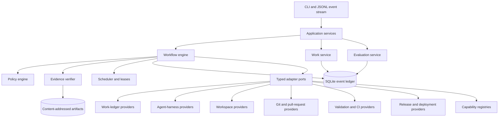
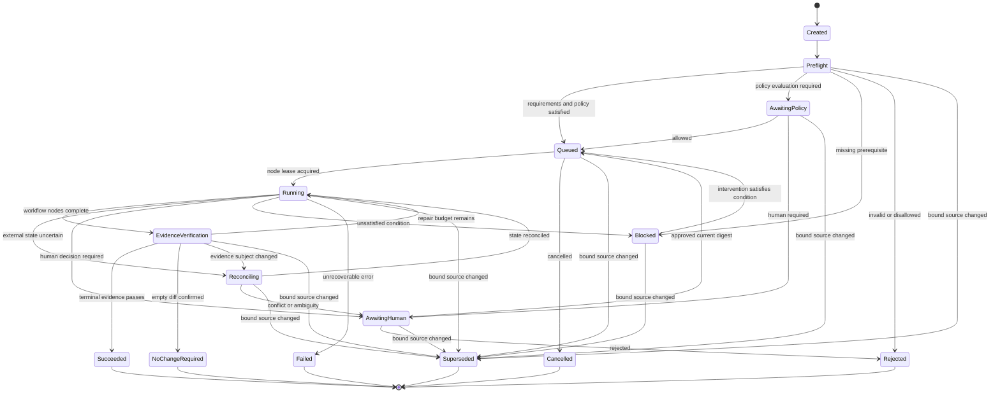
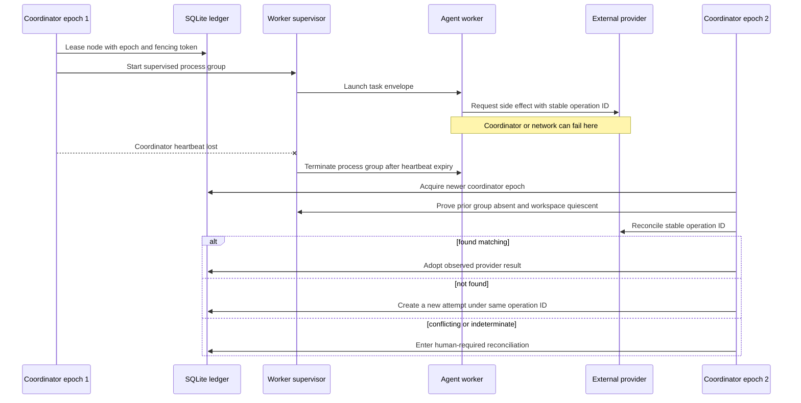
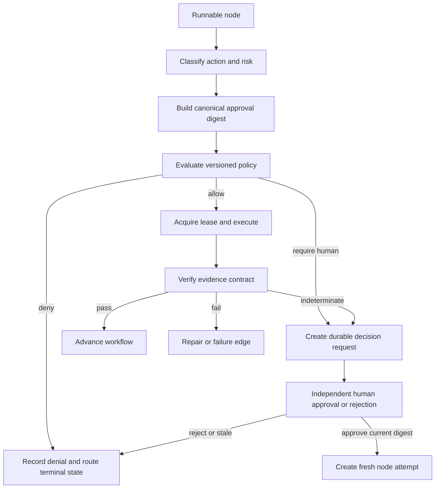
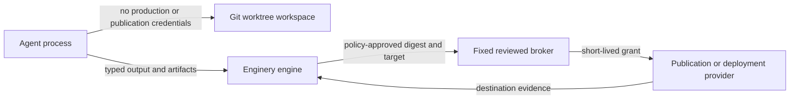
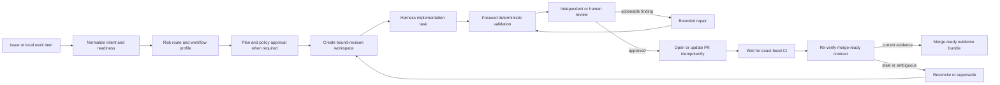
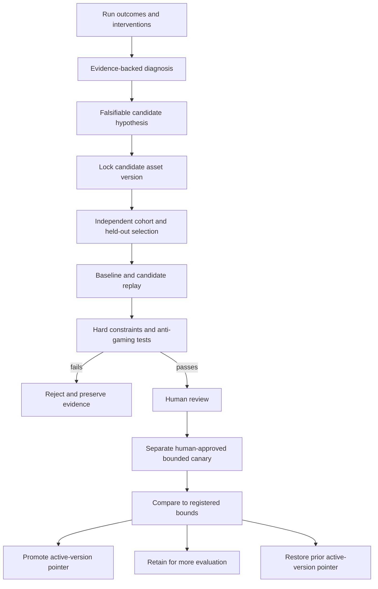

# Enginery System Design

- **Status:** Approved implementation ground truth
- **Date:** 2026-07-14; promoted to sole implementation ground truth 2026-07-18
- **Deployment:** Open-source, local-first Python modular monolith
- **Primary interfaces:** CLI and versioned JSON Lines event stream

> **Design contract:** The workflow is the durable unit of engineering behavior. Agents are replaceable workers assigned to typed workflow nodes.

This document is the authoritative, implementation-grade specification for Enginery. Every milestone plan and `/goal` execution prompt in the private planning directory cites sections of this file, `docs/overview.md`, `docs/pitch.md`, and `docs/workflows.md` as its `SOURCE OF TRUTH`. That planning directory is gitignored and never ships with the repository; it must never be cited by filename or section number from tracked code, comments, or documentation. This file may be cited freely — it is tracked and ships with every checkout.

## 1. Scope and design goals

Enginery coordinates engineering work across ticket-style work ledgers, coding-agent harnesses, git workspaces, validation systems, source control, releases, deployment brokers, and capability registries. It must make work resumable, evidence-backed, policy-governed, and inspectable without making its domain model depend on any one provider.

### Goals

1. Execute explicit, immutable, versioned engineering workflows.
2. Persist enough state and evidence to resume, reconcile, replay, inspect, and compare work.
3. Separate deterministic operations from probabilistic agent work.
4. Gate every consequential action through a recorded, versioned policy decision.
5. Use a dedicated workspace for every code-changing run.
6. Bind outcomes to exact source, workflow, policy, adapter, capability, configuration, and evidence versions.
7. Improve factory assets only through candidate evaluation, human decisions, bounded canaries, and reversible activation.
8. Remain usable as a local application without a hosted control-plane service.

### Non-goals for the first release

- A foundation model or a bespoke coding-agent loop.
- A hosted multi-tenant service, organization RBAC, browser dashboard, or interactive TUI.
- A distributed scheduler, Kubernetes layer, or mandatory container runtime.
- Hostile-code containment on the git-worktree backend.
- Production or publication credentials in agent processes, arbitrary command nodes, or workspaces.
- Online mutation of active workflows or generic user-programmable workflow manifests.
- Universal support for every tracker, source host, CI system, or deployment provider.
- Outcome comparison and governed factory self-improvement (Stage 4) as first-release deliverables; both are retained as gate-deferred design targets (Section 17).

## 2. Relationship to existing projects

### 2.1 Armory

Armory remains a catalog and distribution surface for skills, agents, hooks, rules, commands, utilities, and presets. Enginery can consume Armory through a capability-registry adapter that discovers packages, resolves versions, materializes approved capabilities, and records content digests. Enginery must not depend on Armory for its domain model or execution kernel; other registries and repository-local capabilities must remain valid providers. No package migration is required — add the Armory capability-registry adapter only after Enginery's capability lock and provenance model exist (Section 11.8), and never let the engine import Armory internals.

Portfolio contract:

```text
Armory equips agents.
Enginery directs engineering.
Agent harnesses perform assigned work.
Repositories and delivery systems receive verified outcomes.
```

### 2.2 sage-dev

`sage-dev` contributes requirements and test scenarios, not runtime architecture. Reusable concepts include hierarchical tickets and dependencies, explicit ticket states, feature-to-research-to-specification-to-plan-to-task traceability, sequential and parallel execution, isolated subagents, resumable state, validation scripts, and GitHub synchronization. Enginery must not reuse `sage.stream` or preserve its coupling among Markdown prompts, shell, `jq`, git operations, confirmations, scheduling, and agent spawning.

Migration policy, once the work-item schema stabilizes:

1. extract ticket and workflow behavior into neutral fixtures;
2. stabilize the work-item and event schemas (delivered in M2);
3. implement a one-time `.sage/tickets` importer;
4. validate imported dependencies, states, external references, and provenance;
5. publish migration guidance;
6. archive or redirect `sage-dev` only after the new product demonstrates functional replacement.

Enginery must not promise command-level compatibility with `/sage.*` workflows — it preserves data and intent, not accidental interfaces.

## 3. Architectural style

Enginery begins as a modular monolith. This keeps transaction boundaries, event ordering, recovery semantics, and local operations understandable while preserving strict dependency boundaries. A process boundary is introduced only after a measured requirement justifies it.



### Package boundaries

```text
domain/       Immutable domain types, state transitions, schemas, invariants
application/  Use cases and ports; coordinates domain behavior
engine/       Workflow scheduling, process managers, leases, recovery
ledger/       SQLite event store, projections, inbox, outbox, migrations
policy/       Action schemas, hard rules, approval digests, decisions
evidence/     Evidence contracts, verification, terminal claims
evaluation/   Outcomes, cohorts, replay, comparison, canaries
adapters/     Provider implementations and normalization boundaries
cli/          Commands, JSON output, JSONL streaming, exit codes
```

Dependency rules are strict:

- `domain` imports no application, ledger, adapter, infrastructure, or CLI package.
- `application` depends inward on `domain` and outward only through declared ports.
- `engine`, `policy`, `evidence`, and `evaluation` do not import provider SDKs.
- Provider-native objects enter and leave only through `adapters`.
- `cli` owns presentation and invokes application services; it never implements domain transitions directly.

### Runtime topology

The first release permits one active coordinator lease per SQLite ledger. That coordinator schedules every run in the ledger and is the only process allowed to transition domain aggregates, grant node leases, or ingest worker results. Workers never write the ledger. Read-only CLI commands may run concurrently. Mutating CLI commands append typed operator commands to a transactional inbox; the coordinator consumes them, it never lets a CLI invocation transition an aggregate directly. If no coordinator is active, a mutating command can acquire a new coordinator epoch and process the inbox. A later resident daemon can reuse the same application services, inbox, and event stream.

Every coordinator lease carries a monotonically increasing epoch. Node leases and ingested worker events carry that epoch plus a node fencing token. The ledger rejects a transition or worker result whose epoch or fencing token is no longer current.

## 4. Core invariants

| Invariant | Consequence |
|---|---|
| **Workflow over agent** | Changing a harness does not change workflow lifecycle semantics. |
| **Deterministic code before probabilistic work** | Use deterministic code wherever inputs, transformation, and correctness criteria are specifiable; never spend agent context rediscovering a fact that can be calculated reliably. |
| **Durable state over conversation** | The ledger, not a transcript, determines resumability and current state. |
| **Evidence over confidence** | Agent self-report is an artifact; only satisfied evidence contracts support success. |
| **Policy-gated autonomy** | There is no global auto mode; each consequential action is allow, deny, or require-human. |
| **Explicit escalation** | Ambiguity, missing context, exhausted repair, policy denial, conflicts, stale evidence, and uncertain external outcomes produce named states; no fallback may conceal a failed precondition. |
| **Version-bound execution** | Adapter fingerprint or configuration drift blocks resumption; no silent migration. |
| **Reconcile before retry** | Ambiguous external effects are inspected before another side effect is attempted. |
| **Workspace honesty** | Worktrees isolate repository changes, not hostile processes. |
| **Factory changes are production changes** | Active workflow assets are immutable; candidates are independently evaluated before activation. |

These ten invariants are what "workflow integrity" means in practice: durable, evidence-gated, policy-governed execution that survives crashes and rejects stale claims. The next subsection states precisely where that guarantee ends.

### Safety scope and claim boundary

Enginery protects **workflow integrity**, not host integrity. Its first backend is designed to prevent unauthorized workflow transitions, acceptance of stale or incomplete evidence, and blind retries of supported external actions. It also keeps production and publication credentials in fixed broker code rather than agent processes or workspaces. These controls do not contain a malicious, compromised, or prompt-injected agent process: a worktree process can still reach the user's account, filesystem, network, keychain, and other host processes. Stronger execution-containment claims require a separately designed container or VM backend with constrained mounts, network policy, and a distinct operating-system identity.

Every public claim must name its boundary. "Reconciliation before retry" applies only to adapter operations with a stable provider-visible operation ID and a deterministic reconciliation query. It does not make a provider operation atomic, revoke an already-issued request, or establish that competing products lack an equivalent mechanism.

## 5. Domain model

| Aggregate or value | Purpose | Required fields |
|---|---|---|
| `WorkItem` | Normalized engineering intent | Internal stable ID; work kind (`issue`, `plan`, `milestone`, `incident`, `factory_change`); source provider and external reference; immutable source snapshot reference; title; structured objective; acceptance criteria; constraints; risk class; repository targets; dependencies; lifecycle state; aggregate version |
| `WorkflowDefinition` | Immutable directed graph | Typed input/output schemas; node declarations; dependencies and branch conditions; concurrency constraints; evidence contracts; repair edges; retry/time/cost budgets; policy hooks; terminal states; compatibility metadata; content digest |
| `Run` | One workflow instance | Work-item snapshot; workflow definition and digest; repository and base revision; policy-set version; adapter versions; capability lock; environment manifest; configuration snapshot; aggregate version |
| `NodeAttempt` | One attempt to execute one node | Run and node IDs; attempt number; assigned actor; input digest; lease owner and expiry; timestamps; status; emitted-event range; outputs and artifacts; evidence result; cost and duration observations; failure class; reconciliation state |
| `Artifact` | Content-addressed output | Digest and byte size; media type; artifact kind; producing run/node/attempt; storage reference; redaction classification; creation time; schema version |
| `PolicyDecision` | Durable authority decision | Requested action; normalized inputs; matched policy rule and version; result (`allow`, `deny`, `require_human`); rationale; required evidence or approver; decision time; supersession status |
| `Intervention` | Human input | Approval, rejection, correction, supplied fact, waiver, override, or manual external action; linked to the affected run state; retained as an evaluation signal |
| `Outcome` | Post-execution observation | PR accepted/rejected/abandoned; merge result; CI stability; release result; deployment result; rollback; reopened issue; escaped defect; user-rated quality; never rewrites prior work history |
| `FactoryChange` | Candidate workflow-system change | Affected asset and baseline version; evidence-backed problem statement; falsifiable hypothesis; candidate version; evaluation set; comparison result; approval state; canary cohort; promotion or rollback result |

External labels, comments, users, and states are mapped at the adapter boundary; provider-specific terminology (for example GitHub-specific vocabulary) must not leak into the core model. Artifact kinds are illustrative examples (plans, patches, transcripts, logs, test reports, review reports, PR metadata, release manifests, evaluation results, human decisions), not an exhaustive vocabulary. Retries create new `NodeAttempt`s; they never overwrite prior attempts. Outcomes never rewrite a completed work item — a reopened issue or escaped defect creates a new linked work item and retains the prior item and outcome unchanged.

### Work-item lifecycle states

```text
new -> qualifying
qualifying -> ready | blocked | rejected
ready -> active | cancelled
active -> outcome_pending | blocked | cancelled | failed
blocked -> qualifying | active | rejected | cancelled
outcome_pending -> completed | blocked | failed
```

External providers can expose fewer or different states; adapters project internal state without changing internal semantics. A transition into `blocked` records the prior state and unsatisfied condition. When an intervention satisfies that condition, the item returns to `qualifying` if intent or readiness changed, or to `active` if execution can resume from its durable run state.

### Run and node-attempt lifecycle states



Terminal run states: `succeeded`, `blocked`, `rejected`, `cancelled`, `failed`, `superseded`. `run` transitions into `superseded` from every state where source divergence can occur; a successful run means the workflow's terminal evidence contract passed, not that merge, deployment, or real-world success followed unless those outcomes are part of that workflow.

Each attempt separately follows `pending -> leased -> running -> output_pending -> evidence_pending -> passed | failed | cancelled | timed_out`. A side-effecting attempt may enter `reconciling` only from `running`; `found_matching` adopts the provider result into `output_pending`, `not_found` closes the attempt with a classified failure and permits a fresh attempt under the same operation ID, and `found_conflicting` or `indeterminate` moves the run to `awaiting_human` or `blocked`. Policy evaluation always happens before a side-effecting lease; an approval creates a fresh attempt from a durable checkpoint, never resumes an unleased process.

The work-ledger adapter owns source-watch events and polling cursors. It computes the deterministic digest of bound objective, acceptance criteria, constraints, dependencies, and repository targets. The coordinator compares that digest at preflight, before every approval, before every side effect, before terminal evidence verification, and on adapter notifications. A difference atomically records source supersession, fences the active lease, invalidates dependent approvals and evidence, and transitions the run to `superseded`. Continuation creates a new run from the new snapshot; it never mutates the old run.

### Factory-change lifecycle states

```text
proposed -> evaluation_ready -> evaluating -> review_required
         -> rejected
review_required -> canary_ready -> canarying -> promoted
                 -> rejected
canarying -> retained | rolled_back
retained -> evaluation_ready | canary_ready | rejected
```

Workspace reservation and node execution leases are separate. A run reserves its workspace until terminal cleanup, including while awaiting human action. Node leases expire and are never held during a human wait. The reserved workspace remains immutable to other runs until the run resumes, is cancelled, or an operator explicitly abandons it.

## 6. Durable state, transactions, and artifacts

SQLite is the authoritative local event ledger and projection store. Large artifact bytes reside in a content-addressed filesystem store. This is narrow event sourcing: events and projections are durable runtime facts, while repository contents, configuration files, and artifact bytes remain ordinary files.

Artifact publication uses a two-phase protocol. Bytes are written to a unique temporary path, streamed through the digest calculator, `fsync`ed, and atomically renamed to the digest path before any SQLite command may reference them. The transaction then records immutable metadata and references only the completed digest path. A startup and `ledger verify` sweep deletes abandoned temporary files, detects a metadata reference with absent or digest-mismatched bytes, and blocks evidence use or run resumption until an operator restores or discards the affected state. Cleanup never deletes a digest referenced by retained ledger metadata.

A local state-changing command uses one SQLite transaction to:

1. check every expected aggregate version;
2. append typed events;
3. record only already-published artifact metadata;
4. update node leases, scheduling state, or persisted process-manager state;
5. update deterministic projections from versioned events;
6. persist outbox entries for external projections; and
7. increment aggregate versions and a local commit sequence.

External calls never run inside that transaction. The outbox enables eventual external projection; the run remains responsible for reconciling provider state. A monotonically increasing local commit sequence supports JSONL cursors and deterministic replay order. Aggregate version and causation/correlation IDs preserve the actual domain-causality model. Projection rebuild validates event-schema migrations in order, stops on an unsupported schema, and uses causation/correlation rather than commit sequence alone to interpret cross-aggregate work.

Required transaction properties: optimistic concurrency prevents duplicate transitions; leases have expiries and fencing tokens; projections can be rebuilt from events; event payloads and schemas are versioned; sensitive fields are redacted before persistence; artifact digests are verified on read; backups can be created while the coordinator is stopped; migrations are explicit, reversible where feasible, and verified before startup; event order is total per aggregate, not globally distributed.

### Recovery topology



The first release permits one active coordinator per ledger. Workers never write domain aggregates. Mutating CLI commands append typed commands to an inbox; the coordinator consumes them transactionally. Every coordinator epoch and node lease uses fencing. A stale worker result is rejected even if a prior process survives. The supervisor owns the workspace lock and records process ID, process-group ID, process-start identity, lease token, and heartbeat deadline. On lease fencing or heartbeat expiry it sends termination to the process group, waits for observed exit, releases the lock only after a clean workspace inspection, and persists each observation. A replacement coordinator may re-lease only after it verifies those records and the live process identity.

This protocol protects against accidental orphan continuation; it is not hostile-process containment. If process identity, termination, or workspace quiescence cannot be established, automatic resumption is prohibited. A child workflow is a distinct run linked to its parent; it retains its own event history and evidence bundle.

## 7. Workflow model and scheduler

A repository-owned manifest defines orchestration, not arbitrary code. It may declare registered node type, typed inputs/outputs, dependencies, branch conditions, parallel groups, subworkflow invocation, evidence contract, retry/timeout/budget limits, policy action, and terminal-state mapping. It cannot embed arbitrary shell or a general-purpose programming language.

Executable behavior lives in typed, tested modules. The registered node families are: normalize work; request human decision; execute agent task; run command; verify evidence; route; fan out and join; invoke subworkflow; update external work ledger; create or clean workspace; stage or apply patch; open or update pull request; wait for CI; merge; prepare or publish release; deploy or roll back; compare evaluations; promote workflow.

Every node declares its input/output schemas, actor type, side-effect class, idempotency behavior, reconciliation operation (when side effects are possible), evidence contract, emitted event types, policy action, and required adapter capabilities.

Prompt, skill, agent, and rule assets are files with a version or content digest, declared variables, expected output schema, compatibility requirements, provenance, and licensing metadata where externally sourced. The runtime passes these assets to a harness adapter; it does not reinterpret harness-specific package formats inside the domain core.

The scheduler performs deterministic readiness calculation. It selects nodes only after dependencies, resource limits, workspace requirements, budgets, and policy are satisfied. It enforces bounded global and per-repository concurrency, fairness across active runs, exclusive workspaces, lease renewal and fencing, cancellation propagation to process groups and child runs, dependency-aware fan-out and join, no duplicate execution after coordinator restart, explicit handling of orphaned workers, and queue state visible through the CLI and JSONL events.

## 8. Policy model

Policies evaluate named actions rather than workflow names.

Initial action namespace:

```text
workspace.create
agent.execute
credential.grant
network.request
capability.materialize
evidence.non_applicability.accept
review_finding.waive
pull_request.open
pull_request.merge
release.prepare
release.publish
deployment.execute
deployment.rollback
factory_change.propose
factory_change.canary
factory_change.promote
policy.override
```

Policy inputs include work kind and risk class, repository and changed paths, requested capability, workflow and policy versions, evidence status, retry and budget consumption, validation profile, release type, credential request, prior interventions, and external protection state. Results are `allow`, `deny`, or `require_human`.

An action with no matching policy rule is denied. Adding a new action requires an explicit rule; a generic override cannot authorize an unknown action. `policy.override`, `evidence.non_applicability.accept`, `review_finding.waive`, `factory_change.canary`, and `factory_change.promote` always require an interactive human decision from an approval channel unavailable to agent workers, and the approving actor must be distinct from the requesting run and producer.

Every action type defines a canonical approval schema. Its digest binds all normalized policy inputs, the exact work snapshot, effective configuration, workflow and policy versions, adapter and capability locks, target resource, diff or artifact digest, acceptance-criteria snapshot, and evidence-bundle digest, using explicit nulls for fields that do not apply. Missing required fields make the request invalid. Any change to a bound field supersedes the approval; implementations may not apply a separate "relevance" filter.

CLI flags cannot bypass policy silently. A permitted override is a recorded `policy.override` request with reason, exact scope, human actor, expiry, and superseded input digest.

The non-overridable hard-rule set is closed and testable:

1. unknown actions are denied;
2. production and publication credentials are confined to fixed broker code and never enter an agent process, workspace, arbitrary command node, or agent-authored executable;
3. an actor cannot approve its own output, waiver, non-applicability claim, factory change, or override;
4. approval input digests and supersession checks cannot omit action-schema fields;
5. hard-required evidence, including current-subject CI and configured security gates, cannot be waived, removed, or relaxed by `policy.override`;
6. stale work, base, head, artifact, or evidence subjects cannot satisfy a terminal contract;
7. an ambiguous side effect must reconcile before retry;
8. active factory assets cannot be mutated in place, and held-out evaluation inputs cannot be exposed to the candidate;
9. candidates affecting policy, evidence, merge, release, publication, deployment, credentials, migrations, or rollback cannot control production actions during canary;
10. a capability added or changed by the active run requires an interactive human `capability.materialize` decision before that run can execute it.

Changing this set requires a versioned policy-schema and design migration, not an override. This governance protects the workflow from accidental or delegated authority; the worktree backend does not defend against a malicious process running as the same operating-system user.

### Action-scoped authority flow



The coordinator is the sole actor that creates an approval request, evaluates policy, grants a lease, ingests a worker result, and commits a terminal transition. An approval channel authenticates an `AuthorityPrincipal` with a stable ID, role, and authorization source; workers cannot invoke that channel. Every intervention stores requester, approver or rejector, action schema, exact digest, decision time, expiry, and supersession state. Cancellation may be requested by the operator or policy, but the coordinator alone records it, fences the attempt, and directs the supervisor to terminate the process group.

### Single-operator authority model

Separation rules fall into two classes. **Producer separation** requires the approving principal to be distinct from the principal that produced the output, waiver subject, non-applicability claim, candidate, or override request. A single-operator deployment satisfies this in the common case: the producer of workflow output is a run or agent principal, so the sole human operator is a distinct principal and may approve it. A human cannot approve an artifact recorded under their own actor identity. **Dual-human separation** requires two distinct human `AuthorityPrincipal`s and applies to factory-change canary approval versus promotion approval (Section 12.4). A single-operator deployment cannot satisfy dual-human separation; this is a declared limit, not a waivable gap.

Policy approvals bind the complete action schema — including explicit nulls — plus work snapshot, configuration, workflow and policy versions, adapter/capability locks, target, diff or artifact digest, acceptance criteria, and evidence bundle. Any change to a bound input supersedes the approval.

## 9. Evidence and terminal contracts

An evidence item records its type and schema version, producer, subject revision or resource, observed time, validity window, pass/fail/indeterminate result, artifacts, and verifier version.

Only `pass` satisfies a requirement. `fail` takes a declared repair or failure edge. `indeterminate` never becomes success; it follows an explicit edge and defaults to blocked or human-required. Hard-required evidence cannot be waived or relaxed by an override. Non-applicability claims and review-finding waivers are separate policy actions that always require an interactive human decision; the producing run cannot approve its own claim or waiver. Medium- and high-risk work requires human final review in the first complete release. Lowest-risk work may use an independent agent reviewer only when it runs through a different harness or model family and receives a minimized, instruction-stripped evidence view rather than the producer's untrusted prompt context.

### Merge-ready contract

A pull request is `merge_ready` only when:

- acceptance criteria map to implementation evidence or independently approved non-applicability;
- at least one criterion has positive implementation evidence tied to a non-empty expected diff;
- required validation, static analysis, and review conditions pass;
- CI passes for the exact head commit under verification;
- the diff matches the recorded base and head;
- no unresolved conflict remains;
- PR metadata links the work item and evidence bundle;
- policy permits the terminal transition; and
- the exact verified head SHA is recorded.

The verifier reads the work revision, base SHA, head SHA, PR state, and CI subjects twice: before evidence collection and immediately before committing the terminal transition. Any difference routes back to reconciliation. An all-non-applicable or empty-diff run is not merge-ready; it becomes `no_change_required` after human confirmation.

The double-read narrows the verification race; it does not eliminate it. A window remains between the second read and the terminal-transition commit in which an external subject can change. Where a provider supports conditional operations (for example an ETag or `If-Match` precondition), the verifier must bind its terminal claim to the observed subject version. Where it does not, the residual window is a declared limit: a later external mutation is caught by the adapter's source watch or the next reconciliation, which removes the merge-ready projection and creates a re-verification run. Merge itself remains a separately policy-gated action, which bounds the consequence of the residual window.

### Released contract

A work train is `released` only when: required constituent work is merged; version and changelog match release policy; package or deployment smoke checks pass; tag and release artifacts reference the intended commit; publication is verified from the destination; a tested rollback capability satisfies the applicable release-risk policy (or an independently approved remediation procedure exists for an irreversible publication destination); and external work state and local evidence are reconciled.

### Outcome separation

Node completion, evidence satisfaction, policy approval, workflow success, and external outcome are distinct and never conflated. This prevents a successful workflow execution from being misreported as successful production behavior.

## 10. Adapter boundary

Adapters normalize provider behavior and do not export provider SDK objects into the core.

### General adapter requirements

Every adapter must: expose identity, version, and capabilities; validate configuration before use; normalize provider data at its boundary; receive a persisted operation ID for each side effect and either use native provider idempotency or implement the four-result reconciliation query defined in Section 7's reconciliation invariant; classify failures as permanent, transient, policy, authentication, rate-limit, conflict, or ambiguous; emit redacted diagnostic events; provide focused contract tests; and avoid hidden fallback to another provider.

Do not add a general plugin framework before two real implementations require the same extension point. Once required, use Python package entry points with explicit API-version negotiation.

| Port | First implementations | Contract requirements |
|---|---|---|
| Work ledger | Local ledger, GitHub Issues | Ingest source records/snapshots; map into `WorkItem` data; publish internal lifecycle projections; append evidence summaries; receive updates by polling or event input; reconcile external/internal versions; preserve external IDs and cursors. Must support Jira, Linear, GitLab, repository files, or custom ledgers without changing the core work-item model. |
| Agent harness | OMP and Claude Code | Probe installation/capabilities; start a worker from a typed task envelope (workspace path, objective, acceptance criteria, constraints, permitted capabilities, evidence requirements, time/cost budgets, artifact return locations); stream normalized structured events and redacted opaque text output; interrupt or cancel; obtain terminal status; collect declared outputs and evidence; report actual harness/model metadata when available. |
| Workspace | Git worktree with child-process policy | Create from an exact revision; assign exclusive ownership; construct a clean environment allowlist; materialize approved capabilities; grant credentials explicitly; start/cancel process groups; record declared filesystem/network policy; detect unexpected changes; snapshot outputs; clean or retain for diagnosis. |
| Source control and PR | Local git and GitHub | Resolve revisions; calculate changed files and diff digests; create branches/commits through policy-approved actions; detect base advancement and conflicts; open or update PRs idempotently; inspect head SHA, review state, and mergeability; merge only under explicit policy; reconcile uncertain remote mutations. |
| Validation and CI | Local commands and hosted CI | Share normalized evidence results across local and hosted providers. A CI result is valid only for the exact commit bound to the evidence contract; stale green checks cannot satisfy merge readiness. |
| Release and deployment | Fixed brokers plus controlled local service | Treat release preparation, artifact publication, deployment, observation, and rollback as distinct capabilities; never imply publication succeeded from a successful local command alone — destination verification is required. |
| Capability registry | Repository-local assets and optional Armory | Discover and lock skills, agents, hooks, rules, commands, utilities, and presets. Repository-local assets remain valid without any registry. |

A run probes adapter identity, version, and capability fingerprint before each attempt. A matching content-addressed adapter can continue; a mismatch blocks the active run as `adapter_version_unavailable` and the run cannot silently migrate. Continuing with a different adapter requires a superseding run with a new configuration lock. Read-only reconciliation may use a newer adapter only when it declares backward-compatible reconciliation for the bound operation schema, and that decision is recorded.

Provider-native event objects never cross the agent-harness adapter boundary. The adapter maps structured fields into versioned domain events and treats process output as opaque text; credential-source fields are removed before persistence, and remaining output passes redaction and is stored as a sensitivity-classified artifact rather than as trusted structured data.

Before materialization, registry capabilities require a `capability.materialize` policy decision over the exact digest and provenance. Repository-local capabilities already present in the bound, reviewed base revision may be trusted by policy; a capability added or changed by the active run requires interactive human approval before that run can execute it. Authenticated external provenance means a publisher signature verified against a pinned key or an equivalent registry signature chain — TLS or transport identity alone is insufficient and requires human approval of the exact digest. Content addressing prevents later mutation; it does not establish initial trust.

### Two independent harness adapters

Two harness adapters share the port above without either becoming mandatory or a fallback for the other: OMP (`OmpHarness`) and Claude Code (`ClaudeCodeHarness`, headless `claude -p --output-format stream-json`). A run's execution configuration names exactly one configured harness provider; an unconfigured or missing provider is a diagnostic failure, never a silent substitution.

Both adapters:

- probe by running the CLI's own version command and report `AdapterAvailability.UNAVAILABLE` (CLI absent) or `MISCONFIGURED` (unexpected output) with no fingerprint, never a fallback to the other provider;
- normalize their own event schema into the same `NormalizedAdapterEvent` kinds (`STARTED`/`PROGRESS`/`DIAGNOSTIC`/`TERMINAL`), rejecting unknown or malformed lines as a classified failure rather than skipping them;
- redact output before artifact publication;
- have no CLI-level timeout flag; the coordinator's lease/heartbeat expiry calls the same cancellation entry point an operator would, so a timeout and an operator cancellation are the same code path and the same reported outcome;
- run through the same coordinator-supervised dispatch path, sharing the provider-neutral worker-supervision entrypoint;
- report harness/model metadata from observed output rather than a hardcoded model ID — a model identity is only ever taken from what the harness itself reports.

A shared parametrized fixture exercises unavailable-harness diagnostics, malformed-output rejection, a clean run's terminal status, and cancellation identically against both adapters, and asserts that neither the shared task envelope nor the shared running-worker identity type carries a provider-named field.

Claude Code is optional installation, exactly like OMP: neither is required to exist on the host. Probing is the only supported way to determine availability; there is no compile-time or configuration-time requirement that both be installed.

## 11. Credentials and trust boundaries

Treat repository content, issue text, agent output, external comments, tool output, and downloaded capabilities as untrusted input.

Production and publication credentials are confined to fixed, reviewed brokers outside the agent workspace. A broker exposes a typed API whose schema rejects free-form commands, scripts, environment maps, and unapproved targets. It starts from a scrubbed environment, obtains a short-lived grant only after the coordinator records the policy-approved action digest, and records grant identity, scope, issuance, expiry, revocation result, target, and resulting provider operation ID. It binds an approved artifact digest and target, calls a fixed provider API, and never evaluates agent-authored code under broker credentials.

Credential-source fields never enter event or artifact serialization. Harness and command output is redacted for known secret patterns, sensitivity classified, and stored as an artifact where necessary. This is not an absolute promise to detect all unknown secret formats. Retention, deletion, backup, and operator access policy therefore apply to every sensitivity-classified artifact; a missing redaction guarantee is not permission to persist unrestricted output.



### Commands

Deterministic nodes use argument vectors rather than implicit shells; shell execution requires an explicit node type and policy. Cancellation terminates the process group. Command, working directory, environment-key names, exit code, duration, and output artifacts are recorded, and secrets are omitted or redacted.

### Workspace limitations

The worktree backend reduces accidental interference. It does not prevent a process from accessing the user account, network, filesystem, keychain, or other processes. Untrusted workloads require a future container or VM backend.

### Supply chain

Capabilities and workflow assets are content-addressed and locked per run. Content addressing prevents mutable reference drift but does not establish trust. External provenance requires a verified signature chain against a pinned publisher identity or exact-digest human approval; a mutable remote reference cannot change an in-flight run. A capability added or changed by an active run cannot execute until an interactive human approves its exact digest.

## 12. Four end-to-end workflows

### 12.1 Issue to merge-ready pull request



**Inputs:** GitHub issue or local work item; repository and base revision; policy profile; optional capability constraints; optional human-supplied context.

**Terminal states:** `merge_ready`, `blocked`, `rejected`, `cancelled`, `failed`, `superseded`.

**Acceptance criteria:** coordinator termination during any resumable node does not duplicate completed side effects; a stale CI result cannot produce `merge_ready`; changing issue acceptance criteria supersedes affected approval and evidence; exhausted repair attempts escalate with the failed evidence attached; two concurrent runs cannot own the same workspace; cancellation terminates child processes and records the cleanup outcome; the same work item can be processed from GitHub or the local ledger without changing domain behavior.

The workflow stops at merge readiness — merging is a separate policy action in the release workflow.

### 12.2 Plan to verified release

A validated plan becomes linked child work items and runs. Dependency cycles and unresolved dependencies fail before execution. Independent milestones may run concurrently within repository limits; dependent work waits at hard barriers. Branch ancestry is stored separately from work dependencies. After fresh current-head evidence at each merge, fixed brokers prepare version/changelog data, build artifacts, publish only after policy approval, then verify destination version and artifact digest.

**Inputs:** validated development plan; target repositories; dependency and stack hints; declared release target and policy; verification requirements.

**Terminal states:** `released`, `release_no_go`, `blocked`, `cancelled`, `failed`.

**Acceptance criteria:** dependent milestones never start before required predecessors are merge-ready or merged according to plan policy; independent milestones run concurrently without workspace collision; stale child CI after PR retargeting cannot satisfy a merge gate; version/changelog preparation cannot begin before implementation gates pass; ambiguous publication triggers reconciliation rather than republishing; a release is not marked complete until destination verification succeeds; partial release-train failure preserves enough state for targeted resumption.

### 12.3 Incident to verified hotfix and rollback

The incident workflow freezes available evidence, identifies affected release lineage, separates containment from remediation, establishes a falsifiable failure or declares reproduction unavailable, creates a correct-lineage workspace, implements the smallest remediation, and verifies a non-vacuous guard where feasible. A controlled local service exercises deployment and actual rollback before a production-authoritative claim is possible. Deployment and rollback are separately authorized. Post-deployment observation binds to the deployed revision; follow-up work remains separate.

**Inputs:** incident record; operational evidence; affected service and repository references; severity and authority policy; deployment/rollback providers where configured.

**Terminal states:** `hotfix_ready`, `mitigated`, `resolved`, `rolled_back`, `blocked`, `cancelled`, `failed`.

**Acceptance criteria:** no agent process obtains production or publication credentials in its workspace or environment; deterministic deployment and rollback broker actions are separately authorized; the hotfix base revision matches the affected release lineage; unavailable reproduction is visible and cannot be reported as reproduced; regression verification is non-vacuous where the system can establish it; rollback is exercised against the controlled target and observed to restore the prior revision before production deployment; post-deployment observation belongs to the deployed revision; follow-up work remains separate from emergency remediation.

### 12.4 Governed factory self-improvement



The proposer cannot select cohorts, inspect held-out inputs, weaken hard evidence, or approve its own candidate. Baseline and candidate operate on identical registered cohorts. Candidates affecting policy, evidence, merge, release, publication, deployment, credentials, migrations, or rollback run only on controlled non-production targets or baseline-authoritative shadow mode.

`FactoryChange` records immutable principal IDs for proposer, cohort selector, evaluator, canary approver, and promotion approver; the policy engine rejects an overlapping identity where separation is required. Canary approval and promotion approval are dual-human separations: two distinct human principals are required (Section 8's single-operator authority model), which a single-operator deployment cannot provide. This workflow is executable only in deployments with at least two registered human principals. An `ActiveFactoryPointer` contains asset name, active digest, monotonic version, prior digest, and last approved change ID. Promotion is a compare-and-swap transaction over the expected active digest and pointer version, the approval digest, and the candidate digest.

**Inputs:** historical run cohort; outcome observations; intervention and failure records; baseline factory-asset versions; evaluation policy.

**Restrictions:** no in-place edits to active factory assets; no self-approval; no deletion or selective omission of unfavorable evaluation cases without recorded review; no metric improvement may compensate for a hard safety or evidence regression; sanitized historical inputs must preserve provenance without persisting secrets; a candidate cannot train or evaluate on outcome information unavailable at original decision time when replay validity depends on temporal causality; cohort-selection criteria come from a fixed registry or independent evaluator and cannot be authored or changed by the proposing run; held-out population, adversarial cases, and their random seed or selection digest remain unavailable to the candidate until evaluation completes; "reversible" requires a tested rollback that restores the prior state within the declared observation window — a merge or irreversible publication does not qualify.

**Acceptance criteria:** at least one real candidate change is evaluated against evidence from earlier workflows; baseline and candidate use the same pre-registered development and held-out cohorts; candidate performance is measured on a held-out set the proposal did not construct or inspect; all exclusions are recorded, independently reviewable, and applied equally to baseline and candidate; evaluation outputs are reproducible from locked inputs and versions after held-out evaluation completes; promotion and canary entry require separate human decisions and a rollback reference; canary scope and maximum work-item count are explicit — policy-, evidence-, merge-, release-, publication-, deployment-, credential-, migration-, or rollback-affecting changes use a controlled non-production target or baseline-authoritative shadow mode; regression triggers rollback without mutating historical evidence.

## 13. Evaluation and metrics

Do not optimize one aggregate success score. Track raw observations and versioned derivations.

Initial scorecard: evidence-complete completion rate; first-pass validation rate; repair attempts; human interventions by type; human review time; queue, lead, and execution time; harness-reported model usage and cost when available; cancellation and timeout rate; external-provider failure rate; escaped-defect and reopen rate; rollback rate; policy-override rate; reproducibility rate; cleanup failure rate; user-rated outcome quality; outcome-capture completeness and indeterminate-outcome rate.

Comparisons must use compatible cohorts and show sample size, exclusions, confidence limitations, and distribution changes. Historical raw observations remain immutable when metric formulas change. An outcome not observed within its declared observation window is `indeterminate`, never favorable. Factory comparisons cannot improve by suppressing, delaying, or breaking outcome attribution.

## 14. CLI and event stream

### Command families

```text
enginery init
enginery doctor

enginery work ingest
enginery work list
enginery work show
enginery work reconcile

enginery run start
enginery run list
enginery run inspect
enginery run watch
enginery run approve
enginery run reject
enginery run cancel
enginery run resume

enginery evidence list
enginery evidence show
enginery evidence verify

enginery workflow list
enginery workflow validate
enginery workflow inspect
enginery workflow replay
enginery workflow compare

enginery factory-change propose
enginery factory-change evaluate
enginery factory-change canary
enginery factory-change promote
enginery factory-change rollback

enginery adapter list
enginery adapter doctor
enginery policy explain
enginery gc
```

The executable name is `enginery`. Each milestone in the private development plan implements only the command families its scope covers; `M1` ships `--version` and `doctor` only.

### Output contract

Human-readable output goes to the terminal. `--json` returns one documented result object for bounded commands. `--events jsonl` emits versioned events for long-running commands. Stdout carries requested machine output; diagnostics go to stderr. Exit codes distinguish success, policy denial, human action required, blocked prerequisites, external conflict, cancellation, and internal failure. Mutating commands accept an idempotency key. Watch commands can resume from an event cursor.

## 15. Scalability, failure handling, and limits

The first release scales through bounded local concurrency, not distributed coordination. One ledger has one active coordinator epoch. The scheduler bounds global and per-repository concurrency and preserves exclusive workspace ownership. This supports the initial local operator while avoiding premature distributed-systems claims.

Required failure classes: invalid input; missing prerequisite; policy denial; human action required; transient provider failure; authentication failure; rate limit; external conflict; stale evidence; worker failure; validation failure; timeout; cancellation; ambiguous external side effect; internal invariant violation.

Required recovery scenarios: coordinator exits during a worker run; worker process disappears; harness emits malformed output; issue changes during execution; base branch advances; PR head changes outside the run; CI result belongs to a stale commit; required credential expires; merge conflict occurs; release publication reports an uncertain result; deployment observation is unavailable; cleanup fails; adapter version changes while a run is active; human approval arrives after its input digest is superseded.

Recovery never fabricates success. Coordinator loss follows the supervised-process proof protocol in Section 6; source changes follow the adapter-owned digest watch in Section 5. Ambiguous side effects always enter `reconciling`; uncertain workspace quiescence blocks resumption; blind retry is prohibited.

## 16. Configuration

Use repository-owned TOML for stable project configuration and user-level TOML for machine-specific provider locations and credential references.

Configuration layers, from lowest to highest precedence:

1. product defaults;
2. user configuration;
3. repository configuration;
4. workflow profile;
5. explicitly recorded operational run override.

Run overrides may reduce concurrency, time, cost, or other operational ceilings within the policy-approved envelope. They cannot change normalized work kind or risk, evidence requirements, validation profile, requested capabilities, credential scope, release target, deployment target, or any policy input. Soft policy-relevant changes require a `policy.override` decision and produce a new effective configuration digest; the hard-rule set in Section 8 cannot be overridden. Every effective configuration is materialized, redacted, digested, and stored as an artifact. Environment variables supply secrets by reference or explicit ephemeral operational overrides, not durable workflow policy.

## 17. Verification strategy and staged proof

Tests defend contracts rather than implementation plumbing:

- domain tests assert valid and invalid transitions, schema validation, budgets, and operation-ID stability;
- ledger tests inject conflicts, interrupted writes, migration failures, corrupt artifacts, replay, backup, and restore;
- engine tests inject lease loss, coordinator death, worker orphaning, process-group cancellation, and workspace collision;
- policy and evidence tests exercise default-deny, digest supersession, self-approval prevention, stale evidence, no-op rejection, and hard-rule bypasses;
- adapter contract suites run against every implementation and do not treat local fixtures as proof that live providers work;
- end-to-end tests use temporary repositories and local process workers; opt-in real-provider smoke tests run only against allowlisted test environments;
- factory-change tests use independently authored and parameterized gaming candidates, not fixed candidate names or source-text matching. The detector must reject validation weakening, biased cohort selection, suppressed outcome capture, selective case omission, and overfitting without matching fixed candidate identities or fixture text.

| Stage | Falsifiable gate | Fails when |
|---|---|---|
| 1: Issue to PR | A real issue yields a non-empty, current-head, evidence-complete merge-ready PR; interruption does not duplicate effects; no-op work is rejected. | The diff is empty, every criterion is non-applicable, evidence is stale or indeterminate, CI belongs to another head, a required review is absent, or resumption duplicates an external side effect. |
| 2: Plan to release | A multi-milestone fixture releases through fresh merge evidence, destination verification, and two harnesses satisfying the same contract. | Dependency order is violated, stack evidence is stale, publication is unverified, release state cannot reconcile, or the shared harness fixture does not complete through both shipped adapters. |
| 3: Incident to hotfix | A controlled fault yields a minimal hotfix, observed deployment, actual rollback, and observed restoration with preserved authority records. | The incident cannot be represented honestly, the regression guard is vacuous, credentials reach an agent process, rollback is not actually executed on the controlled target, restoration is not observed, or authority decisions are missing. |
| 4: Self-improvement | A real candidate uses prior evidence, fails held-out anti-gaming checks when unsafe, then is independently canaried and promoted, retained, or rolled back. | The candidate shapes its cohort or held-out cases, suppresses outcomes, weakens hard evidence, overfits fixed fixtures, canaries authority changes against production, lacks separate human canary and promotion decisions, or cannot roll back without mutating history. |

### Release packaging (revised 2026-07-14)

Stage 1 is the `v0.1.0` deliverable, shipped together with the outcome-capture schema so runs emit raw, versioned observations from the first release. Stages 2 and 3 follow as `v0.2` and `v0.3`. Stage 4 is retained as a design target but gate-deferred: its milestones may not start until a data-threshold entry gate passes — completed-run and intervention volume across at least two workflow types and risk classes, an outcome-capture completeness floor, at least one recurring evidence-backed workflow deficiency, corpus diversity beyond a single repository, and the dual-human authority precondition in Section 8. The gate is evaluated on a review cadence, never by elapsed time.

The architecture deliberately defers provider selections that do not alter the domain model: repository owner, second independent harness, first fixture publication provider, controlled deployment target, and timing of stronger workspace isolation or a UI.

Implementation must not convert these gaps into hidden assumptions. The product remains credible only if each phase proves its stated terminal claim with exact evidence and declares limits that remain unimplemented.

## 18. Decisions and rejected alternatives

| Decision | Selected | Rejected | Reason |
|---|---|---|---|
| Repository | New product repository | Armory runtime; in-place sage-dev rebuild | Keeps capability distribution, orchestration, and historical implementation debt separate. |
| Deployment | Open-source local core | Hosted-first; private-first | Preserves local ownership and enables ecosystem validation. |
| Worker model | Harness adapters | Own agent runtime; OMP-only | Keeps focus on workflow engineering and proves provider neutrality. |
| Work intake | Extensible adapter contract; GitHub and local first | GitHub-shaped core; custom board only | Supports any ticket-style ledger without recreating every tracker UI. |
| Isolation | Worktree plus process policy | Mandatory container; two backends initially | Low-friction local operation with honest security limitations. |
| Autonomy | Policy-gated per action | Human at every boundary; zero-touch default | Allows earned autonomy without unsafe global modes. |
| Interface | CLI plus JSONL events | Web UI; TUI | Stabilizes runtime contracts before projection interfaces. |
| Persistence | SQLite events plus filesystem artifacts | Conversation state; remote service; repository files only | Provides local durability, replay, transactions, and recovery. |
| Architecture | Modular monolith | Microservices | Minimizes operational complexity while preserving boundaries. |
| Self-improvement | Candidate evaluation and promotion | Online prompt mutation | Preserves auditability, rollback, and causal evaluation. |
