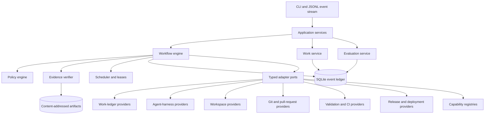
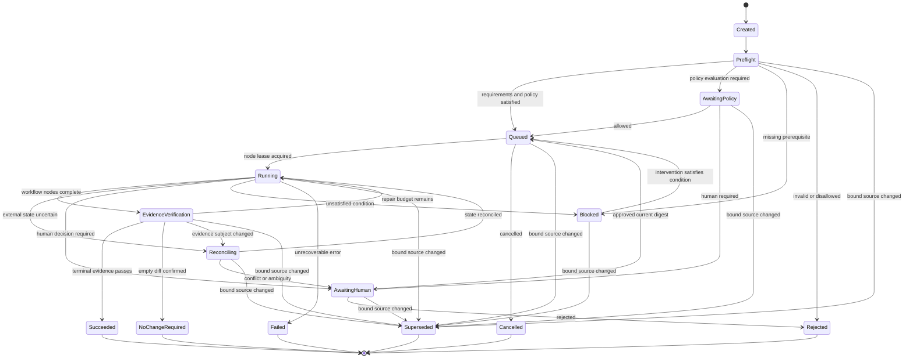
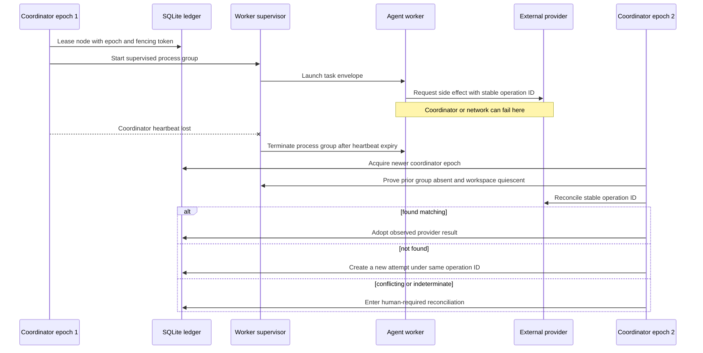
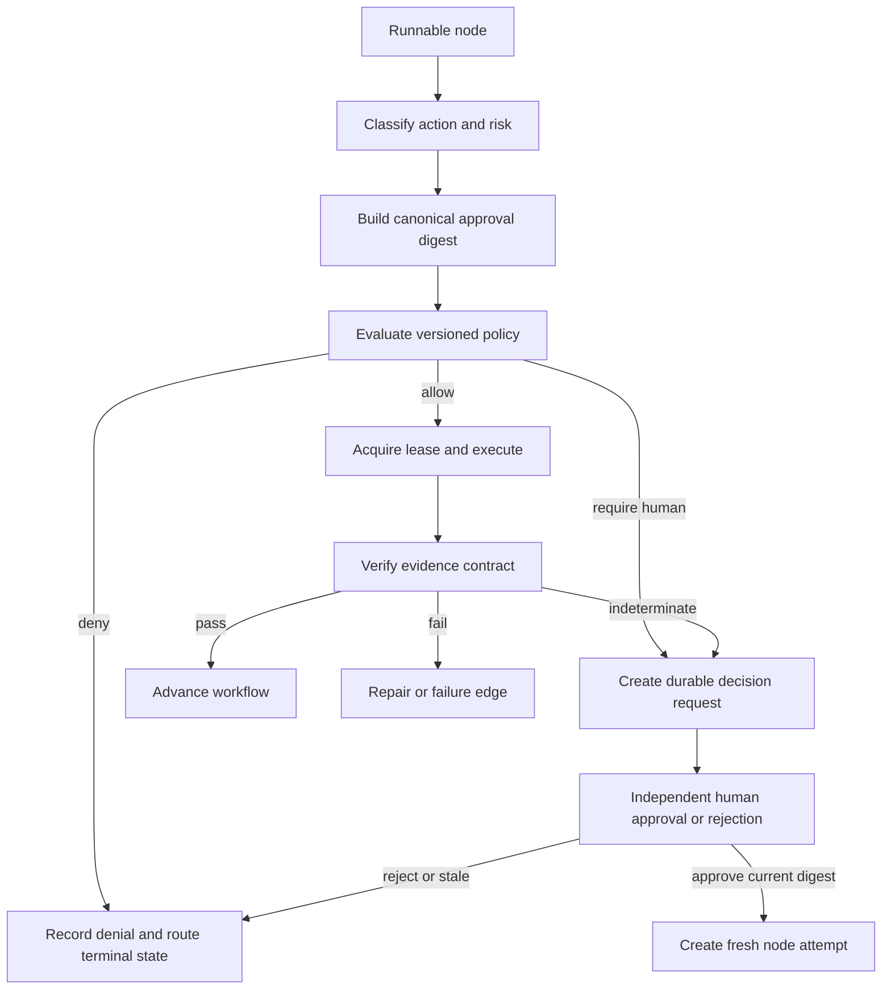
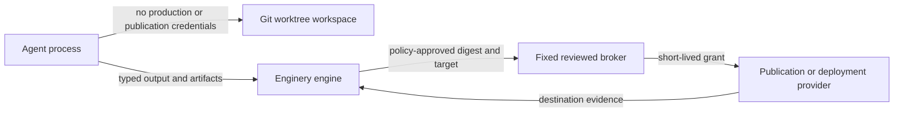
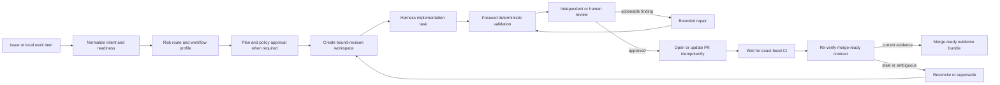
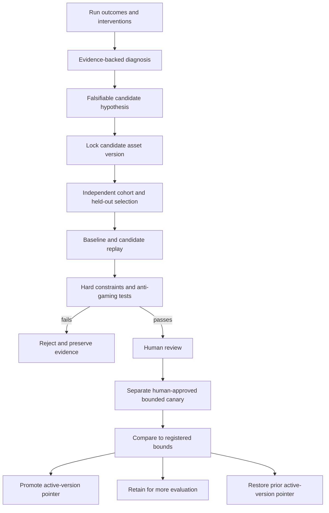

# Enginery System Design

- **Status:** Approved concept design for implementation planning
- **Date:** 2026-07-14
- **Deployment:** Open-source, local-first Python modular monolith
- **Primary interfaces:** CLI and versioned JSON Lines event stream

> **Design contract:** The workflow is the durable unit of engineering behavior. Agents are replaceable workers assigned to typed workflow nodes.

## 1. Scope and design goals

Enginery coordinates engineering work across ticket-style work ledgers, coding-agent harnesses, git workspaces, validation systems, source control, releases, deployment brokers, and capability registries. It must make work resumable, evidence-backed, policy-governed, and inspectable without making its domain model depend on any one provider.

### Goals

1. Execute explicit, immutable, versioned engineering workflows.
2. Persist enough state and evidence to resume, reconcile, replay, inspect, and compare work.
3. Separate deterministic operations from probabilistic agent work.
4. Gate every consequential action through a recorded, versioned policy decision.
5. Use a dedicated workspace for every code-changing run.
6. Bind outcomes to exact source, workflow, policy, adapter, capability, configuration, and evidence versions.
7. Improve factory assets only through candidate evaluation, human decisions, bounded canaries, and reversible activation.
8. Remain usable as a local application without a hosted control-plane service.

### Non-goals for the first release

- A foundation model or a bespoke coding-agent loop.
- A hosted multi-tenant service, organization RBAC, browser dashboard, or interactive TUI.
- A distributed scheduler, Kubernetes layer, or mandatory container runtime.
- Hostile-code containment on the git-worktree backend.
- Production or publication credentials in agent processes, arbitrary command nodes, or workspaces.
- Online mutation of active workflows or generic user-programmable workflow manifests.
- Universal support for every tracker, source host, CI system, or deployment provider.
- Outcome comparison and governed factory self-improvement (Stage 4) as first-release deliverables; both are retained as gate-deferred design targets (Section 12).

## 2. Architectural style

Enginery begins as a modular monolith. This keeps transaction boundaries, event ordering, recovery semantics, and local operations understandable while preserving strict dependency boundaries. A process boundary is introduced only after a measured requirement justifies it.



### Package boundaries

```text
domain/       Immutable domain types, state transitions, schemas, invariants
application/  Use cases and ports; coordinates domain behavior
engine/       Workflow scheduling, process managers, leases, recovery
ledger/       SQLite event store, projections, inbox, outbox, migrations
policy/       Action schemas, hard rules, approval digests, decisions
evidence/     Evidence contracts, verification, terminal claims
evaluation/   Outcomes, cohorts, replay, comparison, canaries
adapters/     Provider implementations and normalization boundaries
cli/          Commands, JSON output, JSONL streaming, exit codes
```

Dependency rules are strict:

- `domain` imports no application, ledger, adapter, infrastructure, or CLI package.
- `application` depends inward on `domain` and outward only through declared ports.
- `engine`, `policy`, `evidence`, and `evaluation` do not import provider SDKs.
- Provider-native objects enter and leave only through `adapters`.
- `cli` owns presentation and invokes application services; it never implements domain transitions directly.

## 3. Core invariants

| Invariant | Consequence |
|---|---|
| **Workflow over agent** | Changing a harness does not change workflow lifecycle semantics. |
| **Durable state over conversation** | The ledger, not a transcript, determines resumability and current state. |
| **Evidence over confidence** | Agent self-report is an artifact; only satisfied evidence contracts support success. |
| **Policy-gated autonomy** | There is no global auto mode; each consequential action is allow, deny, or require-human. |
| **Version-bound execution** | Adapter fingerprint or configuration drift blocks resumption; no silent migration. |
| **Reconcile before retry** | Ambiguous external effects are inspected before another side effect is attempted. |
| **Workspace honesty** | Worktrees isolate repository changes, not hostile processes. |
| **Factory changes are production changes** | Active workflow assets are immutable; candidates are independently evaluated before activation. |

## 4. Domain model

| Aggregate or value | Purpose | Essential bindings |
|---|---|---|
| `WorkItem` | Normalized engineering intent | Kind, immutable source snapshot, objective, criteria, constraints, risk, repository targets, dependencies, lifecycle version |
| `WorkflowDefinition` | Immutable directed graph | Node types, dependencies, schemas, budgets, policy hooks, evidence contracts, terminal mapping, content digest |
| `Run` | One workflow instance | Work snapshot, workflow digest, base revision, policy version, adapter fingerprints, capability lock, environment and configuration digest |
| `NodeAttempt` | One execution of one node | Attempt number, actor, input digest, lease, output/evidence artifacts, cost, duration, failure and reconciliation state |
| `Artifact` | Content-addressed output | Digest, media type, producer, redaction class, storage reference, schema version |
| `PolicyDecision` | Durable authority decision | Action, normalized input, matched rule/version, allow/deny/require-human result, rationale, supersession state |
| `Intervention` | Human input | Approval, rejection, correction, waiver, override, manual external action; linked to the affected state |
| `Outcome` | Post-work observation | Merge, release, deployment, rollback, reopen, escaped defect, quality; never rewrites prior work history |
| `FactoryChange` | Candidate workflow-system change | Problem evidence, hypothesis, candidate lock, cohort, comparison, canary, promotion or rollback result |

### Run and node-attempt lifecycle states



Each attempt separately follows `pending -> leased -> running -> output_pending -> evidence_pending -> passed | failed | cancelled | timed_out`. A side-effecting attempt may enter `reconciling` only from `running`; `found_matching` adopts the provider result into `output_pending`, `not_found` closes the attempt with a classified failure and permits a fresh attempt under the same operation ID, and `found_conflicting` or `indeterminate` moves the run to `awaiting_human` or `blocked`. Policy evaluation always happens before a side-effecting lease; an approval creates a fresh attempt from a durable checkpoint, never resumes an unleased process.

The work-ledger adapter owns source-watch events and polling cursors. It computes the deterministic digest of bound objective, acceptance criteria, constraints, dependencies, and repository targets. The coordinator compares that digest at preflight, before every approval, before every side effect, before terminal evidence verification, and on adapter notifications. A difference atomically records source supersession, fences the active lease, invalidates dependent approvals and evidence, and transitions the run to `superseded`. Continuation creates a new run from the new snapshot; it never mutates the old run.

## 5. Durable state, transactions, and artifacts

SQLite is the authoritative local event ledger and projection store. Large artifact bytes reside in a content-addressed filesystem store. This is narrow event sourcing: events and projections are durable runtime facts, while repository contents, configuration files, and artifact bytes remain ordinary files.

Artifact publication uses a two-phase protocol. Bytes are written to a unique temporary path, streamed through the digest calculator, `fsync`ed, and atomically renamed to the digest path before any SQLite command may reference them. The transaction then records immutable metadata and references only the completed digest path. A startup and `ledger verify` sweep deletes abandoned temporary files, detects a metadata reference with absent or digest-mismatched bytes, and blocks evidence use or run resumption until an operator restores or discards the affected state. Cleanup never deletes a digest referenced by retained ledger metadata.

A local state-changing command uses one SQLite transaction to:

1. check every expected aggregate version;
2. append typed events;
3. record only already-published artifact metadata;
4. update node leases, scheduling state, or persisted process-manager state;
5. update deterministic projections from versioned events;
6. persist outbox entries for external projections; and
7. increment aggregate versions and a local commit sequence.

External calls never run inside that transaction. The outbox enables eventual external projection; the run remains responsible for reconciling provider state. A monotonically increasing local commit sequence supports JSONL cursors and deterministic replay order. Aggregate version and causation/correlation IDs preserve the actual domain-causality model. Projection rebuild validates event-schema migrations in order, stops on an unsupported schema, and uses causation/correlation rather than commit sequence alone to interpret cross-aggregate work.

### Recovery topology



The first release permits one active coordinator per ledger. Workers never write domain aggregates. Mutating CLI commands append typed commands to an inbox; the coordinator consumes them transactionally. Every coordinator epoch and node lease uses fencing. A stale worker result is rejected even if a prior process survives. The supervisor owns the workspace lock and records process ID, process-group ID, process-start identity, lease token, and heartbeat deadline. On lease fencing or heartbeat expiry it sends termination to the process group, waits for observed exit, releases the lock only after a clean workspace inspection, and persists each observation. A replacement coordinator may re-lease only after it verifies those records and the live process identity, or it moves the run to human-required reconciliation. Fencing cannot revoke a stale worker’s already-issued provider request; the stable operation ID and provider reconciliation query are therefore mandatory before any replacement side effect.

## 6. Workflow model and scheduler

A repository-owned manifest defines orchestration, not arbitrary code. It may declare registered node types, schemas, dependencies, branches, parallel groups, subworkflow invocations, evidence requirements, budgets, policy actions, and terminal mappings. It cannot embed arbitrary shell or a general-purpose programming language.

Executable behavior lives in typed, tested modules. Initial node families include normalization, routing, human decision, agent task execution, deterministic command execution, evidence verification, fan-out and join, workspace management, pull request operations, CI wait, release preparation, publication, deployment, rollback, comparison, and promotion.

Every node declares its input and output schemas, actor, side-effect class, idempotency behavior, reconciliation query, evidence contract, emitted events, policy action, and required provider capabilities.

The scheduler performs deterministic readiness calculation. It selects nodes only after dependencies, resource limits, workspace requirements, budgets, and policy are satisfied. It enforces bounded global and per-repository concurrency, fairness across active runs, exclusive workspaces, lease renewal, cancellation propagation, and dependency-aware fan-out and join.

### Action-scoped authority flow



The initial action namespace includes workspace creation, agent execution, credential grant, network request, capability materialization, pull-request operations, release and deployment operations, factory-change operations, evidence non-applicability, finding waiver, and policy override. Unknown actions are denied.

The coordinator is the sole actor that creates an approval request, evaluates policy, grants a lease, ingests a worker result, and commits a terminal transition. An approval channel authenticates an `AuthorityPrincipal` with a stable ID, role, and authorization source; workers cannot invoke that channel. Every intervention stores requester, approver or rejector, action schema, exact digest, decision time, expiry, and supersession state. A principal cannot approve its own produced output, waiver, non-applicability claim, candidate, or override. Cancellation may be requested by the operator or policy, but the coordinator alone records it, fences the attempt, and directs the supervisor to terminate the process group. Waivers and overrides are named actions with the same identity and audit requirements, not CLI bypasses.

### Single-operator authority model

Separation rules fall into two classes. **Producer separation** requires the approving principal to be distinct from the principal that produced the output, waiver subject, non-applicability claim, candidate, or override request. A single-operator deployment satisfies this in the common case: the producer of workflow output is a run or agent principal, so the sole human operator is a distinct principal and may approve it. A human cannot approve an artifact recorded under their own actor identity. **Dual-human separation** requires two distinct human `AuthorityPrincipal`s and applies to factory-change canary approval versus promotion approval (Section 10.4). A single-operator deployment cannot satisfy dual-human separation; this is a declared limit, not a waivable rule. Executing the governed self-improvement workflow therefore requires at least two registered human principals, recorded as a precondition of its entry gate. Every other workflow in this design is single-operator complete.

Policy approvals bind the complete action schema—including explicit nulls—plus work snapshot, configuration, workflow and policy versions, adapter/capability locks, target, diff or artifact digest, acceptance criteria, and evidence bundle. Any change to a bound input supersedes the approval.

## 7. Evidence and terminal contracts

An evidence item records its type and schema version, producer, subject revision or resource, observed time, validity window, pass/fail/indeterminate result, artifacts, and verifier version.

Only `pass` satisfies a requirement. `fail` takes a declared repair or failure edge. `indeterminate` never becomes success; it follows an explicit edge and defaults to blocked or human-required. Hard-required evidence cannot be waived or relaxed by an override.

### Merge-ready contract

A pull request is `merge_ready` only when:

- acceptance criteria map to implementation evidence or independently approved non-applicability;
- at least one criterion has positive implementation evidence tied to a non-empty expected diff;
- required validation, static analysis, and review conditions pass;
- CI passes for the exact head commit under verification;
- the diff matches the recorded base and head;
- no unresolved conflict remains;
- PR metadata links the work item and evidence bundle;
- policy permits the terminal transition; and
- the exact verified head SHA is recorded.

The verifier reads the work revision, base SHA, head SHA, PR state, and CI subjects twice: before evidence collection and immediately before committing the terminal transition. Any difference routes back to reconciliation. An all-non-applicable or empty-diff run is not merge-ready; it becomes `no_change_required` after human confirmation.

The double-read narrows the verification race; it does not eliminate it. A window remains between the second read and the terminal-transition commit in which an external subject can change. Where a provider supports conditional operations (for example an ETag or `If-Match` precondition), the verifier must bind its terminal claim to the observed subject version. Where it does not, the residual window is a declared limit: a later external mutation is caught by the adapter's source watch or the next reconciliation, which removes the merge-ready projection and creates a re-verification run. Merge itself remains a separately policy-gated action, which bounds the consequence of the residual window.

## 8. Adapter boundary

Adapters normalize provider behavior and do not export provider SDK objects into the core.

| Port | First implementations | Contract requirements |
|---|---|---|
| Work ledger | Local ledger, GitHub Issues | Immutable source snapshots, lifecycle projection, version reconciliation |
| Agent harness | OMP, then a second independent harness | Probe identity/fingerprint, typed task envelope, normalized events, cancellation, declared outputs |
| Workspace | Git worktree with child-process policy | Exact revision, exclusive ownership, environment allowlist, process-group management, declared limits |
| Source control and PR | Local git and GitHub | Revision/diff digests, branch/PR idempotency, exact head/base and review queries, reconciliation |
| Validation and CI | Local commands and hosted CI | Normalized evidence, CI subject exactness |
| Release and deployment | Fixed brokers plus controlled local service | Destination verification, typed inputs, separate deployment and rollback authority |
| Capability registry | Repository-local assets and optional Armory | Content lock, provenance, licensing, exact-digest policy approval |

Every adapter exposes identity, version, capability set, and configuration validation. It receives a persisted operation ID for every side effect and either passes it as a provider-native idempotency key or implements deterministic reconciliation with `not_found`, `found_matching`, `found_conflicting`, and `indeterminate`. It classifies errors as invalid input, missing prerequisite, policy, human required, transient, authentication, rate-limit, conflict, ambiguous, timeout, cancellation, or invariant violation. There is no hidden fallback to another provider.

A run probes adapter identity, version, and capability fingerprint before each attempt. A mismatch blocks the active run. Resuming with different behavior requires a superseding run with a new lock.

## 9. Credentials and trust boundaries

Treat repository content, issue text, agent output, external comments, tool output, and downloaded capabilities as untrusted input.

Production and publication credentials are confined to fixed, reviewed brokers outside the agent workspace. A broker exposes a typed API whose schema rejects free-form commands, scripts, environment maps, and unapproved targets. It starts from a scrubbed environment, obtains a short-lived grant only after the coordinator records the policy-approved action digest, and records grant identity, scope, issuance, expiry, revocation result, target, and resulting provider operation ID. It binds an approved artifact digest and target, calls a fixed provider API, and never evaluates agent-authored code under broker credentials.

Credential-source fields never enter event or artifact serialization. Harness and command output is redacted for known secret patterns, sensitivity classified, and stored as an artifact where necessary. This is not an absolute promise to detect all unknown secret formats. Retention, deletion, backup, and operator access policy therefore apply to every sensitivity-classified artifact; a missing redaction guarantee is not permission to persist unrestricted output.



Capabilities are content-addressed and locked per run. Content addressing prevents mutable reference drift but does not establish trust. External provenance requires a verified signature chain against a pinned publisher identity or exact-digest human approval. A capability added or changed by an active run cannot execute until an interactive human approves its exact digest.

## 10. Four end-to-end workflows

### 10.1 Issue to merge-ready pull request



The workflow stops at merge readiness. Merging is a separate policy action in the release workflow.

### 10.2 Plan to verified release

A validated plan becomes linked child work items and runs. Dependency cycles and unresolved dependencies fail before execution. Independent milestones may run concurrently within repository limits; dependent work waits at hard barriers. Branch ancestry is stored separately from work dependencies. After fresh current-head evidence at each merge, fixed brokers prepare version/changelog data, build artifacts, publish only after policy approval, then verify destination version and artifact digest.

### 10.3 Incident to verified hotfix and rollback

The incident workflow freezes available evidence, identifies affected release lineage, separates containment from remediation, establishes a falsifiable failure or declares reproduction unavailable, creates a correct-lineage workspace, implements the smallest remediation, and verifies a non-vacuous guard where feasible. A controlled local service exercises deployment and actual rollback before a production-authoritative claim is possible. Deployment and rollback are separately authorized. Post-deployment observation binds to the deployed revision; follow-up work remains separate.

### 10.4 Governed factory self-improvement



The proposer cannot select cohorts, inspect held-out inputs, weaken hard evidence, or approve its own candidate. Baseline and candidate operate on identical registered cohorts. Candidates affecting policy, evidence, merge, release, publication, deployment, credentials, migrations, or rollback run only on controlled non-production targets or baseline-authoritative shadow mode.

`FactoryChange` records immutable principal IDs for proposer, cohort selector, evaluator, canary approver, and promotion approver; the policy engine rejects an overlapping identity where separation is required. Canary approval and promotion approval are dual-human separations: two distinct human principals are required (Section 6), which a single-operator deployment cannot provide. This workflow is executable only in deployments with at least two registered human principals. An `ActiveFactoryPointer` contains asset name, active digest, monotonic version, prior digest, and last approved change ID. Promotion is a compare-and-swap transaction over the expected active digest and pointer version, the approval digest, and the candidate digest. It appends the promotion event and pointer update atomically. Rollback is a separate, audited compare-and-swap that restores the recorded prior digest only when the current pointer still names the candidate; a concurrent divergence blocks for human reconciliation. Candidate and evaluation history are immutable regardless of pointer outcome.

## 11. Scalability, failure handling, and limits

The first release scales through bounded local concurrency, not distributed coordination. One ledger has one active coordinator epoch. The scheduler bounds global and per-repository concurrency and preserves exclusive workspace ownership. This supports the initial local operator while avoiding premature distributed-systems claims.

Failures are named rather than hidden: invalid input, missing prerequisite, policy denial, human action required, transient provider failure, authentication failure, rate limit, external conflict, stale evidence, worker failure, validation failure, timeout, cancellation, ambiguous side effect, and invariant violation.

Recovery never fabricates success. Coordinator loss follows the supervised-process proof protocol in Section 5; source changes follow the adapter-owned digest watch in Section 4. Worker loss, base movement, PR-head movement, stale CI, credential expiry, merge conflict, uncertain publication, unavailable observation, adapter drift, budget exhaustion, or a superseded approval transition into their explicit attempt or run state. An uncertain external operation is reconciled before retry; uncertain workspace quiescence blocks resumption.

## 12. Verification strategy and staged proof

Tests defend contracts rather than implementation plumbing:

- domain tests assert valid and invalid transitions, schema validation, budgets, and operation-ID stability;
- ledger tests inject conflicts, interrupted writes, migration failures, corrupt artifacts, replay, backup, and restore;
- engine tests inject lease loss, coordinator death, worker orphaning, process-group cancellation, and workspace collision;
- policy and evidence tests exercise default-deny, digest supersession, self-approval prevention, stale evidence, no-op rejection, and hard-rule bypasses;
- adapter contract suites run against every implementation and do not treat local fixtures as proof that live providers work;
- end-to-end tests use temporary repositories and local process workers; opt-in real-provider smoke tests run only against allowlisted test environments;
- factory-change tests use independently authored and parameterized gaming candidates, not fixed candidate names or source-text matching.

| Stage | Falsifiable gate |
|---|---|
| 1: Issue to PR | A real issue yields a non-empty, current-head, evidence-complete merge-ready PR; interruption does not duplicate effects; no-op work is rejected. |
| 2: Plan to release | A multi-milestone fixture releases through fresh merge evidence, destination verification, and two harnesses satisfying the same contract. |
| 3: Incident to hotfix | A controlled fault yields a minimal hotfix, observed deployment, actual rollback, and observed restoration with preserved authority records. |
| 4: Self-improvement | A real candidate uses prior evidence, fails held-out anti-gaming checks when unsafe, then is independently canaried and promoted, retained, or rolled back. |

### Release packaging (revised 2026-07-14)

Stage 1 is the `v0.1.0` deliverable, shipped together with the outcome-capture schema so runs emit raw, versioned observations from the first release. Stages 2 and 3 follow as `v0.2` and `v0.3`. Stage 4 is retained as a design target but gate-deferred: its milestones may not start until a data-threshold entry gate passes — completed-run and intervention volume across at least two workflow types and risk classes, an outcome-capture completeness floor, at least one recurring evidence-backed workflow deficiency, corpus diversity beyond a single repository, and the dual-human authority precondition in Section 6. The gate is evaluated on a review cadence, never by elapsed time. See the development plan's decision gates and [`analysis.md`](analysis.md) Section 7.

The architecture deliberately defers provider selections that do not alter the domain model: repository owner, second independent harness, first fixture publication provider, controlled deployment target, and timing of stronger workspace isolation or a UI.

Implementation must not convert these gaps into hidden assumptions. The product remains credible only if each phase proves its stated terminal claim with exact evidence and declares limits that remain unimplemented.

## Source grounding

- [Product direction](../.docs/02_PRODUCT_DIRECTION.md)
- [Approved system design](../.docs/03_SYSTEM_DESIGN.md)
- [Specification review and safety corrections](../.docs/04_SPECIFICATION_REVIEW.md)
- [Development plan and staged gates](../.docs/DEVELOPMENT_PLAN.md)
- [Agentic engineering source analysis](../.docs/01_VIDEO_ANALYSIS.md)
