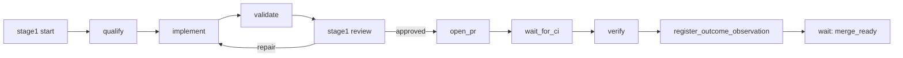

# Operator Guide

This is the operator-facing reference for running Enginery locally: install,
configuration, health checks, the Stage 1 command surface, recovery,
backup/restore, and the security limits an operator must understand before
running real workflows.

Every command shown here is copied from `--help` output or a real, executed
invocation against this repository at the version documented in
[`README.md`](../README.md#status). Enginery is `v0.3.0`. The Stage 1
(issue-to-merge-ready-pull-request) and Stage 2 (plan to verified
release) command surfaces are supported, documented features of this
release; `stage2 status` remains the only Stage 2 CLI command (a
read-only stack inspection — Stage 2's own merge/build/publish
orchestration runs through the release-preparation workflow, not a
shipped `enginery` verb). Stage 3 (incident to hotfix and rollback) is
a shipped, adversarially-tested library surface
(`enginery.incidents`) with no CLI command of its own yet — see
[`docs/adapters.md`](adapters.md#the-incident-to-hotfix-and-rollback-surface).
Stage 4 (governed factory self-improvement) has no CLI surface and is
gate-deferred — see
[Release scope and gate-deferred work](#release-scope-and-gate-deferred-work).

## Installation

`v0.1.0`, `v0.2.0`, and `v0.3.0` are all published to PyPI. Install the
latest with:

```bash
pip install enginery
```

Or install from source:

```bash
git clone https://github.com/Mathews-Tom/Enginery.git
cd Enginery
uv sync --all-extras --dev
```

This requires [`uv`](https://docs.astral.sh/uv/) and Python 3.12 or newer.
Enginery is Apache-2.0 licensed and supports macOS and Linux. **Windows is
not supported in this release.** The approved local-supervisor design binds
process supervision, cancellation, and recovery to POSIX process groups,
signals, and process-start identity; native Windows process supervision and
worktree locking are out of scope until a Windows-specific supervisor
backend is designed and proven.

After installing, run the built-in health check before doing anything else:

```bash
uv run enginery doctor
```

```text
[ok] python_version: running Python 3.12.8; requires >= 3.12
[ok] package_metadata: enginery 0.3.0 installed
```

`enginery doctor --json` emits the same report as a machine-readable
document; every CLI command that reports structured state accepts `--json`
for scripting.

## Configuration

Enginery does not read a project- or user-level configuration file in this
release. Every run's provider configuration is an explicit, versioned
`--request` document passed to `enginery stage1 start` (see
[Running a Stage 1 workflow](#running-a-stage-1-workflow) below): work-item
identity, acceptance criteria, validation commands, and an
`execution_configuration` block naming the GitHub repository, an opaque
GitHub credential reference, the harness provider (`omp` or `claude-code`),
an opaque harness credential reference, and an absolute artifact root. A
credential *reference* is not a credential: the GitHub CLI (`gh`) and the
configured harness CLI (`omp` or `claude`) each resolve their own
already-authenticated local session; Enginery never reads, stores, or
serializes a literal secret value.

The layered repository/user/workflow-profile TOML configuration model
described in the system design is a forward design target for a later
milestone, not present-state behavior. Do not write a `.toml` configuration
file expecting Enginery to read it today.

The `--database` flag on every mutating command names the SQLite ledger
file. There is no default location; an operator chooses and tracks this
path per project or environment. The ledger file is the single source of
durable truth: deleting or corrupting it discards every run, node, policy
decision, and evidence record it contains, so back it up (see
[Backup and restore](#backup-and-restore)) before any risky operation.

## Command surface

The full current CLI surface, generated from `enginery --help`:

```text
usage: enginery [-h] [--version]
                {doctor,adapter,ledger,policy,stage1,stage2,outcome,gate,workspace,capability}
                ...

positional arguments:
  {doctor,adapter,ledger,policy,stage1,stage2,outcome,gate,workspace,capability}
    doctor              Report locally implemented prerequisites.
    adapter             Inspect configured adapter providers.
    ledger              Ledger consistency and storage commands.
    policy              Explain policy decisions.
    stage1              Run the Stage 1 issue-to-PR lifecycle.
    stage2              Inspect Stage 2 plan-to-release stack state.
    outcome             Inspect raw outcome observations and completeness.
    gate                Report readiness against a decision gate.
    workspace           Inspect and release run-scoped workspace reservations.
    capability          Capability lock commands.
```

This is materially narrower than the full command-family list in the system
design document, which also names `init`, `work`, `run`, `evidence`,
`workflow`, `factory-change`, and `gc` families. Those are design targets
for later milestones; they do not exist in this release. Do not document or
script against a command that is not listed above.

| Command | Purpose |
|---|---|
| `enginery doctor [--json]` | Report locally implemented prerequisites (Python version, installed package). |
| `enginery adapter doctor [--json] [--github-repository ...] [--deployment-app-script PATH] ...` | Report the deterministic local provider and Stage 2/3 broker configuration state Enginery ships (see [Local provider inventory and Stage 2/3 broker configuration](#local-provider-inventory-and-stage-23-broker-configuration)). |
| `enginery ledger verify --database PATH [--artifacts PATH] [--json]` | Check ledger and artifact-store consistency. |
| `enginery ledger backup --database PATH --output PATH [--artifacts PATH]` | Snapshot a ledger to a directory. |
| `enginery ledger restore --backup PATH --database PATH [--artifacts PATH]` | Restore a ledger from a backup directory. |
| `enginery ledger rebuild-projections --database PATH` | Rebuild ledger projections from stored events. |
| `enginery policy explain REQUEST [--json]` | Explain a policy decision for a request document without authorizing it. |
| `enginery stage1 {start,watch,review,approve,reject,cancel,resume,evidence,build-request}` | Run and inspect the Stage 1 lifecycle, plus compose a `--request` document from flags (below). |
| `enginery stage2 status --database PATH --owner OWNER --stack-id ID` | Report one Stage 2 stack's slice states and merge readiness. |
| `enginery outcome {list,show,completeness,interventions,failures}` | Inspect raw outcome observations and completeness. |
| `enginery gate status --gate G4 --database PATH [--floor-config PATH] [--json]` | Report readiness against a registered decision gate. |
| `enginery workspace inspect --database PATH --owner OWNER [--json]` | List every repository's current workspace reservation. |
| `enginery workspace release --database PATH --owner OWNER --repository-id ID --run-id ID [--dry-run] [--json]` | Release a retained workspace reservation with no live lease (below). |
| `enginery capability lock [--check] [--lockfile PATH] [--capabilities-root PATH] [--json]` | Inspect or verify a capability lock. |

### Local provider inventory and Stage 2/3 broker configuration

`enginery adapter doctor --json` reports the deterministic local providers
Enginery ships out of the box — these back local development and the
cumulative Stage-1 gate described in
[Cumulative Stage-1 recovery evidence](#cumulative-stage-1-recovery-evidence),
not a live GitHub/OMP run — plus the real Stage 2 release brokers
(`GitHubReleaseAdapter`, `PyPiAdapter`) and the real Stage 3
`LocalServiceDeploymentAdapter`. Every broker entry is a local
configuration-sanity check only — is the required CLI tool installed
(`gh --version`, `uv --version`), does the deployment fixture's
`app_script` exist, does its `python_executable` resolve — never a
live GitHub, PyPI, or local-service network call:

```text
$ enginery adapter doctor --json
[
  {"kind": "work_ledger",       "provider_id": "local-work-ledger",       "capabilities": ["fetch", "publish"]},
  {"kind": "harness",           "provider_id": "scripted-harness",        "capabilities": ["cancel", "events"]},
  {"kind": "workspace",         "provider_id": "local-git-worktree",      "capabilities": ["create", "cleanup", "retain"]},
  {"kind": "source_control",    "provider_id": "local-git",               "capabilities": ["branches", "commits", "diff"]},
  {"kind": "validation",        "provider_id": "local-validation",        "capabilities": ["commands"]},
  {"kind": "release",           "provider_id": "local-publication",       "capabilities": ["publish", "verify"]},
  {"kind": "deployment",        "provider_id": "local-deployment-fixture","capabilities": ["deploy", "rollback"]},
  {"kind": "capability_source", "provider_id": "local-capability-source", "capabilities": ["discover", "resolve"]},
  {"kind": "release",           "provider_id": "github-release",         "capabilities": ["release_create_and_verify"]},
  {"kind": "release",           "provider_id": "pypi",                   "capabilities": ["publish_and_verify"]},
  {"kind": "deployment",        "provider_id": "local-service-deployment","capabilities": ["deploy", "observe", "rollback"]}
]
```

`github-release` and `pypi` bind to the GitHub repository and PyPI
project name an installed `enginery` distribution's own package
metadata reports (`Project-URL: Repository`, `Name`) — the same source
`scripts/verify_project_identity.py` treats as canonical — never a
fabricated placeholder; `--github-repository`/`--pypi-project-name`
override them, and `--github-executable`/`--pypi-executable` override
the CLI tool checked (default `gh`/`uv`). `local-service-deployment`
checks `--deployment-app-script` (default
`fixtures/enginery-stage3-local-service/app.py`, relative to the
current directory), `--deployment-artifacts-root`/
`--deployment-state-root` (default under `.enginery/`), and
`--deployment-python-executable` (default the running interpreter). A
missing prerequisite reports `"availability": "misconfigured"` or
`"unavailable"` with a `detail` string, never a silent pass, and
`adapter doctor` exits non-zero — the same fail-closed convention
`doctor`/`gate status` already use.

Each entry also carries a content-addressed `fingerprint`; a Stage 1 run
binds to the exact fingerprint of every provider it uses and refuses to
silently resume under a changed adapter (see
[Recovery semantics](#recovery-semantics)).

## Running a Stage 1 workflow

Stage 1 takes one issue-shaped work item from qualification through an
open, current-head-CI-verified, `merge_ready` pull request. It never
merges — merging is a separately policy-gated Stage 2 action.



### Composing a request

`stage1 start --request` needs a JSON document decodable by
`stage1_request_from_state`. `enginery stage1 build-request` writes one
from flags instead of hand-writing the Python composition
[`docs/examples.md`](examples.md#example-b-real-github-issue-with-an-omp-or-claude-code-harness)
documents:

```bash
uv run enginery stage1 build-request \
  --output request.json \
  --run-id issue-142 \
  --repository <owner>/<repo> \
  --external-reference "https://github.com/<owner>/<repo>/issues/142" \
  --source-snapshot-reference "issue:142@<observed-revision>" \
  --source-revision <observed-revision> \
  --base-revision <real base revision> \
  --title "<issue title>" \
  --objective "<what a merge-ready PR must accomplish>" \
  --acceptance-criterion "<criterion 1>" --acceptance-criterion "<criterion 2>" \
  --repository-path <absolute path to the local checkout> \
  --workspace-path <absolute path to a fresh workspace directory> \
  --artifact-root <absolute path to an artifact directory>
```

Every field not shown above defaults to the same values
`docs/examples.md` documents (`policy-v1`, `uv run pytest -q`,
`repair-limit 1`, a 1800-second/`5.0`-cost-budget OMP implementation
attempt, `operator-gh-cli`/`operator-harness-session` credential
references). `--capability-lockfile` (default
`.enginery/capabilities.lock.json`) binds the request's
`capability_lock_digest` to the real lockfile `enginery capability
lock` already reads when one exists, and to the documented
no-capabilities-locked sentinel otherwise.
`--environment-manifest-digest`/`--environment-manifest-file` and
`--configuration-snapshot-digest`/`--configuration-snapshot-file`
bind the two remaining opaque `Run` digests to real bytes when a real
environment manifest or configuration snapshot exists; omitted, they
fall back to the same fixed local-environment/local-configuration
sentinels the documented manual script uses. The command never
contacts GitHub, OMP, or any external provider — it only writes a
local file.

Every step after `stage1 start` runs through `enginery stage1 watch
--advance`, which performs **at most one durable next action** derived
purely from the ledger and returns the next action still pending:

```bash
uv run enginery stage1 start --database ledger.db --owner operator --request request.json
uv run enginery stage1 watch --database ledger.db --owner operator --run-id run-1 --advance
# repeat `watch --advance` until `next_action` reports `wait`
uv run enginery stage1 review --database ledger.db --owner operator --run-id run-1 \
  --report review.json --repair-attempt 0
uv run enginery stage1 evidence --database ledger.db --owner operator --run-id run-1
```

`stage1 review` is a separate command because it records an independent
human or reviewer decision `watch --advance` cannot manufacture on its own.
`stage1 approve` / `stage1 reject` resolve a node the run is durably waiting
on a human decision for; `stage1 cancel` terminates a running or
human-waiting node; `stage1 resume` restarts a specific human-wait node
after a durable interruption. `stage1 evidence` prints the run's current
status, request digest, source revision, and every runtime node's state —
the operator's read path for "what is this run doing and why."

## Recovery semantics

Enginery permits **one active coordinator per SQLite ledger**. There is no
separate "recovery mode": restarting the `enginery` process and re-running
`stage1 watch --advance` against the same `--database` file *is* recovery.
The ledger, not any in-memory state, is authoritative. Every coordinator
epoch and node lease carries a fencing token; a stale process's write is
rejected even if it is still technically running. If the prior process
cannot be proven dead and its workspace quiescent, Enginery refuses
automatic resumption rather than risk a duplicate side effect (opening a
second pull request, re-running a completed check, and so on).

This protects against **accidental** orphan continuation. It is not hostile-
process containment: git worktrees isolate concurrent runs from each other,
not a compromised or malicious process from the operator's account,
filesystem, network, or keychain. See
[Security limits](#security-limits) below.

### Inspecting and releasing a stuck workspace reservation

A run's `implement` node reserves one workspace per repository for the
run's lifetime. If a run is aborted outside the normal lifecycle (the
process was killed, or a human decides not to continue), that
reservation can outlive the run. `enginery workspace inspect` lists
every repository's current reservation, from the same durable state
`stage1`'s coordinator already reads:

```bash
uv run enginery workspace inspect --database ledger.db --owner operator --json
```

`enginery workspace release` releases one reservation through
`CoordinatorRuntime.release_workspace` -- the identical fenced-proof
check the coordinator already enforces internally, not a weaker
CLI-only check: it refuses unless the reservation belongs to the given
`--run-id` and its status is `retained` (a human-wait or otherwise
quiesced workspace with no live worker lease). A `materialized`
workspace -- one a live worker still holds -- is always refused.
`--dry-run` reports whether release would succeed, and why not when it
would not, without releasing anything:

```bash
uv run enginery workspace release --database ledger.db --owner operator \
  --repository-id owner/repo --run-id run-1 --dry-run
# review the dry-run output, then, only once satisfied, drop --dry-run
uv run enginery workspace release --database ledger.db --owner operator \
  --repository-id owner/repo --run-id run-1
```

**This command is destructive** -- it removes the reserved git
worktree. Always run `--dry-run` first and review its output before
running the real release, especially in an unattended or scripted
context.

### A queued node not selected on its registering tick

`stage1`'s scheduler enforces one global concurrency slot and one
per-repository slot by default (matching every documented `stage1`
invocation above). If the `implement` node's registering
`dispatch_implementation` tick finds no free slot -- another run
already occupies the sole global slot -- the node is still durably
registered as `queued`, but `dispatch_implementation` raises rather
than silently leaving the run to retry later. Confirmed by fault
injection (`tests/engine/test_queued_node_fault.py`): once this
happens, `stage1 watch --advance`'s `next_action` reports `wait`
forever and never re-attempts scheduling, even after the slot that
blocked it genuinely frees up. This is the accepted, precisely
documented limit `docs/pitch.md`'s pilot named -- not a bug this
release fixes with a dedicated retry mechanism, because none is
needed beyond the path already documented above:
`stage1 cancel --node-id implement` cancels the stuck queued node
(no active lease is required to cancel a `queued` node), after which
`next_action` routes to `await_human_review` -- the same repair path
an actionable review finding already takes, letting `stage1 review`
start a fresh implementation attempt within the run's `repair_limit`.

### Cumulative restart/replay evidence

`scripts/full_system_gate.py --stages 1,2,3 --restart-between-stages`
drives Stage 1 (two independent local work items through the full
lifecycle above), Stage 2 (a fixture package through merge -> prepare
-> build -> publish -> verify, with no live GitHub/PyPI network or
credential access), and Stage 3 (a real, ledger-backed incident through
ingest -> hotfix -> deploy -> observe -> roll back -> restore against a
real local HTTP service subprocess) on their own durable SQLite
ledgers, closing every in-memory coordinator/service object and
reopening it from durable state alone before every externally
observable step. This is this repository's established restart-proof
convention — a freshly constructed coordinator over the same on-disk
ledger, matching the recovery topology's coordinator-epoch model — not
a literal new operating-system process boundary. Qualification,
implementation dispatch, and validation are completed through direct
durable node-state transitions in the Stage 1 leg rather than the real
executors; those three nodes' own crash/fault-injection coverage
already exists in the merged Stage 1 implementation stack. `--stages`
accepts any combination of `1`, `2`, and `3`; Stage 4's cumulative gate
belongs to its own gate-deferred, unversioned train once gate G4
passes. See [`docs/RELEASE_EVIDENCE.md`](RELEASE_EVIDENCE.md) (`v0.3.0`
first, `v0.2.0` and `v0.1.0` below it) for the exact evidence digests
each release's gate run produced, and
[`docs/release-readiness-v0.1.0.md`](release-readiness-v0.1.0.md) for
the measured local performance baseline from
`scripts/performance_baseline.py`.

## Backup and restore

```bash
uv run enginery ledger backup --database ledger.db --output backup-dir [--artifacts artifacts-dir]
uv run enginery ledger restore --backup backup-dir --database ledger.db [--artifacts artifacts-dir]
uv run enginery ledger verify --database ledger.db [--artifacts artifacts-dir]
```

`backup` copies files; it never mutates a live ledger's own tables in
place. `restore` writes into `--database`, so restoring over a live ledger
discards its current state — back up the current file first if it might
still be needed. `verify` checks event/projection/artifact consistency
without mutating anything and is safe to run at any time, including
against a live ledger. Run `verify` after any restore and before resuming
a run against a restored ledger.

`ledger rebuild-projections` recomputes every projection from the stored
event log; use it if a projection appears stale or inconsistent after a
manual intervention. It never rewrites historical events.

## Security limits

State every guarantee precisely; do not imply more than what is
implemented.

- **Worktree isolation is not hostile-code containment.** Enginery's
  workspace backend is a git worktree with a child-process policy. It
  reduces *accidental* interference between concurrent runs sharing one
  repository. It does not prevent a process — malicious, compromised, or
  prompt-injected — from reaching the operator's user account, filesystem,
  network, keychain, or other host processes. A stronger execution-
  containment claim requires a separately designed container or VM backend,
  which does not exist in this release.
- **Credential references, not credentials, cross the Stage 1 boundary.**
  Stage 1 never merges, publishes, or deploys, so it never needs
  production or publication credentials in the first place. The GitHub and
  harness `credential_reference` fields in a Stage 1 request are opaque
  labels; the actual authenticated session lives entirely in the `gh`,
  `omp`, or `claude` CLI's own local credential store, invoked as a
  subprocess. Enginery's ledger, event stream, and artifacts never contain
  a literal credential value. The stronger *fixed broker* pattern — where
  production/publication credentials are confined to reviewed broker code
  that never enters an agent workspace — governs Stage 2's release
  actions and Stage 3's deployment/rollback actions, both shipped in this
  release. Neither has an `enginery` action verb of its own yet: Stage 2's
  broker runs through the release-preparation workflow
  (`Stage2ReleaseWorkflow`) and Stage 3's through the library-level
  `IncidentService`/`LocalServiceDeploymentAdapter` pair (see
  [`docs/adapters.md`](adapters.md#the-incident-to-hotfix-and-rollback-surface));
  both are exercised by this repository's own release/gate tooling, not
  by a shipped operator-facing action command.
  `enginery adapter doctor` reports read-only configuration sanity for
  both brokers (see
  [Local provider inventory and Stage 2/3 broker configuration](#local-provider-inventory-and-stage-23-broker-configuration)),
  but performs neither a publish nor a deploy action.
- **Single-operator authority model.** Every consequential action is
  policy-gated to `allow`, `deny`, or `require_human`; there is no global
  autonomous mode. Producer separation (the human approving an action must
  be a distinct principal from the run or agent that produced the output)
  is satisfied by a single human operator in the common case, since the
  producer is always a run or agent principal. **Dual-human separation is
  a declared limit a single-operator deployment cannot satisfy.** It
  applies specifically to Stage 4 governed factory self-improvement: candidate
  canary approval and promotion approval each require two distinct human
  principals. A single-operator deployment can run Stage 1-3 in full; it
  cannot run Stage 4's canary/promotion workflow at all until a second
  registered human principal exists. This is not implemented in this
  release regardless (see
  [Release scope and gate-deferred work](#release-scope-and-gate-deferred-work)).
- **The merge-ready evidence window has a documented residual race.** The
  merge-ready verifier reads the work revision, base SHA, head SHA, PR
  state, and CI subjects twice — once before evidence collection and once
  immediately before committing the terminal transition — narrowing but
  not eliminating the race. A window remains between that second read and
  the terminal-transition commit in which an external subject (a force
  push, a new commit, a CI re-run) can change. Where the provider supports
  a conditional operation (an ETag or `If-Match` precondition), Enginery
  binds its terminal claim to the observed subject version; where it does
  not, this residual window is accepted as a declared limit: a later
  external mutation is caught by the next reconciliation pass or source
  watch, which removes the stale `merge_ready` projection and creates a
  re-verification run rather than silently trusting a stale claim. Merge
  itself is a separately policy-gated action in Stage 2, which bounds the
  practical consequence of this residual window.

## Release scope and gate-deferred work

`v0.1.0`, `v0.2.0`, and `v0.3.0` are all published. Together they cover
Stage 1 (issue to merge-ready pull request), Stage 2 (plan to verified
release, second-harness neutrality, capability provenance), and Stage 3
(incident to hotfix and rollback), plus the raw outcome-observation
schema and capture pipeline. Stage 4 (governed factory
self-improvement) is the only remaining stage; it is a separate,
unversioned, gate-deferred train with its own milestones, gate, and
operator documentation once it starts. In particular:

- Stage 4's milestones (cohorts/replay/comparison and governed
  self-improvement) may not start — including design work beyond the raw
  outcome schema already shipped — until a data-threshold entry gate
  passes: sufficient completed-run and intervention volume across at
  least two workflow types and risk classes, an outcome-capture
  completeness floor, at least one recurring evidence-backed workflow
  deficiency, corpus diversity beyond a single repository, and the
  dual-human authority precondition described above. The gate is reviewed
  on a cadence, never assumed from elapsed time.
- Do not run this release expecting a Stage 4 CLI surface, a hosted UI,
  or additional harness/work-ledger providers beyond OMP, Claude Code,
  and GitHub. None of those exist yet. `stage2 status` (read-only stack
  inspection) remains the only Stage 2+ CLI surface; Stage 3 has no CLI
  surface at all (library-level only, see above).

## See also

- [`docs/adapters.md`](adapters.md) — adapter authoring, contracts, and the
  Armory capability-registry relationship.
- [`docs/migration-sage-dev.md`](migration-sage-dev.md) — the manual,
  human-executed procedure for preserving historical `sage-dev` work data.
- [`docs/design.md`](design.md) — the full system design, including the
  domain model, evidence contracts, and policy model referenced above.
