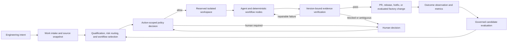

# Enginery System Overview

- **Status:** `v0.3.0` published (Stage 1, 2, and 3 shipped); Stage 4 gate-deferred
- **Date:** 2026-07-14
- **Audience:** Engineers, prospective collaborators, and engineering leaders

> **Thesis:** Coding agents perform tasks. Enginery engineers the system in which those tasks become trustworthy software outcomes.

## Executive summary

Enginery is an open-source, local-first **agentic engineering control plane**. It coordinates coding-agent harnesses, deterministic engineering operations, policy decisions, evidence collection, and human authority across the path from work intake to a verified outcome.

Its claim is workflow integrity: bind each run to explicit inputs, require evidence before terminal claims, gate consequential actions through policy, and reconcile supported external actions before retrying. Coding agents remain interchangeable workers. GitHub, local ledgers, CI, package registries, deployment targets, and capability registries remain external systems.

The first backend uses a CLI, a versioned JSON Lines event stream, a local SQLite ledger, git worktrees, and policy-gated authority to bind every run to explicit inputs and reconcile external effects before retry. Enginery earns broader autonomy through falsifiable workflow gates rather than an undifferentiated claim of “autonomous software engineering”; Section 10 states its safety scope precisely.

## 1. The problem

Coding agents already plan, edit, test, and propose pull requests. GitHub documents that Copilot cloud agent can research a repository, create a plan, make branch changes, run tests and linters, and optionally open a pull request. It runs in an ephemeral GitHub Actions environment and remains bounded by repository and session constraints. [^copilot]

OpenAI describes Codex as a cloud software-engineering agent that can work on parallel tasks in isolated environments, run commands and tests, commit changes, and return log- and test-backed evidence for human review. Its own launch material still requires users to review and validate generated code before integration. [^codex]

Those are useful workers. The surrounding engineering system remains fragmented:

- the ticket, prompt, worktree, agent session, test result, pull request, release, and deployment state live in different places;
- conversation state and transient processes are mistaken for operational state;
- agents can claim success without evidence tied to the exact revision or external object;
- a retry after a timeout can duplicate a pull request, release, deployment, or other side effect;
- one generic loop is asked to handle low-risk chores, normal features, releases, and incidents with different authority and evidence needs;
- “auto mode” grants broad authority instead of evaluating one consequential action at a time;
- process isolation is overstated when a worktree only separates repository changes;
- workflow improvements are adopted from anecdotes rather than compatible baseline-versus-candidate comparisons.

The missing unit is not a better chat loop. It is a durable, inspectable, versioned **engineering workflow**.

## 2. What Enginery is

Enginery is the control plane that turns engineering intent into verified outcomes. It owns:

- normalized work intake and immutable source snapshots;
- versioned workflow definitions and routing;
- durable run, node-attempt, lease, approval, evidence, and outcome state;
- workspace lifecycle and bounded agent-task envelopes;
- deterministic command execution, validation, and evidence verification;
- policy evaluation and explicit human interventions;
- idempotent external-operation reconciliation;
- measurement of outcomes and workflow behavior;
- governed evaluation, canarying, promotion, retention, and rollback of factory changes.

It delegates coding-agent reasoning, and GitHub, Git, CI, package-registry, deployment-platform, and issue-tracker interfaces, through typed adapters rather than replacing them. Section 10 states precisely where its safety guarantees end.

## 3. Why this approach

Enginery treats engineering value as a deliberate allocation among three actors:

| Actor | Best responsibility | Control required |
|---|---|---|
| Engineer | Intent, accountability, judgment, exceptions, final authority | Explicit approvals and interventions |
| Coding agent | Ambiguous reasoning, synthesis, implementation, diagnosis, review | Bounded task envelope, isolated workspace, evidence requirements |
| Deterministic code | State transitions, routing inputs, policy evaluation, validation, digesting, reconciliation | Typed contracts and tests |

This model rejects two failures at once: asking a model to repeatedly rediscover deterministic facts, and pretending deterministic code can resolve ambiguous engineering intent. The correct boundary is operational, not ideological: automate what is specifiable; use agents where interpretation or synthesis remains necessary; preserve human authority where policy, ambiguity, or external consequences require it.

The result is a compounding asset. Improving a workflow definition, evidence verifier, routing policy, repair protocol, or capability lock can improve every compatible future work item. That does not justify uncontrolled self-modification. It requires a more rigorous form of improvement: create a candidate, lock its inputs, compare it against a baseline on compatible and held-out cases, approve a bounded canary, then promote or roll back without rewriting history.

## 4. How it works

A run is bound to the work snapshot, workflow digest, policy version, adapter fingerprints, capability lock, repository revision, and effective configuration. A change to a bound input invalidates dependent approvals and evidence. The old run becomes superseded; the system does not silently continue under different intent or behavior.

Every external side effect receives a stable operation ID. On uncertainty, Enginery reconciles first and obtains one of four answers: `not_found`, `found_matching`, `found_conflicting`, or `indeterminate`. Only `not_found` permits a new execution; `found_matching` adopts the observed result; the other two require explicit reconciliation or human action. Blind retry is prohibited.

This protocol prevents blind retries; it does not make an external provider operation atomic or revoke a request already issued to a provider. Each supported adapter must prove its provider-visible correlation and reconciliation behavior with fault injection before Enginery claims duplicate-effect prevention for that operation.

## 5. Initial workflows and proof status

Three of the four workflow targets below have shipped and produced
their stated evidence in a real, bounded environment; the fourth
remains a **design target, not a demonstrated product capability**,
and is additionally gate-deferred (see below).

| Workflow target | Planned capability under test | Required proof before the terminal claim | Status |
|---|---|---|---|
| Issue to merge-ready PR | Intake, workspaces, agent execution, validation, evidence, review, source supersession, PR/CI reconciliation | A real, non-empty PR whose final evidence is current; forced interruption yields zero duplicate side effects; no-op work ends `no_change_required` | **Shipped, `v0.1.0`** |
| Plan to verified release | Child workflows, dependency scheduling, stacked changes, merge freshness, fixed publication broker, destination verification | A multi-milestone fixture reaches a destination-verified release; ambiguous publication reconciles without a duplicate version | **Shipped, `v0.2.0`** |
| Incident to hotfix and rollback | Urgent routing, release-lineage selection, minimal remediation, non-vacuous regression evidence, separately authorized deployment and rollback | A controlled service is changed, observed, rolled back, and observed at the prior revision | **Shipped, `v0.3.0`** |
| Governed factory self-improvement | Independent cohorts, replay, held-out evaluation, anti-gaming checks, human canary and promotion | A real candidate sourced from earlier runs is evaluated on locked cohorts and reaches promoted, retained, or rejected with rollback evidence | Design target, gate-deferred |

The product must not market itself as a complete self-improving software factory before the fourth target passes with evidence from the earlier three.

Release packaging: the first workflow target plus the outcome-capture schema shipped as `v0.1.0`; the second shipped as `v0.2.0` (also carrying second-harness neutrality and capability provenance); the third shipped as `v0.3.0`; the fourth is retained as a design target but gate-deferred — its milestones may not start until a data-threshold entry gate passes, including corpus diversity beyond a single repository and a second registered human principal for its dual-human approval separations. That gate has not passed: the current corpus is single-repository, single-operator dogfooding, which the gate's own corpus-diversity condition explicitly disqualifies.

### Product-hypothesis decision rule

The core product hypothesis is not “agents need orchestration” in the abstract. It is: **a technically skilled local operator will choose Enginery over a manually coordinated agent session when it improves recovery and evidence traceability enough to justify operating a local ledger, coordinator, adapters, backups, and retained artifacts.**

The first pilot must compare the same class of issues against a documented manual baseline. It is a `go` only when it completes at least three representative work items without a duplicate side effect, rejects every injected stale-evidence case, recovers from a forced coordinator loss with an independently inspectable evidence bundle, and the operator reports that the additional operating burden is acceptable. It is a `no-go` when recovery cannot be proved, the workflow needs broad unsafe authority, or the operator prefers the manual baseline after observing the burden. These are discovery thresholds, not claims of product-market fit.

## 6. Market research and positioning

### The market signal

Primary vendor materials show a category of delegated coding work, not independent evidence of market demand. GitHub positions Copilot cloud agent around repository research, planning, branch changes, pull requests, custom agents, hooks, and automation. [^copilot] OpenAI positions Codex around parallel software-engineering tasks, isolated environments, command execution, evidence, and human review. [^codex] Factory positions its “Droids” across coding, testing, and deployment within an agent-native SDLC. [^factory]

Those offerings are a **product-category signal**: major vendors are investing in delegated engineering agents. They do **not** establish demand for a separate, local control plane. That narrower question remains the central product hypothesis.

### Landscape

| Category | Representative products | Primary value | Gap Enginery proposes to test |
|---|---|---|---|
| Coding-agent workers | GitHub Copilot cloud agent, Codex, Factory Droids, Devin | Perform delegated coding work in a defined environment | Cross-worker lifecycle semantics, independent durable state, action-scoped authority, and evidence across systems |
| Agent frameworks | General agent-orchestration frameworks | Build custom agent applications | Engineering-specific state, SCM/CI/release semantics, and falsifiable terminal contracts |
| Task/worktree runners | CLI and workspace orchestration tools | Run multiple local tasks or agents | Durable reconciliation, policy, outcomes, and governed improvement |
| Capability registries | Armory and repository-local assets | Distribute reusable instructions and tooling | Runtime execution state, scheduling, policy, and evaluation |

As of July 2026 the category vocabulary is contested beyond the worker products above. OpenHands markets a hosted "Agent Control Plane" (policy, least-privilege scoping, cost budgets, audit trails); Databricks open-sourced Omnigent, an Apache-2.0 cross-harness meta-layer with stateful policy, spend caps, and human-approval gates; Guild.ai raised a Series A on "the control plane for AI agents"; and the GitHub Copilot desktop app, Codex subagents, and Claude Code agent teams ship native worktree-isolated multi-agent orchestration. Category overlap is therefore high. Mechanism overlap is a separate question: none of these products has been verified — in either direction — to implement stable-operation-ID reconciliation before retry, version-bound evidence invalidation, or fault-injected interrupted-run recovery. Hands-on verification of the closest entrants precedes any claim that Enginery alone provides them.

Enginery does not claim that incumbents lack all of these capabilities. It chooses a boundary: an open, local control plane that coordinates worker and delivery providers without becoming another worker or a hosted replacement for them.

### Boundary and operator model

The local ledger is authoritative for execution state: work snapshots, runs, attempts, approvals, evidence, and outcomes. An external tracker remains authoritative for its own UI, comments, and provider-specific metadata; an adapter ingests a normalized snapshot and projects concise lifecycle/evidence summaries back. Git, CI, registries, and deployment providers remain authoritative for their own objects. Enginery verifies those objects against its bound run before making a terminal claim.

The initial operator installs the CLI and configured adapters, starts or invokes the single local coordinator, stores backups, applies migrations, retains or deletes sensitivity-classified artifacts under policy, and responds to blocked reconciliation and human decision requests. This is intentional early-stage operational ownership, not a claim of zero-operations local software.

### Beachhead

The initial user hypothesis is a technically sophisticated solo engineer who already operates coding-agent harnesses and local repositories, delegates repeatable work, and experiences a concrete recovery or evidence failure that scripts and provider-native views do not resolve. Interview and pilot evidence—not the category descriptions above—must establish whether that user will adopt Enginery.

## 7. Differentiation and potential moat

The intended differentiation is a **trustworthy control plane**, not a claim of superior code generation.

Potential defensibility comes from an accumulating, versioned operational corpus:

1. **Evidence and reconciliation semantics.** A stable operation identity, exact-subject evidence, and fault-tested recovery become hard to retrofit into a prompt-oriented runner.
2. **Policy and approval history.** Action-level decisions, superseded approvals, hard-rule tests, and human interventions form a reusable governance model.
3. **Comparable outcome data.** Runs, interventions, outcomes, cohorts, and versioned metric derivations enable measured workflow improvement rather than anecdotal prompt changes.
4. **Provider-neutral integration contracts.** An adapter contract proven by two independent harnesses reduces dependency on a single agent vendor.
5. **Open local ownership.** A local ledger and inspectable event stream reduce lock-in and make the system suitable for users who do not want a central hosted execution database.

These are **moat hypotheses**, not established facts. Incumbents can reproduce features; open-source projects can reproduce architecture. The durable advantage must come from reliable implementation, trustworthy evidence, ecosystem adoption, and a body of comparative workflow results that users can inspect. Any public claim that a specific mechanism is unique to Enginery additionally requires hands-on verification of the closest control-plane entrants; secondary-source absence is not evidence of absence.

### Differentiation evidence required

Before claiming a mechanism is unique or a competitor gap is material, Enginery must test the closest entrants against the same scenarios: ambiguous side effects, exact-head CI and evidence binding, approval supersession after input changes, and provider-neutral recovery. Product discovery must also record actual operator incidents and compare recovery effort, intervention count, evidence completeness, and maintenance burden against a manually coordinated agent-session baseline. A plausible failure mode is a test case, not a market claim.

## 8. Risks and disconfirming evidence

| Risk | Why it matters | Mitigation or falsifier |
|---|---|---|
| Incumbents absorb the control plane | Worker vendors already own agent execution, repository access, and user attention | Prove that provider-neutral durability, policy, and evaluation solve a problem users will adopt independently |
| Integration surface dominates the product | Trackers, harnesses, SCM, CI, release, and deployment systems change independently | Keep the domain core provider-neutral; ship local contract fixtures before live adapters; track adapter maintenance cost per integration |
| Local operations outweigh value | A solo operator must run migrations, backups, coordinator recovery, and artifact retention | Measure setup, recovery, and maintenance burden against the documented manual baseline |
| Retained evidence creates privacy or compliance burden | Logs, source snapshots, and artifacts can contain sensitive repository or issue data | Classify artifacts, define retention/deletion and backup policy, and reject use cases whose controls are not implemented |
| “Local-first” is conflated with security | Worktrees do not contain hostile processes | State guarantees precisely; confine sensitive credentials to fixed brokers; add stronger isolation only when implemented |
| Governance creates friction | Excess gates can erase the productivity benefit | Apply policy per action and risk class; compare review and intervention burden with the baseline without weakening hard rules |
| Metrics create false confidence | A candidate can improve a proxy by excluding hard work or suppressing outcomes | Fixed or independent cohorts, held-out inputs, immutable raw observations, completeness metrics, and adversarial tests |
| Resource limits undermine the local model | One coordinator and bounded local concurrency can become a bottleneck | Publish measured bounds before performance claims; scale architecture only after a measured need |
| Product scope expands before proof | Four workflows plus ecosystem integrations can become a broad platform before a usable core exists | Use dependency-ordered gates; do not claim later-stage capabilities early |

## 9. Examples

### Example A: a repository issue becomes a merge-ready PR

This is an **intended Stage 1 behavior**, not an observed result. A GitHub issue enters as an immutable source snapshot. Enginery qualifies acceptance criteria, records an explainable risk route, creates a worktree at the bound base revision, locks approved capabilities, and sends a bounded task envelope to a harness. Deterministic nodes run tests and verify evidence. The PR is opened idempotently, CI is bound to the exact head SHA, and the verifier double-reads work, base, head, PR, and CI state before emitting `merge_ready`. If the issue changes, the base advances, or CI belongs to an old head, the run is superseded or reconciled rather than accepted. The pilot compares this recovery and evidence trace against a documented manual-agent baseline and records the extra operator time.

### Example B: a publication call times out after succeeding

This is an **intended Stage 2 fault-injection test**. A fixed publication broker submits a prebuilt artifact to a configured fixture registry and the client loses the response. Enginery does not publish again. It uses the persisted operation ID and deterministic provider markers to reconcile. A matching destination artifact is adopted; a conflicting artifact or ambiguous result blocks for human reconciliation. The product never declares a release complete until destination version and digest are verified. The relevant pass criterion is no duplicate version after the injected uncertainty.

### Example C: a factory improvement is proposed responsibly

This is an **intended Stage 4 behavior**. If repeated compatible runs show excessive repair attempts, a candidate router version is created without changing the active workflow. An independent evaluator selects development and held-out cohorts after the candidate is locked. Baseline and candidate replay against the same cases with real side effects disabled. The evaluation rejects a candidate that improves a success rate by weakening validation, suppressing outcome attribution, or excluding difficult cases. A valid candidate needs distinct human canary and promotion decisions; rollback restores the previous active-version pointer without deleting history.

## 10. Safety scope and roadmap

Enginery earns broader autonomy through falsifiable workflow gates, not through an undifferentiated claim of “autonomous software engineering.” Workspaces ensure isolated, reproducible repository changes: git worktrees give every run its own exclusive checkout, preventing accidental collision between concurrent runs. Explicit containerization is required for untrusted external code execution and is planned as a future backend, not a property of the first release.

The near-term focus is workflow integrity for a local operator: binding runs to explicit inputs, requiring evidence before terminal claims, gating consequential actions through policy, and reconciling supported external actions before retry. A hosted multi-tenant service, browser dashboard, distributed scheduler, Kubernetes layer, and a stronger process-containment backend are deferred roadmap items, earned after the workflow-integrity core is proven — not abandoned goals.

The planned first backend binds supported external actions to stable operation IDs and keeps production and publication credentials in fixed broker code outside agent workspaces. It does not prevent an agent process from accessing the user’s account, filesystem, network, keychain, or other host processes; that guarantee ships with the future container or VM backend. Product copy must not imply otherwise.

[^copilot]: GitHub Docs, [About GitHub Copilot cloud agent](https://docs.github.com/en/copilot/concepts/agents/cloud-agent/about-cloud-agent), accessed 2026-07-14.
[^codex]: OpenAI, [Introducing Codex](https://openai.com/index/introducing-codex/), 2025-05-16, accessed 2026-07-14.
[^factory]: Factory, [Factory: Agent-Native Software Development](https://www.factory.ai/), accessed 2026-07-14.
