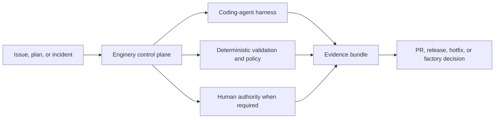

# Enginery: a control plane for trustworthy agentic engineering

- **Conversation memo**
- **Purpose:** Test whether this is a problem worth solving with engineers, potential collaborators, and engineering leaders.
- **Status:** Product concept; no productivity, market-size, or security outcome is claimed without validation.

## The short version

Coding agents are becoming capable workers. They can inspect a repository, write code, run tests, and propose a pull request. The missing layer is the system that decides **which work should run, under what authority, with what evidence, how it recovers from failure, and how the workflow itself improves without becoming unsafe**.

**Enginery is an open-source, local-first control plane for that layer.**

> Coding agents perform tasks. Enginery engineers the system in which tasks become trustworthy software outcomes.

It does not compete by building another agent. It coordinates the agents and deterministic operations a team already chooses to use, while retaining durable state, evidence, policy decisions, and human authority.

### Plain-language terms

- **Control plane:** the local program that records and directs engineering work; it does not write product code itself.
- **Evidence bundle:** the linked tests, checks, revisions, logs, approvals, and provider facts used to justify a claim such as “this PR is ready for review.”
- **Operation ID:** one stable identifier for a real-world action, reused during recovery so a timeout does not create a duplicate PR, release, or deployment.
- **Capability lock:** the exact version and digest of an instruction, skill, or tool asset used by a run.
- **Workflow asset:** a versioned part of the factory, such as a routing rule, prompt, validator, policy, or deterministic node.

## The problem we are testing

The critical objection is straightforward: capable coding-agent products already exist. GitHub Copilot cloud agent can research a repository, plan, change a branch, run tests and linters, and open a pull request. [^copilot] OpenAI describes Codex as an agent that can execute parallel coding tasks in isolated environments, run commands, and return logs and test results for human review. [^codex] Factory positions Droids across coding, testing, and deployment. [^factory]

So why build another layer?

Because engineering work is more than code generation. Once agents operate beyond a single interactive session, teams need answers to operational questions that sit between the ticket and the worker:

- Which workflow is appropriate for a low-risk chore, a feature, a release, or an incident?
- Which action is allowed automatically, and which requires a human decision?
- What does “done” mean for this exact source revision, pull request head, CI run, artifact, or deployment?
- What happens if the coordinator, worker, network, or provider fails after an external action may have succeeded?
- How do we prevent a retry from opening a duplicate PR, publishing a duplicate release, or repeating a deployment?
- How do we change a prompt, router, validator, or policy without silently altering active engineering behavior?
- How do we distinguish a workflow that looks faster from one that is actually safer, more reliable, and better for compatible work?

Most current practice distributes these answers across conversations, shell scripts, worktrees, issue trackers, CI, provider-specific interfaces, and human memory. That fragmentation is manageable when an agent is an occasional assistant. It becomes the reliability boundary when agents execute independently and in parallel.

## The proposed product

Enginery is a local control plane that receives an engineering work item, binds its source state, routes it to a versioned workflow, coordinates a coding-agent harness and deterministic checks in an isolated workspace, records evidence and authority decisions, and reconciles outcomes with external systems.

The worker remains replaceable. Enginery’s durable responsibilities are:

- normalized work intake and immutable source snapshots;
- workflow routing and scheduling;
- SQLite-backed event state, attempts, leases, and human interventions;
- worktree lifecycle and agent-task envelopes;
- policy decisions per consequential action rather than a global “auto mode”;
- evidence verification tied to exact revisions and external objects;
- stable operation IDs and reconciliation before retry;
- outcome measurement and governed workflow improvement.

It delegates issue-tracker UI, source hosting, hosted CI, publication, deployment, and agent reasoning loops through typed adapters.

## The ideology behind it

Enginery is based on a practical division of labor:

| Actor | Contribution |
|---|---|
| Engineers | Intent, accountability, judgment, exceptions, and authority |
| Agents | Interpretation, synthesis, implementation, diagnosis, and review |
| Deterministic code | State transitions, validation, policy, evidence, and repeatable operations |

This is not an argument for automating every step. It is an argument against wasting model context on facts that code can compute, against treating a transcript as runtime state, and against treating an agent’s confidence as proof.

The deeper idea is “build the system that builds the system.” Repeated engineering work should improve the workflow that produces it. That only works if self-improvement is governed: a candidate workflow asset is versioned, evaluated against the same registered cohort as its baseline, checked against held-out and adversarial cases, approved for a bounded canary, then promoted or rolled back without rewriting history.

## Why it is technically credible

This concept does not depend on a claim that an agent is always correct. It is designed around the opposite assumption: workers, providers, and processes can fail at inconvenient boundaries.

### Durable state, not conversation state

A local SQLite event ledger holds work-item state, workflow runs, node attempts, policy decisions, evidence, process leases, and projections. Agents produce artifacts; they do not become the system of record.

### Evidence, not confidence

A merge-ready PR requires evidence bound to the current base and head, current CI for that head, relevant validation, resolved review conditions, a non-empty expected diff, and a recorded policy decision. A stale green check does not count. An all-non-applicable or empty-diff run does not become a false “success.”

### Reconciliation, not blind retries

Every external side effect has an operation ID that remains stable across attempts. If a provider call times out after possibly succeeding, the engine reconciles first: adopt a matching result, safely retry only when nothing exists, or require a human when the result conflicts or remains ambiguous.

### Action-scoped policy, not global autonomy

Unknown actions deny. An implementation task, a credential request, a pull-request action, a release publication, and a factory promotion are distinct policy decisions. Human approvals bind the exact input digest. A later source, configuration, workflow, or evidence change supersedes the old approval.

### Honest workspace claims

The first backend uses git worktrees and child-process supervision. This prevents accidental repository collision; it is not hostile-process containment. Production and publication credentials stay in fixed, reviewed broker code outside agent workspaces. Stronger isolation is a future implementation choice, not a marketing adjective.

## The first four proofs

The proposed roadmap is deliberately sequential. Each stage must work before the product claims the next capability.

1. **Issue to merge-ready PR** — a real work item reaches an evidence-complete, non-empty, current-head PR and survives interrupted coordination without duplicating external effects.
2. **Plan to verified release** — a dependency-ordered plan produces a verified fixture release through fresh merge evidence, fixed publication brokers, and destination checks.
3. **Incident to hotfix and rollback** — a controlled incident results in a minimal hotfix, observed deployment, actual rollback, and observed restoration of the previous revision with separate authority decisions.
4. **Governed factory improvement** — a real workflow candidate is evaluated using evidence from the earlier stages, checked against held-out anti-gaming cases, then independently canaried and promoted, retained, or rolled back.

The product must not call itself a self-improving software factory until the fourth proof passes.

## Where this fits in the market

The current market is a **product-category signal**, not a demand study:

- GitHub offers an agent that operates in a GitHub-hosted ephemeral environment, can use custom instructions, skills, hooks, and automation, and produces branch and PR artifacts. [^copilot]
- OpenAI positions Codex around parallel, sandboxed software tasks with test and log evidence, while retaining manual review and validation as an essential safeguard. [^codex]
- Factory positions agent-native “Droids” across coding, testing, and deployment. [^factory]

These sources establish that major vendors are investing in delegated coding-agent products. They do not establish adoption, willingness to operate local infrastructure, or demand for a separate control plane.

Enginery’s hypothesis is narrower: these systems are workers or worker platforms; a defined user segment also needs a local, inspectable, provider-neutral program for lifecycle semantics, evidence, reconciliation, policy, and evaluated workflow evolution.

That hypothesis can be wrong. A worker vendor can add these layers, users may accept provider-specific operation, or the governance burden may exceed its value. Enginery should earn adoption by solving a concrete failure mode for a real workflow, not by asserting that control planes are inherently valuable.

## Potential differentiation—not a proven moat

A credible advantage could accumulate around five assets:

1. **Operational correctness:** version-bound evidence and fault-tested reconciliation across external side effects.
2. **Governance:** policy decisions, approval supersession, hard-rule tests, and explicit human interventions.
3. **Learning data:** outcome observations, comparable cohorts, and workflow-version comparisons instead of anecdotes.
4. **Provider neutrality:** multiple harnesses and delivery systems behind enforceable contracts, not an OMP- or vendor-shaped core.
5. **Local ownership:** a local event ledger and CLI-first interface that avoid requiring a hosted execution database.

None is defensible merely because it is designed. The advantage exists only if the product remains reliable under failure, accumulates useful evidence, and earns ecosystem adoption before incumbents converge.

## Risks we should confront early

| Risk | Direct question |
|---|---|
| Existing platforms converge | Is there a persistent need for an independent control plane, or is this a feature set workers will absorb? |
| Integration cost | Does every additional tracker, harness, CI system, and delivery target create more maintenance than user value? |
| Governance friction | Can action-scoped policy protect meaningful operations without making ordinary work slower than manual coordination? |
| False security claims | Can the product communicate worktree and credential limits precisely enough that users do not mistake local execution for containment? |
| Data retention and compliance | Who can access retained source snapshots, logs, evidence, and backups; what deletion, residency, and retention obligations apply? |
| Operator burden | Who installs, upgrades, backs up, restores, monitors, and troubleshoots the local ledger, coordinator, adapters, and brokers? |
| Metrics gaming | Can workflow improvement remain honest when candidates could exclude difficult cases, weaken validation, or suppress outcomes? |
| Scope | Can the product prove Stage 1 before turning into a general platform? |

## A concrete pilot

The first pilot is not a company-wide rollout. It is one repository, one technically skilled operator, one allowlisted tracker/source-control environment, and a constrained issue-to-merge-ready workflow.

### Operating model

The pilot operator installs the CLI and selected adapters, owns the local SQLite ledger and encrypted backup location, starts the single coordinator, applies migrations, manages artifact retention, and responds to human approval or reconciliation requests. The product does not yet offer a hosted operations team, enterprise administration, or zero-maintenance operation.

### Comparison protocol and decision rule

Use at least three comparable low- or medium-risk issues, each with explicit acceptance criteria. For each class, document a manually coordinated agent-session baseline: task input, operator actions, elapsed time, tests, review evidence, and any recovery step. Then run the same class through Enginery. Inject one coordinator interruption and one ambiguous external-operation result in the Enginery path.

**Pilot question:** Does Enginery produce a more inspectable and recoverable engineering record than the baseline at an operator cost the pilot user accepts?

**Go:** every injected stale-evidence case is rejected; no duplicate external effect occurs; the interrupted run resumes only after reconciliation; an independent reader can explain why the result is merge-ready or blocked from the evidence bundle; and the operator accepts the additional installation and maintenance burden.

**No-go:** any duplicate effect occurs; recovery cannot prove prior-process quiescence or provider state; the pilot requires unsafe broad authority; or the operator chooses the documented manual baseline after comparing burden and clarity. The sample is for falsification and workflow learning, not a statistical claim of productivity.

### Pilot boundaries

- No automatic merge, publication, production deployment, or untrusted-code security claim.
- One tracked work-item source, one code host, one worktree backend, and one coding harness.
- Human review remains required for medium- and high-risk changes.
- The evidence bundle records elapsed time, intervention count and reason, recovery path, stale-evidence behavior, duplicate-effect count, and artifact-retention burden.

## What feedback we need

**Primary request:** Reply with one of `pilot`, `needs-evidence`, or `no-need`, and a one-sentence reason. The deciding question is whether the recovery-and-evidence problem is important enough to justify the operator model above.

### From engineers

1. Where does agentic work fail in your current repository: intent, context, tests, review, recovery, CI, release, or ownership?
2. Which evidence would make you trust a proposed agent PR more than a terminal transcript?
3. Which actions should never be automatically permitted in a local tool?
4. Does a local event ledger and CLI improve your workflow, or add an operational system you do not want to own?
5. Which single agent, tracker, and CI integration would determine usability?

### From potential collaborators

1. Is the worker-versus-control-plane boundary coherent enough for a standalone product?
2. Which part is most differentiated: recovery, evidence, policy, provider neutrality, or evaluation?
3. Which part is most likely to become accidental complexity?
4. What is the smallest Stage 1 that proves a nontrivial advantage?
5. What would make this architecture unacceptable to maintain or contribute to?

### From engineering leaders

1. Who would own installation, backup, retention, incident response, and support for a local control plane in your environment?
2. What evidence, authority, and auditability would be necessary before an agent workflow touched a shared repository?
3. Which outcome matters most: reduced coordination overhead, higher throughput, lower operational risk, stronger traceability, or something else?
4. Where would local-first operation help or hinder data-governance and compliance obligations?
5. What bounded pilot would be safe enough to authorize, and what result would make you stop investing?

## Supporting material

- [System overview](overview.md)
- [System design](design.md)
- [Workflow examples](workflows.md)
- [Approved product direction](../.docs/02_PRODUCT_DIRECTION.md)
- [Approved design](../.docs/03_SYSTEM_DESIGN.md)
- [Development plan](../.docs/DEVELOPMENT_PLAN.md)

[^copilot]: GitHub Docs, [About GitHub Copilot cloud agent](https://docs.github.com/en/copilot/concepts/agents/cloud-agent/about-cloud-agent), accessed 2026-07-14.
[^codex]: OpenAI, [Introducing Codex](https://openai.com/index/introducing-codex/), 2025-05-16, accessed 2026-07-14.
[^factory]: Factory, [Factory: Agent-Native Software Development](https://www.factory.ai/), accessed 2026-07-14.
