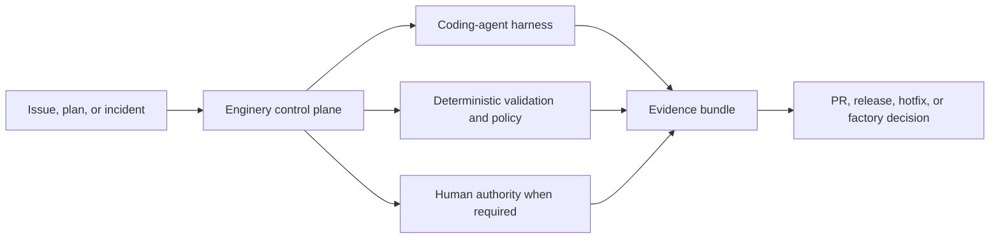

# Enginery: a control plane for trustworthy agentic engineering

- **Conversation memo**
- **Purpose:** Test whether this is a problem worth solving with engineers, potential collaborators, and engineering leaders.
- **Status:** `v0.3.0` published (Stage 1, 2, and 3 shipped, each with real evidence — see [Pilot results](#pilot-results-2026-07-20) below and the `v0.2.0`/`v0.3.0` release trains that followed it); Stage 4 remains gate-deferred and unclaimed. This memo predates that delivery and is retained as the historical record of the original pitch and the gate-G1 pilot decision that authorized the `v0.2.0` train.

## The short version

Have you had a coding agent open a pull request, lose the network response, and a blind retry open a second PR against the same branch? Or watched a release-publish call time out — succeeded or not, nobody can tell — with a retry one step from shipping a duplicate version? The code was never the hard part. Proving what actually happened, and recovering without guessing, is.

**Enginery is an open-source, local-first control plane for that problem.**

> Coding agents perform tasks. Enginery engineers the system in which tasks become trustworthy software outcomes.

It coordinates the agents and deterministic operations a team already chooses to use, while retaining durable state, evidence, policy decisions, and human authority.

The first claim under test is deliberately narrow: for a supported provider operation, an interrupted or retried run reconciles the persisted operation ID and provider state before another side effect is attempted. The first public artifact is a recorded fault-injection demonstration, published 2026-07-22: a real coordinator interruption mid-run, reconciliation-driven recovery, confirmation that no duplicate effect occurred for the supported operation, and the evidence bundle published for independent inspection — [gist.github.com/Mathews-Tom/eb2ff07e918b329dc25a0fbfcab71945](https://gist.github.com/Mathews-Tom/eb2ff07e918b329dc25a0fbfcab71945). The reusable runbook is [`docs/recovery-demonstration.md`](recovery-demonstration.md).

### Plain-language terms

- **Control plane:** the local program that records and directs engineering work; it does not write product code itself.
- **Evidence bundle:** the linked tests, checks, revisions, logs, approvals, and provider facts used to justify a claim such as “this PR is ready for review.”
- **Operation ID:** one stable identifier for a real-world action, reused during recovery so a timeout does not create a duplicate PR, release, or deployment.
- **Capability lock:** the exact version and digest of an instruction, skill, or tool asset used by a run.
- **Workflow asset:** a versioned part of the factory, such as a routing rule, prompt, validator, policy, or deterministic node.

## The problem we are testing

The critical objection is straightforward: capable coding-agent products already exist. GitHub Copilot cloud agent can research a repository, plan, change a branch, run tests and linters, and open a pull request. [^copilot] OpenAI describes Codex as an agent that can execute parallel coding tasks in isolated environments, run commands, and return logs and test results for human review. [^codex] Factory positions Droids across coding, testing, and deployment. [^factory]

So why build another layer?

Because engineering work is more than code generation. Once agents operate beyond a single interactive session, teams need answers to operational questions that sit between the ticket and the worker:

- Which workflow is appropriate for a low-risk chore, a feature, a release, or an incident?
- Which action is allowed automatically, and which requires a human decision?
- What does “done” mean for this exact source revision, pull request head, CI run, artifact, or deployment?
- What happens if the coordinator, worker, network, or provider fails after an external action may have succeeded?
- How do we prevent a retry from opening a duplicate PR, publishing a duplicate release, or repeating a deployment?
- How do we change a prompt, router, validator, or policy without silently altering active engineering behavior?
- How do we distinguish a workflow that looks faster from one that is actually safer, more reliable, and better for compatible work?

Take the last question concretely. A developer sees an agent fail a task, tweaks the prompt, reruns it on that one case, watches it pass, and ships the new prompt — with no idea whether it just broke fifty other tasks. Enginery's governed evaluation path replaces that guess with a registered baseline-versus-candidate comparison on held-out cases before a workflow change is promoted.

Most current practice distributes these answers across conversations, shell scripts, worktrees, issue trackers, CI, provider-specific interfaces, and human memory. That fragmentation is manageable when an agent is an occasional assistant. It becomes the reliability boundary when agents execute independently and in parallel.

## The proposed product

Enginery is a local control plane that receives an engineering work item, binds its source state, routes it to a versioned workflow, coordinates a coding-agent harness and deterministic checks in an isolated workspace, records evidence and authority decisions, and reconciles outcomes with external systems.

The worker remains replaceable. Enginery’s durable responsibilities are:

- normalized work intake and immutable source snapshots;
- workflow routing and scheduling;
- SQLite-backed event state, attempts, leases, and human interventions;
- worktree lifecycle and agent-task envelopes;
- policy decisions per consequential action rather than a global “auto mode”;
- evidence verification tied to exact revisions and external objects;
- stable operation IDs and reconciliation before retry;
- outcome measurement and governed workflow improvement.

It delegates issue-tracker UI, source hosting, hosted CI, publication, deployment, and agent reasoning loops through typed adapters.

## The ideology behind it

Enginery is based on a practical division of labor:

| Actor | Contribution |
|---|---|
| Engineers | Intent, accountability, judgment, exceptions, and authority |
| Agents | Interpretation, synthesis, implementation, diagnosis, and review |
| Deterministic code | State transitions, validation, policy, evidence, and repeatable operations |

This is not an argument for automating every step. It is an argument against wasting model context on facts that code can compute, against treating a transcript as runtime state, and against treating an agent’s confidence as proof.

The deeper idea is “build the system that builds the system.” Repeated engineering work should improve the workflow that produces it. That only works if self-improvement is governed: a candidate workflow asset is versioned, evaluated against the same registered cohort as its baseline, checked against held-out and adversarial cases, approved for a bounded canary, then promoted or rolled back without rewriting history.

## Why it is technically credible

This concept does not depend on a claim that an agent is always correct. It is designed around the opposite assumption: workers, providers, and processes can fail at inconvenient boundaries.

### Durable state, not conversation state

A local SQLite event ledger holds work-item state, workflow runs, node attempts, policy decisions, evidence, process leases, and projections. Agents produce artifacts; they do not become the system of record.

### Evidence, not confidence

A merge-ready PR requires evidence bound to the current base and head, current CI for that head, relevant validation, resolved review conditions, a non-empty expected diff, and a recorded policy decision. A stale green check does not count. An all-non-applicable or empty-diff run does not become a false “success.”

### Reconciliation, not blind retries

Every external side effect has an operation ID that remains stable across attempts. If a provider call times out after possibly succeeding, the engine reconciles first: adopt a matching result, safely retry only when nothing exists, or require a human when the result conflicts or remains ambiguous.

### Observed interruption-and-recovery record

On 2026-07-19, an allowlisted GitHub issue for a single worktree verification test ran through the Stage 1 workflow. The coordinator was deliberately stopped after its supervised OMP worker had started. A replacement coordinator read the durable `implement-0` attempt, returned `wait` rather than launching another worker, and later collected the original worker's single pushed commit. Focused validation passed; an independent human review recorded no findings; PR #86 reached current-head CI success on macOS and Ubuntu. The terminal verifier published `merge_ready` evidence digest `sha256:2104d50b4df157d47f1e897c9d8b25b048a60b6fae0b02bcde161c20f105bee0` without merging the PR.

This is one recovery demonstration, not a completed pilot or a productivity claim. Its reusable fault-injection sequence is: record the active operation and worker identity, interrupt only the coordinator, recover against the durable attempt, reject a second launch while the original worker remains live, collect the original result, then rebind final evidence to the current source, base, head, and CI subjects.

### Action-scoped policy, not global autonomy

Unknown actions deny. An implementation task, a credential request, a pull-request action, a release publication, and a factory promotion are distinct policy decisions. Human approvals bind the exact input digest. A later source, configuration, workflow, or evidence change supersedes the old approval.

### Honest workspace claims

The first backend uses git worktrees and child-process supervision. This prevents accidental repository collision; it is not hostile-process containment. Production and publication credentials stay in fixed, reviewed broker code outside agent workspaces. Stronger isolation is a future implementation choice, not a marketing adjective.

## The first four proofs

The proposed roadmap is deliberately sequential. Each stage must work before the product claims the next capability.

1. **Issue to merge-ready PR** — a real work item reaches an evidence-complete, non-empty, current-head PR and survives interrupted coordination without duplicating external effects.
2. **Plan to verified release** — a dependency-ordered plan produces a verified fixture release through fresh merge evidence, fixed publication brokers, and destination checks.
3. **Incident to hotfix and rollback** — a controlled incident results in a minimal hotfix, observed deployment, actual rollback, and observed restoration of the previous revision with separate authority decisions.
4. **Governed factory improvement** — a real workflow candidate is evaluated using evidence from the earlier stages, checked against held-out anti-gaming cases, then independently canaried and promoted, retained, or rolled back.

The product must not call itself a self-improving software factory until the fourth proof passes.

## Where this fits in the market

The current market is a **product-category signal**, not a demand study:

- GitHub offers an agent that operates in a GitHub-hosted ephemeral environment, can use custom instructions, skills, hooks, and automation, and produces branch and PR artifacts. [^copilot]
- OpenAI positions Codex around parallel, sandboxed software tasks with test and log evidence, while retaining manual review and validation as an essential safeguard. [^codex]
- Factory positions agent-native “Droids” across coding, testing, and deployment. [^factory]

Since mid-2026 the control-plane vocabulary itself is contested: OpenHands markets a hosted "Agent Control Plane," Databricks open-sourced Omnigent (a cross-harness meta-layer with stateful policy and approval gates), Guild.ai raised on "the control plane for AI agents," and Copilot, Codex, and Claude Code ship native multi-agent orchestration with worktree isolation. Whether any of them implements Enginery's specific reconciliation and evidence mechanisms is unverified in either direction.

These sources establish that major vendors are investing in delegated coding-agent products. They do not establish adoption, willingness to operate local infrastructure, or demand for a separate control plane.

Enginery’s hypothesis is narrower: these systems are workers or worker platforms; a defined user segment also needs a local, inspectable, provider-neutral program for lifecycle semantics, evidence, reconciliation, policy, and evaluated workflow evolution.

That hypothesis can be wrong. A worker vendor can add these layers, users may accept provider-specific operation, or the governance burden may exceed its value. Enginery should earn adoption by solving a concrete failure mode for a real workflow, not by asserting that control planes are inherently valuable.

### Evidence before differentiation

Enginery should not claim that its mechanisms are unique, that existing workers cannot recover safely, or that agent failures are widespread without direct evidence. The first research work is a hands-on capability matrix for the closest alternatives, exercised against the same ambiguous-side-effect, stale-evidence, approval-supersession, and recovery scenarios. The product case then rests on observed operator failures and a documented baseline comparison of recovery effort, intervention count, evidence completeness, and maintenance burden—not on category labels.

## Potential differentiation—not a proven moat

A credible advantage could accumulate around five assets:

1. **Operational correctness:** version-bound evidence and fault-tested reconciliation across external side effects.
2. **Governance:** policy decisions, approval supersession, hard-rule tests, and explicit human interventions.
3. **Learning data:** outcome observations, comparable cohorts, and workflow-version comparisons instead of anecdotes.
4. **Provider neutrality:** multiple harnesses and delivery systems behind enforceable contracts, not an OMP- or vendor-shaped core.
5. **Local ownership:** a local event ledger and CLI-first interface that avoid requiring a hosted execution database.

None is defensible merely because it is designed. The advantage exists only if the product remains reliable under failure, accumulates useful evidence, and earns ecosystem adoption before incumbents converge.

## Risks we should confront early

| Risk | Direct question |
|---|---|
| Existing platforms converge | Is there a persistent need for an independent control plane, or is this a feature set workers will absorb? |
| Integration cost | Does every additional tracker, harness, CI system, and delivery target create more maintenance than user value? |
| Governance friction | Can action-scoped policy protect meaningful operations without making ordinary work slower than manual coordination? |
| False security claims | Can the product communicate worktree and credential limits precisely enough that users do not mistake local execution for containment? |
| Data retention and compliance | Who can access retained source snapshots, logs, evidence, and backups; what deletion, residency, and retention obligations apply? |
| Operator burden | Who installs, upgrades, backs up, restores, monitors, and troubleshoots the local ledger, coordinator, adapters, and brokers? |
| Metrics gaming | Can workflow improvement remain honest when candidates could exclude difficult cases, weaken validation, or suppress outcomes? |
| Scope | Can the product prove Stage 1 before turning into a general platform? |

## A concrete pilot

The first pilot is not a company-wide rollout. It is one repository, one technically skilled operator, one allowlisted tracker/source-control environment, and a constrained issue-to-merge-ready workflow.

### Operating model

The pilot operator runs their own local SQLite ledger — an immutable record of every run, decision, and piece of evidence, owned and inspectable on their own machine rather than locked inside a vendor's hosted database. That ownership comes with real responsibility: installing the CLI and selected adapters, holding the encrypted backup location, starting the single coordinator, applying migrations, managing artifact retention, and responding to approval or reconciliation requests. The product does not yet offer a hosted operations team, enterprise administration, or zero-maintenance operation — the pilot is testing whether that tradeoff is worth making.

### Comparison protocol and decision rule

Use at least three comparable low- or medium-risk issues, each with explicit acceptance criteria. For each class, document a manually coordinated agent-session baseline: task input, operator actions, elapsed time, tests, review evidence, and any recovery step. Then run the same class through Enginery. Inject one coordinator interruption and one ambiguous external-operation result in the Enginery path.

**Pilot question:** Does Enginery produce a more inspectable and recoverable engineering record than the baseline at an operator cost the pilot user accepts?

**Go:** every injected stale-evidence case is rejected; no duplicate external effect occurs; the interrupted run resumes only after reconciliation; an independent reader can explain why the result is merge-ready or blocked from the evidence bundle; and the operator accepts the additional installation and maintenance burden.

**No-go:** any duplicate effect occurs; recovery cannot prove prior-process quiescence or provider state; the pilot requires unsafe broad authority; or the operator chooses the documented manual baseline after comparing burden and clarity. The sample is for falsification and workflow learning, not a statistical claim of productivity.

### Pilot boundaries

- No automatic merge, publication, production deployment, or untrusted-code security claim.
- One tracked work-item source, one code host, one worktree backend, and one coding harness.
- Human review remains required for medium- and high-risk changes.
- The evidence bundle records elapsed time, intervention count and reason, recovery path, stale-evidence behavior, duplicate-effect count, and artifact-retention burden.

## What feedback we need

**Primary request:** Reply with one of `pilot`, `needs-evidence`, or `no-need`, and a one-sentence reason. The deciding question is whether the recovery-and-evidence problem is important enough to justify the operator model above.

### From engineers

1. Where does agentic work fail in your current repository: intent, context, tests, review, recovery, CI, release, or ownership?
2. Which evidence would make you trust a proposed agent PR more than a terminal transcript?
3. Which actions should never be automatically permitted in a local tool?
4. Does a local event ledger and CLI improve your workflow, or add an operational system you do not want to own?
5. Which single agent, tracker, and CI integration would determine usability?

### From potential collaborators

1. Is the worker-versus-control-plane boundary coherent enough for a standalone product?
2. Which part is most differentiated: recovery, evidence, policy, provider neutrality, or evaluation?
3. Which part is most likely to become accidental complexity?
4. What is the smallest Stage 1 that proves a nontrivial advantage?
5. What would make this architecture unacceptable to maintain or contribute to?

### From engineering leaders

1. Who would own installation, backup, retention, incident response, and support for a local control plane in your environment?
2. What evidence, authority, and auditability would be necessary before an agent workflow touched a shared repository?
3. Which outcome matters most: reduced coordination overhead, higher throughput, lower operational risk, stronger traceability, or something else?
4. Where would local-first operation help or hinder data-governance and compliance obligations?
5. What bounded pilot would be safe enough to authorize, and what result would make you stop investing?

## Pilot results (2026-07-20)

Ran the documented comparison protocol against three comparable low-risk work-item classes in the dedicated allowlisted fixture repository (`Mathews-Tom/enginery-provider-smoke`): a numeric pure function, a sequence pure function, and a string pure function. Each class produced one manually coordinated baseline PR and one separate, comparable Enginery-run PR — six real GitHub issues and PRs in total. One Enginery run additionally injected a coordinator interruption; a second injected an ambiguous external-operation result (a pre-existing, unrelated pull request pushed to the same head branch). Enginery `0.0.0.dev0` at commit `60dd6fc7`, OMP `17.0.5`, GitHub CLI `2.96.0`. Every PR was left open and unmerged, matching Stage 1's stop-before-merge contract.

**Manual baseline** (operator working directly against the repository, no Enginery orchestration): `clamp()` in 56s (PR #35), `dedupe_preserve_order()` in 24s (PR #36), `title_case_words()` in 21s (PR #37) — average 34s. Zero interventions, zero recovery steps, CI green on first push for all three.

**Enginery path** (`stage1 start` / `watch --advance` through the coordinator-owned run service, OMP as the harness): `round_to_nearest()` in 166s (PR #39), `chunk_list()` in 191s including the injected ambiguous-PR resolution (PR #41), `slugify()` in 159s (PR #42) — average 172s, roughly 5x the manual baseline, dominated by CI wait and the mandatory human-review step rather than implementation time.

**Coordinator interruption.** After Enginery dispatched the OMP worker for `round_to_nearest()` (a real, independently-sessioned OS process, confirmed by PID), the operator withheld any further `watch` call for 20 seconds. A later, separate CLI invocation — the closest analog to a "replacement coordinator" this single-shot CLI has, since no process persists in memory between calls — correctly returned `wait` without launching a second worker, then collected the original worker's result once it was available. No duplicate implementation attempt occurred.

**Ambiguous external-operation result.** Before Enginery's own `open_pr` node ran for `chunk_list()`, the operator manually opened an unrelated pull request against the same head branch, simulating a prior operation whose result was lost. Enginery's `open_pr` node refused to adopt the unrelated PR and refused to create a duplicate — the mutation failed closed ("GitHub rejected the requested mutation") on every retry until the operator closed the injected PR. Once resolved, the run created exactly one PR and reached merge-ready evidence. No duplicate PR was created at any point.

**Stale-evidence rejection (unplanned).** A pilot-harness construction defect on the first Enginery attempt (a hand-built source-revision string that did not match the GitHub issue's freshly fetched value) caused the terminal verifier to return `superseded` rather than certifying merge-ready. The system correctly refused to fabricate merge-ready evidence against mismatched source state, even though the mismatch originated in the test harness rather than a real source change (abandoned as PR #38). Incidental, but additional evidence for the same property the injected cases were designed to test.

**Evidence bundles.** All three completed Enginery runs published a `merge_ready` evidence digest bound to the exact PR head and current-head CI success, readable from the run's evidence output and the GitHub issue's lifecycle comment: `sha256:6e3a62ae...` (PR #39), `sha256:7838f362...` (PR #41), `sha256:c3546e0e...` (PR #42).

**Operator burden.** Every recovery and cleanup step used real, supported library operations (`stage1 cancel`, `CoordinatorRuntime.release_workspace`) — never manual database edits or forced deletes. But standing up a repeatable multi-run pilot exposed real CLI gaps: no `stage1` command constructs a run request (the operator must call the Python library directly); no command releases or inspects a stuck workspace reservation after an aborted run; and a node that reaches `queued` but is not selected within its registering tick has no automatic retry path, only an explicit `stage1 cancel`. None of these produced an unsafe or duplicated external effect, and the friction was concentrated in a rapid multi-run test pattern the real one-issue-at-a-time Stage 1 workflow does not exercise — but they are real, named gaps an operator would hit under repeated or automated use, and are exactly the kind of Stage-1 usage friction later harness-contract and workflow milestones should be freed against.

**Decision.** Applying the rule above: every stale-evidence case observed was rejected, including the unplanned one; no duplicate external effect occurred across six real GitHub PRs plus one injected-conflict PR; the interrupted run resumed only after reconciliation, without launching a second worker; the evidence bundle plus the GitHub PR, CI, and issue-comment trail let an independent reader explain why each result is merge-ready; and the operator accepts the additional installation and maintenance burden, conditioned on closing the three named CLI gaps before wider or automated use.

**Result: `go`.** Combined with the Stage 1 gate evidence recorded above, this satisfies gate G1 in full. The `v0.2.0` train (M9–M12) may proceed.

**Status update.** The `v0.2.0` train did proceed and shipped for real: second-harness neutrality (Claude Code), capability locking and provenance, plan ingestion, and the complete Stage 2 (plan to verified release) lifecycle, published to PyPI and GitHub Releases on 2026-07-21. A `v0.3.0` train followed with Stage 3 (incident to hotfix and rollback) against a controlled local service, published the same day. Stage 4 (governed factory self-improvement) remains gate-deferred; the current corpus is single-repository, single-operator dogfooding, which fails the gate's own corpus-diversity and dual-human-principal conditions. The standalone recorded fault-injection recovery demonstration this section's own G1 pass action named — separate from the pilot record above — published 2026-07-22: [gist.github.com/Mathews-Tom/eb2ff07e918b329dc25a0fbfcab71945](https://gist.github.com/Mathews-Tom/eb2ff07e918b329dc25a0fbfcab71945).

## Stage 2 and Stage 3 pilot comparison (2026-07-22)

The Stage 1 pilot above (2026-07-20) never covered Stage 2 (plan to released version) or Stage 3 (incident to hotfix and rollback). This section extends the same manual-baseline-versus-Enginery comparison protocol and decision rule to one real Stage 2 work item and one real Stage 3 work item, run live on 2026-07-22 against `v0.3.0` at commit `510cc39`. Enginery `0.3.0`, `uv` `0.6.14`, GitHub CLI `2.96.0`.

**Stage 2 (plan to released version).** The comparable unit is the release preparation-through-destination-verification segment of Stage 2 — version/changelog prepare, build, clean-install verify, publish, destination verify — reusing M12's own disposable-fixture-distribution discipline exactly: the `enginery-stage2-fixture` package, never the real `enginery` name or version, published to **TestPyPI** (never `pypi.org`) plus a tagged GitHub Release on the public `Mathews-Tom/Enginery` repository. Each path published one new, previously-unclaimed version.

**Manual baseline** (operator running raw `uv build` / `uvx twine check` / `uv pip install` / `twine upload` / `git tag` / `gh release create` commands directly, no Enginery code invoked): published `enginery-stage2-fixture` `0.2.0` — [TestPyPI](https://test.pypi.org/project/enginery-stage2-fixture/0.2.0/), [GitHub Release](https://github.com/Mathews-Tom/Enginery/releases/tag/enginery-stage2-fixture-v0.2.0) — in 49.5s of hands-on operator time across 9 recorded actions, plus one genuine external-provider authentication failure: the first publish attempt (`uv publish`) returned `403 Invalid or non-existent authentication information` because the token available as `UV_PUBLISH_TOKEN` was a real-PyPI token, not a TestPyPI one — PyPI and TestPyPI are separate services with separate credentials. Diagnosing this and switching to `twine upload --repository testpypi` (reading a separately-configured `~/.pypirc` entry) took a further, separately recorded 293s before the retry succeeded on the first attempt. Total wall-clock including that detour: 342.6s. No duplicate publish or release was created at any point — the failed `uv publish` attempt never registered a partial upload.

**Enginery path** (a throwaway driver script — no product code — calling the real, unmodified `Stage2ReleaseWorkflow` composed from `VersionChangelogBroker`, `FixtureBuilder`, `PyPiAdapter`, and `GitHubReleaseAdapter`, the same application-layer objects M12's own live publish used): published `enginery-stage2-fixture` `0.3.0` — [TestPyPI](https://test.pypi.org/project/enginery-stage2-fixture/0.3.0/), [GitHub Release](https://github.com/Mathews-Tom/Enginery/releases/tag/enginery-stage2-fixture-v0.3.0) — in 8.7s end to end. `release.prepare` was auto-allowed under a registered low-risk policy rule; `release.publish` is hard-required-human by this codebase's own policy layer (`policy/rules.py`) and required one explicit, digest-bound human approval before any live call — the run's only intervention. Both destinations were verified twice: once by `Stage2ReleaseWorkflow.verify_destinations()` inside the run itself, and independently afterward by this repository's own already-shipped `scripts/run_stage2_gate.py --fixture-distribution`, which reported evidence digest `sha256:f6f02aef186df2ebc6988ac97b9be28a8415e2c62e2fd3c4c955322d262304c8`. Running that same independent verification script against the manual baseline's `0.2.0` release **failed** — `GitHub release body does not carry the expected artifact-digest evidence` — because a hand-authored `gh release create` does not automatically embed the `<!-- enginery:artifact-digest:... -->` marker `GitHubReleaseAdapter.publish()` writes by construction. The `0.2.0` digest match was separately confirmed by hand against TestPyPI's and GitHub's raw APIs, but is not machine-verifiable by this repository's own tooling the way the Enginery-orchestrated release is.

**Stage 3 (incident to hotfix and rollback).** Both paths ran the identical narrative against the real, unmodified controlled local service fixture (`fixtures/enginery-stage3-local-service/app.py`, a genuine subprocess bound to a genuine ephemeral `127.0.0.1` port, never a real destination): a "production" `v1` build with a real off-by-one bug is running; the bug is reproduced over real HTTP; a hotfix is diagnosed, applied to a fresh git worktree, and proven non-vacuous by running the same real regression check against both revisions; the hotfix is deployed under a deliberately health-degraded build (the same forced-unhealthy narrative already shipped in `scripts/run_stage3_gate.py`, reused unmodified rather than a different, easier one); the unhealthy result triggers a rollback; the prior revision's restoration is confirmed by a real HTTP call, not asserted from local state.

**Manual baseline** (operator running raw `git`, `subprocess`, and `curl`-equivalent HTTP calls by hand, no `enginery.incidents` or `enginery.adapters.local_service` code invoked): 28.4s across 13 recorded actions — commit the buggy `v1`, deploy it, reproduce the bug, create a hotfix worktree, diagnose and write the one-line fix, commit it, run the regression check against both revisions, review the diff, deploy the health-degraded hotfix, observe it unhealthy, decide to roll back, execute the rollback, confirm restoration, and hand-write a separate follow-up note. Zero recovery steps — every step succeeded on its first attempt.

**Enginery path** (`scripts/run_stage3_gate.py`, already shipped and unmodified — not opt-in gated, since it touches only a local process and no external credential): 7.1s end to end, `PASSED`, final state `rolled_back`, restored revision confirmed matching the original `v1` build. Two explicit, independently policy-gated human-approval decisions were required and recorded (`deployment.execute`, `deployment.rollback`, `authority_record_count: 2`) — the same two decision points the manual operator made by hand, but bound to exact artifact digests and evaluated through the same hard-required-human policy rule Stage 2's `release.publish` uses. A follow-up work item was recorded automatically, scoped separately from the emergency fix, with no further human action.

**Operator burden.** For both stages, the Enginery path completed faster in raw wall-clock time than the manual baseline — the reverse of the Stage 1 pilot's own finding, where Enginery averaged roughly 5x the manual baseline's elapsed time, dominated by CI wait and the mandatory human-review step. Neither Stage 2's release-publish segment nor Stage 3's local-only incident cycle involves a CI wait, so that dominant cost from Stage 1 does not apply here; this is a genuinely different result, not a repeat of Stage 1's pattern, and it should not be read as a general claim that Enginery is faster than manual work — only that it was faster for these two specific, CI-wait-free tasks. What did generalize from Stage 1: the manual paths required more discrete operator decisions per unit of work (9 vs. 1 for Stage 2, 13 vs. 2 for Stage 3) and, for Stage 2, ran into a genuine external-provider credential-configuration failure a real operator would also have hit and had to diagnose — recorded here as an authentic, if unplanned, burden data point rather than an injected fault.

**Applying the decision rule.** This run did not repeat Stage 1's own fault-injection design (a deliberate coordinator interruption, a deliberate ambiguous external-operation result) against Stage 2 or Stage 3, so it cannot claim to have re-proven reconciliation-under-interruption for either stage; that gap is disclosed, not silently assumed passed. Applying the decision rule's remaining, actually-exercised criteria: no duplicate external effect occurred in either path across two real TestPyPI/GitHub Release publications and one real local-service deploy-observe-rollback-restore cycle; an independent reader can explain why each Enginery-orchestrated result is verified from its own evidence bundle (the Stage 2 gate's evidence digest, the Stage 3 gate's structured JSON report) in a way the manual Stage 2 release could not be, since it failed this repository's own verification tooling; and the operator-accepted burden favored the Enginery path on both elapsed time and decision count for these two tasks.

**Result: `go`**, scoped to the criteria above — not a restatement of Stage 1's fault-injection proof, and not a general productivity claim beyond the specific numbers recorded here. Stage 2 and Stage 3 now have pilot evidence comparable in kind, though not in every dimension, to Stage 1's.

## Supporting material

- [System overview](overview.md)
- [System design](design.md)
- [Fault-injection recovery demonstration runbook](recovery-demonstration.md)
- [Workflow examples](workflows.md)

[^copilot]: GitHub Docs, [About GitHub Copilot cloud agent](https://docs.github.com/en/copilot/concepts/agents/cloud-agent/about-cloud-agent), accessed 2026-07-14.
[^codex]: OpenAI, [Introducing Codex](https://openai.com/index/introducing-codex/), 2025-05-16, accessed 2026-07-14.
[^factory]: Factory, [Factory: Agent-Native Software Development](https://www.factory.ai/), accessed 2026-07-14.
