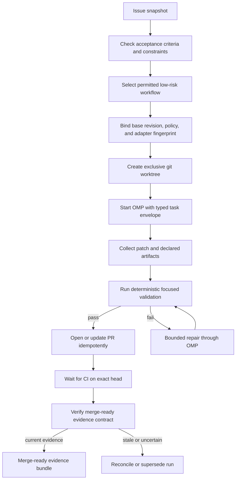
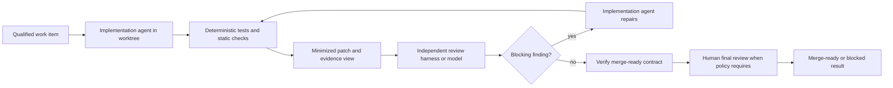
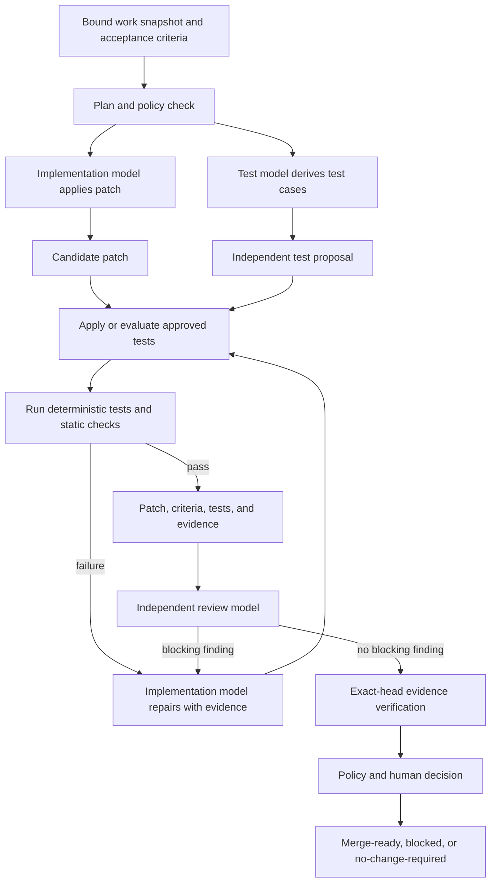
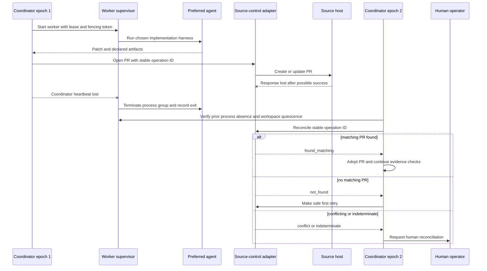

# Enginery Workflow Examples: Using Existing Coding Agents and Models

- **Status:** Intended architecture and operating examples; Enginery is not yet implemented.
- **Audience:** Engineers choosing how existing coding agents and models participate in an Enginery workflow.

> **Core rule:** Users choose their preferred coding agents and models. Enginery coordinates the workflow around them; it does not replace their reasoning loop or silently select a different worker.

## 1. The mental model

Enginery has three separate concepts that are easy to conflate:

| Concept | Meaning | Examples |
|---|---|---|
| **Model** | The reasoning model selected by a coding-agent product or explicitly exposed by it | A high-reasoning model for implementation; an independent model family for review |
| **Harness** | The agent product or CLI that runs tools and interacts with a workspace | OMP, Claude Code, or a future compatible adapter |
| **Enginery** | The local control plane that coordinates state, policy, workspaces, evidence, recovery, and external effects | `enginery` CLI, local ledger, workflow engine, adapter contracts |

A user may prefer one harness for all work, use different harnesses for implementation and review, or use different models for specialized roles within a compatible harness. The worker retains responsibility for ambiguous engineering work; Enginery retains responsibility for the durable process.

```mermaid
flowchart LR
    User[Engineer preferences] --> Workflow[Enginery workflow and policy]
    Workflow --> Adapter[Selected harness adapter]
    Adapter --> Agent[Preferred coding agent]
    Agent --> Workspace[Bound-revision workspace]
    Workspace --> Artifacts[Patch, logs, and declared outputs]
    Artifacts --> Evidence[Deterministic validation and evidence verification]
    Evidence --> Result[Verified outcome or explicit blocked state]
```



### What Enginery sends to an agent

Enginery creates a typed task envelope. It contains the work objective, acceptance criteria, constraints, bound repository revision, allowed capabilities, evidence requirements, artifact-return locations, and time/cost budgets. It does not ask an agent to reconstruct workflow state from a conversation.

### What Enginery receives from an agent

A harness adapter normalizes agent lifecycle events, declared outputs, terminal status, and available harness/model metadata. Raw output is treated as an untrusted, redacted, sensitivity-classified artifact. An agent claiming “done” is not a terminal condition; the workflow must satisfy its evidence and policy contracts.

### What Enginery does not control initially

- an agent product’s internal reasoning loop;
- a harness’s model selection, unless the harness exposes model choice as a declared capability;
- source-host, CI, tracker, registry, or deployment-provider internals;
- human judgment or final authority where policy requires a human decision.

## 2. Example: one preferred agent implements a small change

### Situation

A developer prefers OMP for repository work. A GitHub issue requests an actionable validation error for an invalid region code. The change is low risk but should still produce a current pull request and evidence rather than a terminal transcript.

### Configuration intent

```text
Preferred implementation harness: OMP
Work item source: GitHub issue
Workspace backend: git worktree
Workflow: issue-to-merge-ready-pr
Risk policy: low risk; deterministic validation required
Terminal claim: merge-ready PR, not automatic merge
```

### Workflow



### Division of responsibility

| Actor | Responsibility |
|---|---|
| Engineer | Defines the issue, selects preferred harness, resolves policy-required questions, reviews when required |
| OMP | Explores the repository, chooses an implementation, edits the worktree, explains its output |
| Enginery | Binds the source revision, creates the workspace, records attempts, runs policy/evidence transitions, opens or reconciles the PR, verifies exact-head CI |
| CI and deterministic code | Execute configured tests, linters, type checks, and exact-subject evidence verification |

### Why the agent remains the preferred worker

The user continues to use OMP’s existing instructions, tools, local authentication, and model configuration. Enginery does not replace those preferences. It makes the surrounding operation durable: after a crash, the operator can inspect the bound revision, the latest attempt, the workspace reservation, the artifacts, and any pending external reconciliation.

## 3. Example: one agent implements and another independently reviews

### Situation

A user prefers OMP for implementation but wants a separate coding agent to review medium-risk changes. The goal is not to claim that the second agent is universally better. It is to reduce correlated mistakes by giving review a different harness or model family, a smaller evidence view, and a distinct role.

### Workflow



### Review input is deliberately constrained

The review worker receives the acceptance criteria, patch, changed-file list, relevant test evidence, and repository review policy. It should not automatically receive the implementation worker’s full prompt transcript or private reasoning. This reduces two risks:

1. an implementation agent framing its own work as correct and biasing the reviewer; and
2. untrusted text in an issue or transcript instructing the reviewer to ignore its actual task.

### Repair is bounded

A review finding does not create an infinite loop. The workflow declares a repair budget. Each repair creates a new attempt with its own input digest, artifacts, and evidence. When the budget is exhausted, Enginery records the finding and transitions to a blocked or human-required state rather than calling the result successful.

## 4. Example: one model implements, another reviews, and a third writes or validates tests

### Situation

A team wants three distinct cognitive roles for a feature that changes authorization behavior:

- an **implementation model** writes the patch;
- a **test model** independently derives tests from the acceptance criteria and checks whether the guard is non-vacuous;
- a **review model** reviews the patch and evidence for logic, security, and requirement coverage.

This can run inside three compatible harness invocations, or across different harnesses. The design does not assume that every agent product exposes model selection directly. Where a harness owns model selection, the role is configured through that harness; where it exposes model capabilities, Enginery records the selected model metadata and enforces the workflow’s independence requirement.

### Why three roles

The implementation model is optimized for changing code. It can anchor too strongly on its chosen design. The test model starts from acceptance criteria and failure behavior rather than the patch, making it more likely to discover an untested interpretation. The review model consumes the patch and test evidence after both are available and asks whether the change actually satisfies the intended contract.

None of the three is the final authority. Deterministic execution and evidence verification decide whether configured checks passed for the exact revision. Policy decides whether a human must review the result.



### Step-by-step operation

#### Step 1: bind the work

Enginery freezes the issue or work-item fields that define the task: objective, acceptance criteria, constraints, dependencies, target repository, and base revision. A later change to a bound field supersedes the current run. The system does not allow an old approval or old test result to apply to new intent.

#### Step 2: run implementation and test-design roles

The implementation role receives a task envelope with the repository workspace and constraints. The test role receives the acceptance criteria, existing relevant tests, and permitted test scope. It is instructed to propose tests that fail against the unfixed behavior and pass with the intended behavior where that distinction can be established.

The test role must not simply ask the implementation role whether the test is sufficient. Its output is an independently attributable artifact: proposed cases, test changes if policy permits, commands to execute, and any stated uncertainty.

#### Step 3: execute deterministic validation

Enginery invokes the configured test, lint, type-check, security, and repository validation commands. Their raw output becomes evidence only after redaction and subject binding. A passing result from another revision, another PR head, or an expired validity window does not satisfy the current workflow.

#### Step 4: conduct independent review

The review role receives a minimized evidence view:

```text
- acceptance criteria and declared constraints;
- expected base and current head revision;
- changed files and patch;
- test proposal and executed test results;
- relevant static-analysis and CI evidence;
- review rubric and applicable policy.
```

The review role returns structured findings. It cannot approve its own work, waive a hard evidence requirement, or override policy. Those remain human-only actions where configured.

#### Step 5: verify and decide

Enginery double-reads the work snapshot, base SHA, PR head SHA, PR state, and CI subjects. It then evaluates the workflow’s evidence contract and policy action. The terminal result is explicit:

| Result | Meaning |
|---|---|
| `merge_ready` | Current evidence satisfies the declared contract; merge remains a separate action |
| `blocked` | A missing prerequisite, unresolved review finding, indeterminate evidence, or exhausted repair budget requires action |
| `no_change_required` | The work legitimately needs no implementation change; this is not a false merge-ready success |
| `superseded` | A bound input changed; continuation requires a new run from the new snapshot |
| `failed` or `cancelled` | The workflow ended without its terminal claim |

### Independence rules

Independence is a workflow requirement, not branding. A configuration can require a different harness, a different model family, or an explicitly distinct execution identity for review. The first release’s intended rule is strictest for medium- and high-risk work: human final review is required. For lowest-risk work, an independent agent reviewer may be permitted only under a distinct context and declared policy.

A team should not assume that three labels mean three independent judgments. If all three roles use the same model, prompt, context, and retrieval source, the workflow must record that correlation rather than imply independent review.

## 5. Example: a preferred agent crashes or a PR result is uncertain

### Situation

The implementation agent completes a patch. The source-control adapter submits a pull-request request. The provider creates the PR, but the network response is lost. The coordinator then crashes.

A naïve retry can create a duplicate PR. Enginery treats this as an ambiguous side effect, not as a generic retry.



The preferred agent did not need to solve the provider failure. Enginery owns the durable operation ID, the supervisor observations, the fencing token, and the reconciliation state. It does not claim that fencing can revoke an already-issued external request; that is why provider-visible correlation and reconciliation are mandatory.

## 6. How users choose agents and models

### User preference is the default

A user starts with the harness they already trust and have configured. A workflow may declare:

```text
Implementation: preferred configured harness
Review: independent compatible harness or model capability
Test design: preferred test-specialized model capability
Validation: deterministic repository commands and CI
```

Enginery should explain the selected route, including why a workflow requires or rejects a role. It must not silently substitute another harness because the configured one is unavailable, changed version, lacks a capability, or exceeds policy. Such a condition blocks the run or requires an explicit superseding configuration.

### Model preferences are harness-scoped

Model selection belongs inside a harness unless the harness exposes it through its adapter contract. Where exposed, Enginery records the reported model metadata and can enforce policy such as:

- use a stronger reasoning capability for architectural planning;
- use a distinct model family or harness for independent review;
- limit an expensive implementation role by a declared budget;
- disallow a model or capability for a sensitive repository;
- require human review regardless of model identity.

The control plane does not infer model identity from a label or assume different model names imply meaningful independence.

## 7. Practical boundaries

### Workspaces are not hostile-code sandboxes

A git worktree prevents accidental repository collision. It does not stop a process from accessing the user account, network, filesystem, keychain, or other processes. Untrusted workloads require a future container or VM backend with explicit guarantees.

### Agents never receive production or publication credentials

Production and publication actions run through fixed, reviewed brokers outside agent workspaces. A broker receives typed parameters bound to an approved artifact digest and target; it never executes agent-authored shell commands, scripts, or executables under privileged credentials.

### Evidence is revision-bound

A test result must apply to the exact current subject. Enginery rejects stale CI, an old PR head, a changed issue acceptance criterion, or a superseded approval. This is why the process can be more trustworthy than a generic “tests passed” statement.

## 8. Source grounding

- [System overview](overview.md)
- [System design](design.md)
- [Colleague pitch](pitch.md)
- [Approved product direction](../.docs/02_PRODUCT_DIRECTION.md)
- [Approved system design](../.docs/03_SYSTEM_DESIGN.md)
- [Specification review](../.docs/04_SPECIFICATION_REVIEW.md)
